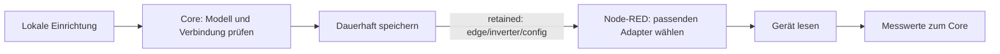

# Wechselrichter auswählen

Die lokale Web-App (`http://<box>:8484`) speichert Modell und Verbindung im Go-Core. Node-RED übernimmt die Auswahl über den lokalen MQTT-Bus. Der aktuelle Katalog und seine Validierung stehen in [`inverter.go`](core/internal/inverter/inverter.go); die Auswahl legt noch keine Schreibfreigabe fest.

## Vertrag

`edge/inverter/config`: Core → Node-RED, QoS 1, retained. Der Core veröffentlicht beim Start und bei Änderungen. Unbekannte Zusatzfelder ignorieren; `schema_version` bleibt für additive Erweiterungen `1.0`.

| Feld | Bedeutung |
|---|---|
| `brand`, `model` | Hersteller und konkretes Katalogmodell |
| `family` | Register-/Decoderfamilie; daraus allein keine Steuerfähigkeit ableiten |
| `communication` | Für das Modell angebotener und validierter Transport |
| `connection` | Transportparameter und gegebenenfalls gerätespezifische Einstellungen |
| `rated_kw` | Modell-Nennleistung; 0/fehlend bedeutet unbekannt |
| `label`, `updated_at` | Anzeige und Änderungszeit |

Der Katalog bietet je nach Modell mehrere Kommunikationswege. Veraltete Regeln wie „Fronius immer HTTP“ gelten nicht. Fehlende Nennleistung darf bei prozentualen Schreibbefehlen nicht geraten werden.

## Verbindungen

| Adapter | Typische Parameter | Details |
|---|---|---|
| Deye / `solarman_v5` | Logger-IP, Port 8899, **Logger-Seriennummer**, `mb_slave_id`; Skalierung/Vorzeichen | [Deye](nodered/DEYE.md) |
| Generisch / `modbus_tcp` | IP, Port, `unit_id`, `profile` | [Eigener Adapter](nodered/CUSTOM-INVERTER.md) |
| Fronius / `fronius_solar_api` | IP, HTTP-Port, gegebenenfalls `insecure_tls` | [Fronius](nodered/FRONIUS.md) |
| Fronius / `fronius_sunspec` | IP, Port, `unit_id`, `model_type` | [Fronius](nodered/FRONIUS.md) |
| KOSTAL / `kostal_modbus` | IP, Port 1502, `unit_id` 71, Byte-Reihenfolge | [KOSTAL](nodered/KOSTAL.md) |
| KACO | HTTP oder Modbus nach Modellfamilie | [KACO](nodered/KACO.md) |

Ports und IDs sind vorbelegte Katalogwerte, keine Garantie für eine bereits umkonfigurierte Anlage. Deye benötigt die Seriennummer des Datenloggers, nicht die des Wechselrichters. Erfassungs- und Steuervorzeichen getrennt kalibrieren.

## Lokale API und Betrieb

- `GET /api/inverter`: `{catalog, selection}` für die Einrichtung.
- `POST /api/inverter`: Auswahl mit `brand`, `model`, `connection` und gegebenenfalls angebotener Kommunikation; Validierungsfehler kommen als deutsche Meldung. `family` bleibt ein Legacy-Fallback für ältere Clients ohne Modell.
- `GET /api/state`: zusammengefasste aktive Auswahl und Mess-/Verbindungszustand.
- Keine/unbekannte Konfiguration: keine erfundene Telemetrie; nach gültiger retained Konfiguration neu verdrahten.
- Weitere Quellen verwenden ihre eigene stabile Zuordnung. Eine zweite Komponente darf nicht still über die primäre Verbindung gelesen werden.

Schreibpfade, Zertifizierung und Rückmeldungen: [Edge-Laufzeit](../docs/edge-runtime.md). Die Auswahl wird auch für deren Transport- und Skalierungsprüfung verwendet; sie ist kein alleiniger Steuerauftrag.
