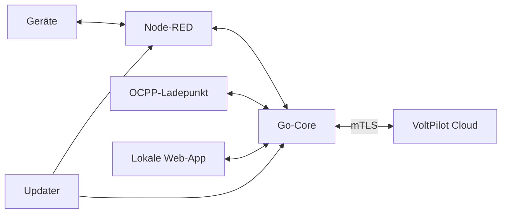

# VoltPilot Box

Installierbare Kunden-Box mit Go-Core, Node-RED-Geräteadaptern und signiertem OTA-Updater. Die Box verbindet das Kundennetz mit der Cloud und setzt Vorgaben innerhalb lokaler Schutzgrenzen um.



## Installation

Für eine echte Box den [Installer](DEPLOY.md) verwenden. Er richtet Compose, Zugangsdaten und Trust-Set ein. Danach die angezeigte Geräte-ID im Portal verbinden und die Komponenten dort konfigurieren.

Die lokale Web-App liegt auf `http://<box>:8484`. Node-RED (`1881`) ist der geschützte Servicezugang; OCPP (`8887`) ist für lokale Ladepunkte bestimmt. Diese Ports nicht öffentlich weiterleiten.

## Ohne Hardware ausprobieren

Im Verzeichnis `edge-app`:

```bash
docker compose --profile sim up -d --build
```

Das Profil ergänzt den SunSpec-Simulator. Cloud-Anbindung erfolgt an die konfigurierte Umgebung; für isolierte Tests die E2E-Skripte verwenden. Ohne `sim` startet der reale Gerätestack.

## Anleitungen

| Aufgabe | Dokument |
|---|---|
| Installieren / verbinden | [DEPLOY](DEPLOY.md), [Enrollment](../docs/connect-a-device.md) |
| Konfiguration und eigener Adapter | [Inverter-Konfiguration](INVERTER-CONFIG.md), [Custom-Inverter](nodered/CUSTOM-INVERTER.md) |
| Unterstützte Gerätepfade | [Deye](nodered/DEYE.md), [Fronius](nodered/FRONIUS.md), [KACO](nodered/KACO.md), [KOSTAL](nodered/KOSTAL.md), [go-e](nodered/GOE.md), [Shelly](nodered/SHELLY.md), [Ebyte I/O-Modul](nodered/EBYTE.md) |
| Physische Steuerung prüfen | [Prüfstand](nodered/CONTROL-BENCH.md), [native Selbstregelung](nodered/UNPLANNED-LOAD-BENCH.md) |
| Messpunkte / Gebäudeautomation | [Messwertruntime](nodered/measurements/README.md), [Modbus-Spiegel](MODBUS-SPIEGEL.md) |
| Updates | [Bedienung](../docs/ota-autonomie.md), [Signaturen](../docs/ota-signing.md) |
| Ausführung und Guards | [Laufzeitregeln](../docs/edge-runtime.md) |

Lesefähigkeit bedeutet keine Schreibfreigabe. Hersteller-/Modellgrenzen stehen in den Geräteanleitungen und Freigaberegistern.

## Tests

```bash
(cd core && go test ./...)
(cd nodered/vp-palette && npm install && npm test)
node --test nodered/*.test.js nodered/deye/*.test.js
./test/e2e-compose.sh
./test/e2e-ocpp.sh
```

Konfiguration: [`.env.example`](.env.example). `VP_DEV_*` ist nur für Entwicklung; Kundeninstallationen verwenden Enrollment und mTLS. Änderungen an Compose/Installer zusätzlich mit den Install-/Update-Selbstchecks prüfen.

## OCPP-Freigabe

Die Ladeverteilung benötigt globale Steuerungsfreigabe und die ausdrückliche OCPP-Freigabe im Portal. Nur ohne gespeicherte OCPP-Einstellung gilt `VP_CONSUMER_CONTROL_ENABLED` als Ersatzvorgabe; andere Verbraucher werden dadurch nicht freigegeben. Einrichtung, Kartenfreigabe und zeitlich begrenzte Ladegrenzen: [OCPP-Steuerung](../docs/ocpp-control.md).
