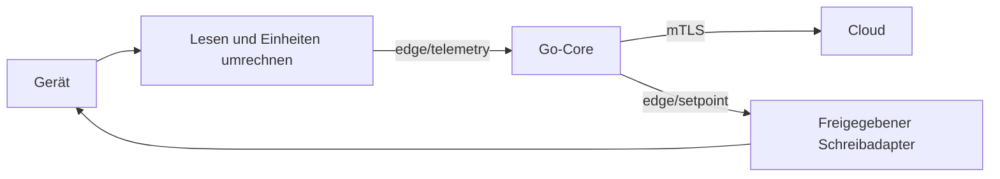

# Eigene Messadapter anbinden

Ein eigener Node-RED-Adapter liest das Gerät, rechnet in kW/Prozent um und veröffentlicht ein flaches JSON-Objekt auf `edge/telemetry`. Der Core ergänzt Cloud-Identität und Sequenz, prüft Messwerte, bildet die Anlagenbilanz und puffert die Übertragung.



## Bus und Nachrichten

Im normalen Compose-Netz: `core:1883`; vom Box-Host: `127.0.0.1:1884`. Der Hostport ist nur auf Loopback gebunden. Bei Host-Netzwerkbetrieb gelten die [Installationsvorgaben](../DEPLOY.md).

| Topic | Richtung | Retained | Zweck |
|---|---|---|---|
| `edge/telemetry` | Adapter → Core | nein | Messwerte, QoS 1 |
| `edge/status` | Adapter → Core | ja | `inverter_link: up/down` |
| `edge/setpoint` | Core → Adapter | ja | Begrenzter Sollwert und Ausführungsmodus |

Dies sind die drei Topics dieses Legacy-Adapters. Der Bus besitzt zusätzlich Konfigurations-, Entitäts- und Flow-Topics; siehe [v2-Verträge](../../docs/contracts/v2/README.md). Der lokale Bus ist eine Vertrauenszone und gehört nicht ins öffentliche Netz.

## Messwerte

| Feld | Einheit / Bedeutung |
|---|---|
| `power_kw` | Netzleistung: positiv Bezug, negativ Einspeisung |
| `pv_power_kw` | PV-Leistung in kW |
| `load_kw` | Hauslast in kW; kann durch die Anlagenbilanz ersetzt werden |
| `soc_pct` | Ladestand, 0–100 Prozent |
| `grid_limit_kw` | Beobachtete lokale Leistungsgrenze in kW |
| `battery_power_kw` | **Gemessene** Batterieleistung: positiv Laden, negativ Entladen |
| `ts` | Optionaler RFC-3339-Messzeitpunkt; ohne gültigen Wert verwendet der Core die aktuelle Zeit |

Nur wirklich gelesene Werte senden. Keine fehlende Messung durch 0 ersetzen und alte Werte nicht mit einem frischen Zeitstempel wiederholen. `battery_power_kw` ist beim v1-Pfad ein lokaler Bilanz-/Anzeigeeingang, kein zusätzliches Feld im eingefrorenen Cloud-Vertrag. v2 besitzt eigene Entitätsmessungen.

```js
// Nach Ihrem Decoder, vor dem Palette-Knoten vp-telemetrie:
const src = msg.payload;
const kw = value => Number.isFinite(value) ? value / 1000 : undefined;
msg.payload = {
  power_kw: kw(src.grid_power_w),
  pv_power_kw: kw(src.pv_power_w),
  load_kw: kw(src.house_load_w),
  battery_power_kw: kw(src.battery_power_w), // bereits + Laden / - Entladen
  soc_pct: Number.isFinite(src.soc_pct) ? src.soc_pct : undefined,
};
return msg;
```

Der gemeinsame `vp-core`-Knoten verbindet `vp-telemetrie`, `vp-status` und `vp-sollwert`. Bei einem eigenen `mqtt out`: JSON, QoS 1, Telemetrie ohne Retain. Identitäten stammen aus Enrollment, nicht aus dem Decoder.

## Tatsächliche Prüfungen

- Malformed JSON und Nachrichten ohne einen der fünf Hauptmesskanäle werden verworfen. Batterieleistung allein reicht für diesen Pfad nicht.
- Unbekannte Felder werden ignoriert; nicht endliche Zahlen werden nicht als Messwert übernommen. Ein falscher JSON-Typ kann die ganze Nachricht ungültig machen.
- Unplausibler SoC verwirft **die ganze Probe**. Die frühere Aussage „150 Prozent werden ungeprüft weitergereicht“ ist überholt.
- Konfigurierbare Spitzenfilter und die physische Modellgrenze können einzelne Kanäle auf ihrem letzten akzeptierten Wert halten. Das ersetzt keine korrekte Skalierung im Adapter.
- Weitere Quellen gehen nur entsprechend ihrer Zuordnung und Frische in die Bilanz ein. Ausführung prüft eigene Schutz- und Aktualitätsbedingungen.

Prüfen: `GET /api/state`, fortschreitendes `last_telemetry`, lokale Messkurven und Core-Logs. Erfolgreiches lokales Einlesen und erfolgreiche Cloud-Übertragung getrennt kontrollieren. Ein quittierter Schreibauftrag belegt noch keine gemessene Wirkung.

Implementierung: [`vp-telemetrie.js`](vp-palette/nodes/vp-telemetrie.js), [`onLocalTelemetry`](../core/internal/agent/agent.go). [Messwerte und Schutz](../../docs/edge-runtime.md) · [Wechselrichterauswahl](../INVERTER-CONFIG.md)
