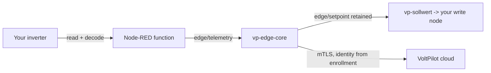

# Feeding measured values into vp-edge-core from a custom Node-RED flow

This is the operator guide for wiring a **custom inverter** (any protocol, any register map) into the VoltPilot edge.
It describes the one stable contract between a customer's Node-RED I/O flow (**Layer 1**) and the VoltPilot edge core (`vp-edge-core`, **Layer 2**).
Get this single message right and the upstream inverter decoding can be anything you like.

**In one sentence:** publish a flat JSON object of kW / percent measurements to `edge/telemetry` on the core's embedded MQTT bus (`core:1883` inside the stack).
The core stamps identity + timestamp + sequence, buffers it store-and-forward, and forwards it as the binding cloud telemetry contract.
All measurement fields are optional; the core ignores what it does not recognise, never rejects on range, and does no unit conversion.



The three `vp-*` palette nodes stay identical for every customer; you only replace the inverter read/decode and the setpoint-write nodes.

---

## 1. The local-bus contract

### 1.1 Where the bus lives

The core runs an **embedded** MQTT broker in-process (mochi-mqtt) - there is no separate broker container.

- Listen address default `:1883` - `edge-app/core/internal/config/config.go:75` (`LocalMQTTAddr: ":1883"`), overridable via `VP_LOCAL_MQTT_ADDR`.
- The broker starts **open** (AllowHook, no auth) as a LAN-local trust zone - `edge-app/core/internal/localbus/localbus.go:42-60`.
- The bus is where Layer 1 (Node-RED) connects; the core reads/writes it via mochi's inline client.

**How a Node-RED flow reaches it:**

| Context | Host | Port | Source |
|---|---|---|---|
| Node-RED **inside** the edge-app stack (normal case) | `core` | `1883` | `edge-app/nodered/vp-palette/nodes/vp-core.js:16-17` defaults + the compose service name; `edge-app/README.md:50` |
| From the **host** (debugging, `mosquitto_pub`) | `127.0.0.1` | `1884` | `edge-app/docker-compose.yml:48` maps `127.0.0.1:${VP_BUS_PORT:-1884}:1883` |

The shipped `vp-core` config node hardcodes `host: "core"`, `port: "1883"` (`edge-app/nodered/flows.json`, node `cfg-vp-core`), which resolves over the compose network.
Env overrides exist: `VP_CORE_HOST` / `VP_CORE_PORT` - `edge-app/nodered/vp-palette/nodes/vp-core.js:16-17`.
The host-mapped `127.0.0.1:1884` is loopback-only and is for debugging from the device host, not for other machines.

### 1.2 Topics

Defined in `edge-app/core/internal/localbus/localbus.go:28-32`:

| Topic | Direction | Retained? | Purpose | Core handler |
|---|---|---|---|---|
| `edge/telemetry` | **Layer 1 → core** | no | inverter measurements (the message you publish) | subscribed at `agent.go:148`, handled by `onLocalTelemetry` `agent.go:274` |
| `edge/setpoint` | core → Layer 1 | **yes (retained)** | guard-clamped battery setpoint command | published at `agent.go:458` |
| `edge/status` | Layer 1 → core | yes (retained) | inverter link state up/down | subscribed at `agent.go:151`, handled by `onLocalStatus` `agent.go:349` |

A custom flow **publishes** `edge/telemetry` (measurements) and `edge/status` (link health), and may **subscribe** `edge/setpoint` to drive the inverter.
The core subscribes only `edge/telemetry` and `edge/status` (`agent.go:148-153`).
There is no local `command` / `config` topic; those exist only on the cloud side (§1.5).

### 1.3 Measurement payload schema (`edge/telemetry`)

The core parses the payload in `onLocalTelemetry` - `edge-app/core/internal/agent/agent.go:274-307`.
It is a **flat** JSON object (not nested under `measurements` - that nesting is added later, by the cloud layer).

| Field | Type | Unit | Required | Sign / range | What a missing / invalid value does |
|---|---|---|---|---|---|
| `power_kw` | number | **kW** | optional | `+` = grid **import**, `−` = **export** (`docs/contracts/mqtt-telemetry.schema.json:41-43`) | omitted from the sample |
| `soc_pct` | number | **percent** (0–100) | optional | battery state of charge | omitted; **core does NOT clamp/validate the 0–100 range** |
| `pv_power_kw` | number | **kW** | optional | PV generation (≥0 in practice) | omitted |
| `load_kw` | number | **kW** | optional | site load (≥0 in practice) | omitted |
| `grid_limit_kw` | number | **kW** | optional | observed §14a envelope (magnitude; used as a ± cap) | omitted; the §14a guard step is skipped |
| `battery_power_kw` | number | **kW** | optional | the inverter's MEASURED battery power, `+` = **charge**, `−` = **discharge** (matches `edge/setpoint`). **LOCAL-BUS ONLY, never a cloud channel**: the core uses it as the battery term of the house-consumption standard (`house = pv_total + grid − battery`, default ON since 2026-07-17 — site grid = Netz-Zähler source, else the primary's own grid reading) AND as the `:8484` dashboard battery line (measured, never derived); the cloud keeps deriving battery from the power balance. | omitted; a provable hybrid then shows the house as nicht messbar (honest gap), an unknown family falls back to the raw-load estimate |
| `ts` | string | RFC 3339 | optional | measurement time | **core stamps `time.Now().UTC()`** (`agent.go:287-292`) |

**Parsing / validation rules, exactly as coded (`agent.go:283-307`):**

1. **Malformed JSON** → logged `"local telemetry malformed; skipped"` and dropped (`agent.go:283-286`). The stream never crashes.
2. Each numeric field is accepted only if present **and** not `NaN`/`Inf` (`put()`, `agent.go:294-298`). A non-finite number is silently dropped for that field.
3. Unknown/extra keys are **ignored** - only the known fields are read (the struct in `onLocalTelemetry`). There is no `additionalProperties` rejection on the local bus.
4. If **none** of the five known measurement channels survive, the whole message is dropped: `"local telemetry carried no known measurement; skipped"`. (`battery_power_kw` is a balance input, not a measurement channel - it alone never makes a message publishable.)
5. **No range checks.** A `soc_pct` of 150 or a negative `pv_power_kw` is accepted and forwarded as-is. Range/enum is documented on the cloud contract only; the core does not enforce it.
6. `ts`: a valid RFC 3339 string is parsed and used (converted to UTC); **anything else - missing or unparseable - falls back to "now"** (`agent.go:287-292`). An unparseable `ts` does not reject the message.

The Node-RED `vp-telemetrie` node applies the **same** shape rules before publishing (`edge-app/nodered/vp-palette/nodes/vp-telemetrie.js:20-37`): it drops non-finite numbers, keeps `ts` only if `Date.parse` succeeds, and returns `null` (publishes nothing) when no measurement is present.
It also accepts two **aliases** from classic decoders: `grid_kw → power_kw`, `pv_kw → pv_power_kw` (`vp-telemetrie.js:27,29`).
Those aliases are a convenience of the palette node only - the raw bus/core contract uses the canonical `power_kw` / `pv_power_kw`.

### 1.4 QoS, retain, cadence, freshness

- **QoS 1**, **not retained** for telemetry - the palette publishes `{ qos: 1 }` with no retain (`vp-telemetrie.js:59`). Match this.
- **Cadence:** the shipped sim flow polls/publishes **every 2 s** (`edge-app/nodered/flows.json`, inject `sim-poll`, `repeat: 2`). There is no hard requirement; every message is buffered (`agent.go:325`). A sane custom flow publishes on each inverter read (e.g. 1–5 s).
- **Freshness the core assumes:**
  - The **setpoint loop** re-evaluates every `SetpointIntervalSeconds` (default **10 s**, `config.go:82`) using the **last** reading (`agent.go:399-411`; `lastReading` updated at `agent.go:316-321`). If you stop publishing, the core keeps acting on the last values you sent.
  - If **no reading has ever arrived**, the core publishes **no setpoint at all** (mode `keine_messwerte`, `agent.go:442-447`; the mode string is defined at `state.go:16`) - this mirrors the Node-RED watchdog, which never writes without a reading.
  - Separately, a **cloud plan** older than **20 min** is stale → self-consumption fallback (`edge-app/README.md:44`); that concerns the schedule, not your telemetry cadence.

### 1.5 How the local fields map to the cloud telemetry contract

The core does **not** transform your numbers - it wraps them.
Buffered measurements are republished verbatim under `measurements`, with identity + sequence attached - `edge-app/core/internal/cloud/cloud.go:156-175`:

```json
{
  "schema_version": "1.0",
  "tenant_id":  "<from enrollment>",
  "site_id":    "<from enrollment>",
  "device_id":  "<from enrollment>",
  "ts":         "<your ts, or the core's now, RFC3339Nano>",
  "seq":        "<monotonic per-device>",
  "measurements": { "power_kw": 0, "soc_pct": 0, "pv_power_kw": 0, "load_kw": 0, "grid_limit_kw": 0 }
}
```

- Published to `ems/{tenant_id}/{site_id}/{device_id}/telemetry`, QoS1, not retained (`cloud.go:170`).
- This matches the **binding** contract `docs/contracts/mqtt-telemetry.schema.json` (topic template `x-topics`, lines 7-13; `measurements` properties + units/signs, lines 35-57).
- **Identity is attached by the core, from enrollment - never by your Node-RED message** (§4). Your local-bus payload carries *no* tenant/site/device IDs.
- Field-by-field, each local key becomes the identically-named key under cloud `measurements`. So `power_kw` on the bus → `measurements.power_kw` in the portal, same value, same unit, same sign.

Cloud → edge topics your flow may care about (documented at `docs/contracts/mqtt-telemetry.schema.json:7-13`, consumed by the core, not by your flow): `.../schedule` (retained plan; the core subscribes at `cloud.go:94-95`), `.../status`, `.../command`, `.../config`.
Your flow does **not** touch these directly - the core translates the schedule into the local `edge/setpoint` (§2).

---

## 2. How the shipped palette / flows do it (copy this pattern)

The palette (`edge-app/nodered/vp-palette/`) has three nodes, all pointing at one shared `vp-core` config node (`edge-app/README.md:50`):

- `vp-telemetrie` - publish measurements to `edge/telemetry` (`vp-palette/nodes/vp-telemetrie.js`)
- `vp-status` - publish inverter up/down to `edge/status` (`vp-palette/nodes/vp-status.js`)
- `vp-sollwert` - subscribe `edge/setpoint`, emit the clamped kW for your driver (`vp-palette/nodes/vp-sollwert.js`)

The shipped SunSpec-simulator tab (`edge-app/nodered/flows.json`, tab `tab-sim` `"SunSpec (Simulator)"`, **enabled**) is the reference chain.
In the running editor at **http://\<device\>:1881** (user `voltpilot`, `edge-app/README.md:60`) it looks like:

```
[inject: poll 2s] → [modbus-flex-getter: read inverter FC3 0..8]
                        → [function: decode SunSpec → Messwerte] ──→ [vp-telemetrie: an VoltPilot Core]  (→ edge/telemetry)
                                                              └────→ [vp-status] and a trigger → down     (→ edge/status)

[vp-sollwert: Sollwert vom Core] → [function: Sollwert → FC6 Reg 40] → [modbus-flex-write]
```

The decode function (node `sim-decode` in `flows.json`) is the crucial "assemble the payload" step.
It reads raw registers and produces exactly the flat shape:

```js
const reading = {
  ts: new Date().toISOString(),
  power_kw: grid_kw,        // + Bezug / - Einspeisung
  soc_pct,                  // r[4] / 10
  pv_power_kw: pv_kw,
  load_kw,
  grid_limit_kw,            // derived from observed §14a % × grid-connection kW
};
return [{ payload: reading }, { payload: true }];   // out1 → vp-telemetrie, out2 → vp-status(true)
```

It converts register scaling to **kW** and **percent** in the decode step - that is where every custom install does its own mapping.
`vp-telemetrie` then re-shapes/validates and publishes QoS1 (`vp-telemetrie.js:52-69`).

For the setpoint direction, `vp-sollwert` emits `msg.payload` = the clamped kW number and `msg.setpoint` = the full command object (`vp-sollwert.js:64`); the sim's `sim-sp2reg` function turns kW into an int16 register (`Math.round(kw * 100)`).
Your custom flow replaces only the Modbus read/decode and the setpoint-write nodes - the three `vp-*` nodes stay identical.

---

## 3. Minimal copy-paste recipe for a custom inverter

Goal: take arbitrary upstream fields from your own inverter integration and emit a valid core payload.
Two nodes: a `function` that assembles the payload, and either a `vp-telemetrie` node (preferred) or a plain `mqtt out` if you do not use the palette.

### 3.1 Function node - assemble the payload

```js
// "assemble VoltPilot telemetry"
// Map YOUR upstream inverter fields (whatever they are) into the flat core
// contract. Everything is optional; emit only what you actually measured.
// UNITS: power in kW (not W), SoC in percent (not fraction).
// SIGNS: power_kw + = grid import / - = export;  pv_power_kw >= 0; load_kw >= 0.

const src = msg.payload || {};                 // <- your inverter's decoded object
const kw  = (w) => (typeof w === 'number' && isFinite(w) ? w / 1000 : undefined); // W -> kW helper

const reading = {
  power_kw:      kw(src.grid_power_w),         // e.g. meter active power in W  -> kW
  pv_power_kw:   kw(src.pv_power_w),            // PV generation
  load_kw:       kw(src.house_load_w),         // site load
  soc_pct:       (typeof src.battery_soc === 'number' ? src.battery_soc : undefined), // already 0..100
  grid_limit_kw: (typeof src.grid_limit_kw === 'number' ? src.grid_limit_kw : undefined), // observed §14a, optional
  // ts is OPTIONAL. Omit it and the core stamps "now" (recommended unless your
  // device clock is trustworthy & NTP-synced). If you set it, use RFC3339:
  // ts: new Date().toISOString(),
};

// Drop undefined keys so the core never sees them (it would ignore them anyway).
Object.keys(reading).forEach((k) => reading[k] === undefined && delete reading[k]);
if (Object.keys(reading).length === 0) { return null; } // nothing measured -> publish nothing

msg.payload = reading;
return msg;
```

Realistic example output (midday, exporting PV surplus, battery charging):

```json
{ "power_kw": -3.2, "pv_power_kw": 7.5, "load_kw": 1.8, "soc_pct": 64.0, "grid_limit_kw": 11.0 }
```

### 3.2 Publish to the core

**Preferred - use the palette node** (handles reconnect, status, validation):

- Drop a `vp-telemetrie` node after the function node and select the shared `vp-core` config node. Nothing else to configure - it publishes to `edge/telemetry` QoS1 (`vp-telemetrie.js:16,59`).

**Alternative - plain `mqtt out`** (if you deliberately avoid the palette):

| mqtt out setting | Value | Why |
|---|---|---|
| Server (broker) | `core` : `1883` | in-stack service name + bus port (`vp-core.js:16-17`, `edge-app/README.md:50`) |
| Topic | `edge/telemetry` | `localbus.go:29` |
| QoS | `1` | matches the palette (`vp-telemetrie.js:59`) |
| Retain | **off** | telemetry is not retained |

The function node's `msg.payload` (a JS object) is JSON-serialised by the `mqtt out` node automatically.
From the **host**, for a quick smoke test, target `127.0.0.1:1884` instead (`edge-app/docker-compose.yml:48`):

```bash
mosquitto_pub -h 127.0.0.1 -p 1884 -t edge/telemetry \
  -q 1 -m '{"power_kw":-3.2,"pv_power_kw":7.5,"load_kw":1.8,"soc_pct":64,"grid_limit_kw":11}'
```

### 3.3 (Optional) report inverter link health

Publish to `edge/status` (retained) when your inverter connection goes up/down.
The `vp-status` node accepts a boolean, `"up"`/`"down"`, or `{ inverter_link: "up"|"down" }` (`vp-status.js:17-27`).
This drives the "Wechselrichter: verbunden/getrennt" line in the local web app; it does **not** affect telemetry ingestion.

---

## 4. Gotchas (the ones you will actually hit)

1. **kW, not W.** Every power field is **kilowatts**. The decode step is where you divide by 1000. `docs/contracts/mqtt-telemetry.schema.json:40-56` and the whole guard/optimizer stack assume kW. Sending watts silently produces 1000× wrong numbers in the portal and blows past the guard power band.

2. **Percent, not fraction, for SoC.** `soc_pct` is `0..100` (`docs/contracts/mqtt-telemetry.schema.json:44-49`). Send `64`, not `0.64`. The **core does not validate or clamp the range** (`agent.go:299-303` just passes it through) - a wrong scale reaches the portal unflagged. Only the *guards* care about SoC bounds (`SocMinPct`/`SocMaxPct`, default 5/95, `config.go:79-80`), and they compare against your raw number - so `0.64` reads as "0.64 %" and the battery is treated as empty (`guards.go:62-69`).

3. **Sign conventions - get them right, the optimizer relies on them:**
   - `power_kw`: **+ import / − export** (`docs/contracts/mqtt-telemetry.schema.json:41-43`).
   - Battery setpoint on `edge/setpoint`: **+ charge / − discharge** (`vp-sollwert.js:9`, `guards.go:38`). You *consume* this; you do not send it.
   - `pv_power_kw` and `load_kw` are magnitudes (≥0). The guard's §14a check computes `predictedGrid = load + battery − pv` (`guards.go:74`) - if you sign-flip PV or load, the export/import envelope clamp misfires.
   - `grid_limit_kw` is used by magnitude (`math.Abs`, `guards.go:73`), so its sign does not matter, but its **scale (kW)** does.

4. **Timestamp: the core stamps it unless you provide a valid RFC 3339 `ts`.** Missing or unparseable `ts` → `time.Now().UTC()` (`agent.go:287-292`). Recommendation: **omit `ts`** and let the core stamp, unless the device clock is NTP-synced - a wrong device clock puts telemetry in the wrong place on the portal time axis, and the original (wrong) `ts` is preserved all the way to the cloud (`cloud.go:162`).

5. **Identity is NOT in your message.** The local-bus payload carries no tenant/site/device IDs. The core attaches them from **enrollment** (`agent.go:202-205`, injected into the cloud payload at `cloud.go:157-164`). Consequence: you cannot "address" a device from Node-RED, and you must not try. Before the device is claimed/enrolled, telemetry is still **accepted and buffered** (`agent.go:325`) - it just is not forwarded to the cloud until the link is up (`publisherLoop`, `agent.go:471-510`), then replayed oldest-first with the original timestamps.

6. **"No known measurement" = silently dropped.** If your function emits keys the core does not know (a typo like `pv_kw_power`, or everything undefined), the message is dropped with a warn log (`agent.go:304-306`). Only these five measurement keys count: `power_kw, soc_pct, pv_power_kw, load_kw, grid_limit_kw` (plus the optional balance input `battery_power_kw`, which alone never makes a message publishable). The `vp-telemetrie` palette node additionally aliases `grid_kw`/`pv_kw` (`vp-telemetrie.js:27,29`), but a raw `mqtt out` does not - use the canonical names.

7. **Non-finite numbers are dropped per-field.** `NaN`/`Infinity` for a field → that field is omitted (`agent.go:294-298`). If a sensor read fails, sending `NaN` is safe (that field just will not appear), but sending the *last good value* is usually what you want.

8. **How to confirm a custom message was accepted:**
   - **Core logs** (`docker compose logs -f core`): a malformed or empty message logs a warning (`agent.go:284`, `305`). **Silence on ingest = accepted** (the happy path logs nothing per-message). A wrong broker/topic shows up as no state change at all.
   - **Local web app** `http://<device>:8484` and its JSON at **`GET /api/state`** (`web.go:29-32`): on a good message the snapshot updates `last_telemetry`, `buffer_pending`, and the live `soc_pct`/`pv_kw`/`load_kw`/`grid_limit_kw` fields (`agent.go:329-344`, `state.go:29-45`). Watch `last_telemetry` advance - that is the definitive "the core ingested my message" signal.
   - **`GET /health`** (`web.go:35-44`) shows `pairing_state` and `cloud_connected` - use it to tell "ingested locally but not yet forwarded" (device unclaimed) from a real problem.
   - **In the Node-RED editor**, the `vp-telemetrie` node's own status text flips to `pv <n> kW` on a successful publish, or `keine Messwerte im payload` when the payload had nothing usable (`vp-telemetrie.js:55,65`).

9. **Broker address inside vs outside the stack.** Inside the compose network use `core:1883`; the host-mapped port is `127.0.0.1:1884` and is loopback-only (`edge-app/docker-compose.yml:48`) - for debugging from the device host, not for other machines. A custom flow running *inside* the `nodered` container must use `core:1883`.

---

## See also

- `edge-app/README.md` - the edge-app overview, the vp-palette table, and "Einen neuen Kunden verdrahten" (the service task this guide details).
- `docs/contracts/mqtt-telemetry.schema.json` - the binding cloud telemetry contract your local fields map onto.
- `edge/sim/sunspec-sim.js` - the SunSpec simulator register semantics the shipped reference decode reads.
