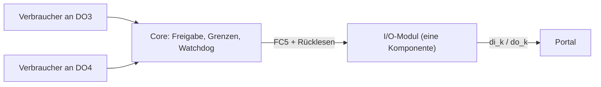

# Ebyte-M31-I/O-Modul: Eingänge lesen, Relais-Ausgänge je Verbraucher schalten

Das Ebyte **M31-AXAX8080G-U** ist ein Modbus-TCP-I/O-Host mit **8 digitalen
Eingängen** (10–28 V DC, NPN/PNP) und **8 Relais-Ausgängen** (Schließer, 5 A je
Relais, 8 A je gemeinsamem COM). U-Serien-Erweiterungsmodule (bis 15 Stück)
setzen die Eingangs- und Ausgangsnummern lückenlos fort. Der **Go-Core** besitzt
den ganzen Geräte-Socket (`edge-app/core/internal/ebyte`, Executor
`internal/agent/ebyte_control.go`); Node-RED, die Messwert-Laufzeit und der
freie Registerzugriff haben bewusst **keinen** Weg zu diesem Gerät.



## 1. Datenmodell: ein Gerät, N Kanäle

- **Das Modul** ist EINE Komponente (Katalog `Ebyte` · Gerätetyp `io_module`,
  Entitätstyp `io-module`). Sie wird nie gesteuert. Die Box liest alle
  Eingänge und Ausgänge (alle 10 s) und meldet sie als Komponenten-Telemetrie
  `di_1..di_N` / `do_1..do_N` (0/1) — bei Änderung und mindestens minütlich.
- **Jeder geschaltete Ausgang** ist ein eigener **Verbraucher** (Heizstab,
  SG-Ready-Kontakt, Pumpe …) mit eigener Steuerart, Nennleistung, Schonzeiten
  und Regel. Die Bindung „Ausgang k dieses Moduls" steht in
  `consumer_profile.io_entity_id/io_channel`; der Registry-Push setzt daraus
  den Treiber `{communication: ebyte_modbus_tcp, io_entity_id, channel}`
  zusammen — bewusst **ohne** eigene Verbindung.
- Ein Ausgang gehört höchstens **einem** Verbraucher. Relais messen keine
  Leistung: die Bestätigungsstufe ist `relay_state` (Stufe 3, Energie
  „angenommen"), ein SG-Ready-Kontakt behält `freigabe`.

## 2. Einrichten

1. **Adresse:** Werkseinstellung `192.168.3.7`, Port 502, Modbus-Adresse 1.
   DHCP schaltet Register `0x7533 = 1` ein (danach Neustart `0x0C1D = 0x5BB5`);
   im Kundennetz eine DHCP-Reservierung setzen. Die Box erkennt das Gerät
   zusätzlich an der **MAC** (`0x7534`): antwortet unter der Adresse ein anderes
   Gerät, wird nichts gelesen und nichts geschaltet.
2. **Module abstimmen:** Nach jedem Stecken/Ziehen eines Erweiterungsmoduls
   verweigert der Host ALLE Ein-/Ausgänge (Fehlercode 2), bis die interne
   Busabstimmung lief: **Reload-Taste innerhalb von 2 s doppelt drücken**
   (oder `0x7584 = 1`, dann `0x7585 = 1`). Die Box stimmt nie selbst ab — die
   Abstimmung nummeriert die Ausgänge neu.
3. **Im Portal:** „Schaltbarer Verbraucher" → Ebyte → IP eintragen →
   *Verbindung testen* (liest Modell, Firmware, MAC, Modul-Stapel und alle
   Zustände; schaltet nie) → speichern. Danach je Last: *Verbraucher hinzufügen*
   → unter „Verbindung" den freien Ausgang wählen.
4. Nach einem **Gerätetausch** oder einer **Modul-Änderung** sperrt die Box das
   Schalten (die Zuordnung könnte auf ein anderes Relais zeigen), bis
   *Verbindung testen* das neue Gerät bestätigt hat.

## 3. Totmann auf dem Gerät

Das Modul hat einen eigenen Offline-Ausfallschutz: `0x0C35` Offline-Zeit
(0,1 s), `0x0C36` Freigabe, `0x1B58+n` Fehlerzustand je Ausgang (1 = AUS).
Prüfstandsbefunde (Firmware 9232-0-13):

- Die Einstellung wirkt **erst nach einem Neustart** des Moduls.
- **Jede** Modbus-Anfrage hält ihn wach — auch ein reines Lesen, auch von
  einem fremden Programm.
- Er löst zwischen einer und zwei Offline-Zeiten nach der letzten Anfrage aus;
  `0x0C37` zählt die Auslösungen.

Die Box schaltet **kein EIN**, solange der Watchdog nicht für jeden Ausgang
auf AUS steht. Sie richtet ihn selbst ein (60 s, alle Ausgänge AUS, Neustart) —
aber nur, wenn alle Ausgänge aus sind, und höchstens alle 5 Minuten. Weil das
Lesen der Box den Watchdog wach hält, schaltet der Executor bei **Not-Aus**
(`VP_CONTROL_ENABLED`/`VP_CONSUMER_CONTROL_ENABLED` aus) und beim **Entfernen**
eines Verbrauchers genau die Ausgänge, die er selbst eingeschaltet hat, aktiv
AUS — fremd geschaltete Ausgänge bleiben unberührt.

## 4. Prüfstand

`edge-app/core/cmd/vp-ebyte-bench` fährt den Box-Treiber direkt gegen ein
Gerät (nur ohne angeschlossene Last):

```bash
cd edge-app/core
CGO_ENABLED=0 go run ./cmd/vp-ebyte-bench -ip 192.168.3.50 read
CGO_ENABLED=0 go run ./cmd/vp-ebyte-bench -ip 192.168.3.50 -mac 00:54:2c:84:9b:90 cycle
CGO_ENABLED=0 go run ./cmd/vp-ebyte-bench -ip 192.168.3.50 arm-watchdog -offline 600
```

Belegt am echten M31-AXAX8080G-U (24.09.2026): Identität, Stapel 8/8
bewiesen, alle 8 Relais einzeln EIN/AUS mit Rücklesen (FC5), gemeinsam per
FC15, Adressen ≥ 8 abgelehnt, Watchdog-Auslösung nach Neustart. Ende-zu-Ende
über einen lokalen Stack dieses Stands (API → Cloud-MQTT → Box → M31):
Verbindungstest mit allen 16 Kanälen, Anlegen als I/O-Modul, je ein
Verbraucher an DO1–DO8, jeder Ausgang per Handeingriff einzeln EIN/AUS mit
Rücklesen am Gerät; DO1 per Cloud EIN, Box gestoppt → das Modul hat DO1
selbst abgeschaltet (Watchdog 60 s). **Offen:** der
physische Nachweis der Eingänge (bislang nur „lesbar, alle 0" — es lag keine
Spannung an) und Erweiterungsmodule (nur im Simulator
`internal/ebyte/ebytesim`). Analog-/PT100-Module werden erkannt und benannt,
aber nicht gelesen.
