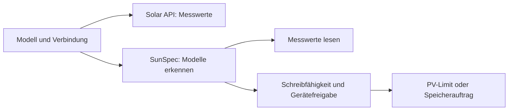

# Fronius: Solar API und SunSpec

Fronius kann über die lokale Solar API oder SunSpec Modbus TCP gelesen werden. PV-Abregelung verwendet SunSpec und eine Freigabe je Wechselrichtereinheit. Registertabellen und Hardwarebelege bleiben unten als technische Referenz.

Lesen allein erfordert keine Steuerfreigabe. Modelle 123/124, physische Zielkennung und Rückfallverhalten am konkreten Gerät prüfen; ein erfolgreiches Registerecho ist kein Wirkungsnachweis. [Prüfstand](CONTROL-BENCH.md) · [Decoder](fronius/solar-api.js) · [SunSpec](sunspec/sunspec-live.js)

## 0. Solar API in der Wechselrichter-Weboberfläche aktivieren (WICHTIG!)

Bei neuerer **GEN24-Firmware (≥ 1.14.1)** ist die Solar API **standardmäßig
AUS** und muss einmalig aktiviert werden - das ist der Fronius-Klassiker unter
den Support-Anrufen (das Pendant zur Deye-Falle "Logger-Seriennummer, nicht
Wechselrichter-Seriennummer"):

1. Weboberfläche des Wechselrichters öffnen (`http://<IP>` bzw. die
   Solar.web-App / das lokale UI).
2. **Kommunikation → Solar API** suchen und die **Solar API aktivieren**.
   (Ältere Datamanager-2.0-Geräte - Symo/Primo mit Datamanager - haben sie i. d. R.
   bereits an.)
3. Speichern; der Wechselrichter antwortet danach unter
   `/solar_api/v1/GetPowerFlowRealtimeData.fcgi`.

Ohne diesen Schritt liefert der Wechselrichter keine Daten und der Lesepfad
bleibt **idle-sicher** (Knotenstatus-Hinweis, keine Telemetrie, kein Absturz).

## 1. Host/IP finden

Die Solar API hört auf dem **lokalen Netz-Interface** des Wechselrichters:

- Im Router / DHCP-Server nach dem Fronius-Gerät suchen (Hersteller-MAC-Präfix
  **`00:03:AC`**), oder
- die IP in der Solar.web-App / im lokalen UI unter Netzwerk ablesen, oder
- eine feste IP / DHCP-Reservierung vergeben (empfohlen, damit sich die Adresse
  nicht ändert).

Kein Benutzername, kein Passwort, keine Seriennummer und keine Unit-ID nötig -
die Solar API ist im LAN unauthentifiziert (wie HA sie liest).

## 2. GEN24: selbstsigniertes HTTPS-Zertifikat

Manche **GEN24-Firmware leitet HTTP auf HTTPS mit einem selbstsignierten
Zertifikat um** (bestätigt über HAs eigenen Workaround `verify_ssl=False`,
home-assistant/core#138881). Wenn ein reiner HTTP-Lesezugriff auf so einem Gerät
fehlschlägt:

- In der Einrichtung **„Selbstsigniertes Zertifikat akzeptieren (HTTPS)"**
  (`insecure_tls`) setzen. Der Edge wählt dann `https://` und akzeptiert das
  selbstsignierte Zertifikat (`rejectUnauthorized: false`).

Auf Geräten ohne diese Umleitung bleibt `insecure_tls` **aus** (Standard) und es
wird schlicht `http://<IP>:80` verwendet.

## 3. API-Version: nur V1

`GetPowerFlowRealtimeData` ist ein **V1-Endpunkt** (GEN24 + Datamanager 2.0
Symo/Primo/Symo Hybrid). Ein reines **V0-Altgerät (Datamanager 1.0)** hat diesen
Endpunkt nicht - das ist ein bewusster **Nicht-Zielfall**: ein V0-Gerät 404t und
der Lesepfad bleibt idle-sicher (nie stiller Rückfall auf halbe Daten). Für die
seltenen V0-Altlogger ist ggf. ein separater Adapter nötig.

## 4. Feldzuordnung (Site-Objekt aus PowerFlow)

`decodePowerFlow` bildet das `Site`-Objekt (plus `Inverters["1"].SOC`) auf die
kanonischen Kanäle ab:

| VoltPilot-Kanal | Fronius-Feld | Umrechnung / Hinweis |
|---|---|---|
| `power_kw` (Netz) | `P_Grid` | W → kW. **Vorzeichen passt bereits** (+Bezug/−Einspeisung), also standardmäßig **keine** Invertierung. |
| `pv_power_kw` | `P_PV` | W → kW, ≥ 0. `null` (Wechselrichter schläft) → Feld **ausgelassen**, nie fabrizierte 0. |
| `load_kw` | **`−P_Load`** | Fronius meldet die Last **negativ** beim Verbrauch; VoltPilots `load_kw` ist nicht-negativ, also negieren (und auf ≥ 0 begrenzen). |
| `soc_pct` | `Inverters["1"].SOC` | Nur bei Hybrid mit Batterie vorhanden. Fehlend/außerhalb `(0,100]` → **ausgelassen**, nie fabrizierte 0 (dieselbe Regel wie Deye `socPlausible`). |
| Batterieleistung (nicht veröffentlicht) | `P_Akku` | Nur Kalibrierung/Gegenprobe - VoltPilot leitet `battery_kw` aus der Leistungsbilanz ab und veröffentlicht die Fronius-Zahl **nie** direkt. **Bewusst auch nicht als lokales `battery_power_kw`** (das die Deye-/Modbus-Pfade für die Hausverbrauch-Bilanz mit Netz-Zähler mitgeben): das `P_Akku`-Vorzeichen ist AM GERÄT ZU PRÜFEN und noch unbestätigt - bei einem nachweislichen Hybrid ohne Batteriemessung bleibt die Hauslast unbekannt; eine ungeprüfte Vorzeichenannahme darf sie nicht ersetzen. |
| `grid_limit_kw` (§14a) | – | In den geprüften Realtime-Endpunkten **nicht bestätigt** vorhanden; der Contract behandelt das Feld ohnehin als optional (fehlt sauber). |

### Vorzeichen sind AM GERÄT ZU PRÜFEN

Wie bei Deye („alle Skalierungen/Vorzeichen am Gerät prüfen"): die Annahmen oben
sind so umgesetzt (Netz: keine Invertierung; Last: `−P_Load`), aber vor dem
Produktivbetrieb **an einem echten Gerät verifizieren**:

- Mittags mit PV-Überschuss → Netz sollte **negativ** (Einspeisung) sein.
- Falls Bezug/Einspeisung vertauscht wirken, in der Einrichtung
  **„Netz-Vorzeichen invertieren"** (`invert_grid_sign`) setzen - der
  Ausweichschalter, standardmäßig **aus** (Fronius stimmt normalerweise).

## 5. Einrichten (Selbstverdrahtung - kein Flow-Edit)

1. Im Edge-App-Webportal (`:8484` → „Wechselrichter einrichten"): Marke
   **Fronius** wählen, IP eintragen, ggf. `insecure_tls` setzen, speichern.
2. Der Core veröffentlicht die Auswahl retained auf `edge/inverter/config`
   (`communication: "fronius_solar_api"`), siehe
   [`../INVERTER-CONFIG.md`](../INVERTER-CONFIG.md).
3. Der Node-RED-Tab **„Wechselrichter (automatisch)"** liest die Auswahl und
   fährt den Fronius-Lesepfad an: **ein** HTTP(S)-GET pro Poll auf
   `/solar_api/v1/GetPowerFlowRealtimeData.fcgi`, dekodiert die Messwerte und
   veröffentlicht sie über `vp-telemetrie` auf `edge/telemetry`. **Kein
   Flow-Edit pro Kunde.**

Ohne/bei unbekannter Auswahl bleibt der Tab idle-sicher.

## 5b. Wenn die Solar API NICHT funktioniert: SunSpec Modbus lesen (READ)

Manche Fronius-Geräte liefern **keine** brauchbare Solar API - z. B. der
**Fronius Eco 27.0-3-S** (3-phasig, String, nur Erzeugung): auf diesem Gerät ist
die Solar API der captain-bestätigte Reinfall. Für diese Fälle gibt es einen
**zweiten Lesepfad über echtes SunSpec Modbus TCP (Port 502)** - dieselbe
standardbasierte Modbus-Schnittstelle, die auch die Steuerung nutzt (§6), aber
hier **nur lesend** (FC3, schreibt nie).

- **Marke:** „Fronius (Modbus / SunSpec)" (`communication: fronius_sunspec`) -
  eine **eigene** Katalog-Marke, damit die „Fronius"-Marke (Solar API) unverändert
  bleibt. Felder: IP, Port (502), Modbus-**Unit-ID** (per TCP meist 1),
  SunSpec-Modelltyp (Standard **automatisch**), Netz-Vorzeichen invertieren.
- **Modbus muss im Wechselrichter-UI aktiviert sein** („Wechselrichter-Steuerung
  über Modbus"). Auf dem Eco steht die Kommunikations-Priorität
  1. IO-Steuerung, 2. dynamische Leistungsreduzierung, 3. Modbus - für das reine
  **Lesen** irrelevant, für eine spätere Steuerung aber load-bearing (§6).
- **Echte SunSpec-Modellerkennung, keine fest verdrahteten Adressen.** Der Walker
  ([`sunspec/model-discovery.js`](sunspec/model-discovery.js)) folgt der
  dynamischen SunSpec-Modellliste ab Basis 40000/50000/0, erkennt Float
  (111/112/113) vs. Integer+SF (101/102/103) und **findet die Modell-Basisadresse
  live** - die Feld-Offsets innerhalb eines Modells sind die feste SunSpec-
  Definition (das Fronius-Handbuch verlangt genau das: „nach dem Modell suchen,
  dann mit Offsets arbeiten"). Der Decode + der Socket-Walk liegen in
  [`sunspec/sunspec-live.js`](sunspec/sunspec-live.js) (offline-getestet gegen
  Fixture-Register + einen In-Process-Modbus-Server).
- **Was gelesen wird:** die AC-Wirkleistung `W` (Modell 11X/10X) →
  `pv_power_kw = max(0, W)/1000` (die AC-Ausgangsleistung eines String-
  Wechselrichters **ist** seine PV-Erzeugung), plus der Betriebszustand `St`
  (inkl. `THROTTLED`) und `Evt1` für Liveness/Fehler. Ein echter 0-W-Messwert
  (Nacht/Leerlauf) ist ein **gültiger** Wert und wird behalten - nie fabriziert.
- **Hybrid-Schutz (Modell 124 = Speicher):** die AC-Gleichsetzung oben gilt NUR
  für einen **batterielosen** String-Wechselrichter. Findet der Walker ein
  **Modell 124 (Storage)** an dieser Unit-ID, ist das Gerät ein **Hybrid**
  (z. B. Symo GEN24 + Speicher) und seine AC-Leistung ist `PV + Entladung −
  Beladung` - als PV veröffentlicht würde sie die PV um die Batterie-Entladung
  aufblähen. Der Decode nimmt dann die **DC-Leistung `DCW`** des Wechselrichter-
  Modells (Modell 113 `DCW` / Modell 103 `DCW` + `DCW_SF`) = die echte PV, und
  zwar **ohne** die einseitige `max(0, …)`-Klammer (ein Vorzeichen-/Skalenfehler
  soll als sichtbares Minus auffallen statt als stille 0). Ist `DCW` nicht
  lesbar, wird **gar nichts** veröffentlicht - nie eine AC-Zahl als PV
  ("idle, never fabricate"). **AM GERÄT ZU PRÜFEN:** die `DCW`-Offsets sind die
  Standard-SunSpec-Definition, aber mangels Hybrid-Hardware hier nicht am Gerät
  bestätigt - beim ersten Hybrid-Fronius verifizieren. Der batterielose Pfad
  (kein Modell 124) ist unverändert.
- **Zähler (Modell 21X):** der Decoder existiert **minimal + optional**, ist aber
  auf dieser Anlage NICHT verdrahtet (der Eco-Standort hat keinen Fronius Smart
  Meter) und **nicht am Gerät verifiziert**. Ohne Zähler ist ein reiner
  `pv_power_kw`-Messwert ein ehrlicher Teil-Read.
- **Umfang:** ein SunSpec-Read pro `(IP, Unit-ID)`. **Mehrere Wechselrichter an
  EINEM Datamanager (eine IP, mehrere Unit-IDs) sind first-class** - je
  Wechselrichter eine eigene Erzeuger-Quelle, inkl. Auto-Erkennung weiterer
  Unit-IDs beim Hinzufügen/Testen; siehe Abschnitt 5c.
- **AM GERÄT ZU PRÜFEN (Captain-Follow-up):** dass `W → pv_power_kw` auf dem
  echten Eco stimmt, `St`/`Evt1` plausibel sind und - falls je ein Zähler dazu
  kommt - dessen `W`-Vorzeichen (`invert_grid_sign`). Hier ist alles gegen
  Fixtures/Simulator bewiesen, aber **nicht** gegen die echte Hardware.

Einrichten: im `:8484`-Portal Marke **„Fronius (Modbus / SunSpec)"** wählen, IP
+ Unit-ID eintragen, mit **„Verbindung testen"** den Read vor dem Beanspruchen
beweisen, speichern - der Selbstverdrahtungs-Tab fährt den SunSpec-Lesepfad dann
automatisch an (`communication: fronius_sunspec`, siehe
[`../INVERTER-CONFIG.md`](../INVERTER-CONFIG.md)).

## 5c. Mehrere Wechselrichter an EINEM Datamanager (Multi-Inverter)

Ein Fronius **Datamanager** stellt alle an ihm hängenden Wechselrichter unter
**einer IP** auf Modbus TCP 502 bereit - **ein Wechselrichter = eine
Modbus-Unit-ID**, und die Konvention ist schlicht: **Wechselrichter-Nummer =
Unit-ID** (die Nummer aus der Datamanager-Übersicht bzw. dem Display). Der
„String Control Adress-Offset" (z. B. 101) betrifft nur String-Controls, nicht
die Wechselrichter-Unit-IDs.

**Gelebtes Beispiel (Referenzanlage „Asbeck Büro Isaraue"):** Datamanager
`192.168.210.40`, zwei **Fronius Eco 27.0-3-S** à 32,4 kWp - „(1) ost" =
Unit-ID 1, „(2) west" = Unit-ID 2. Eine einzelne Quelle mit der Standard-
Unit-ID 1 liest NUR „ost"; „west" fehlt still in der Anlagen-PV (live
bestätigt: Quelle 22,3 kW bei ost = 22,11 und west = 26,14 kW).

**Einrichtung: je Wechselrichter EINE Erzeuger-Quelle** (`:8484` → „Meine
Anlage" → Erzeuger hinzufügen), gleiche IP, unterschiedliche Unit-ID:

1. Erste Quelle anlegen (IP + Unit-ID 1). **Auto-Erkennung:** beim
   „Verbindung testen" und nach dem Speichern tastet der Edge dieselbe Adresse
   nach WEITEREN Unit-IDs ab (1..10, ein kurzer SID-Read je ID, nur lesend,
   begrenzt). Findet er mehr Wechselrichter als konfiguriert, sagt die
   Oberfläche ehrlich „An dieser Adresse wurden 2 Wechselrichter gefunden
   (Unit-IDs 1, 2)." und **bietet an**, je weiterer Unit-ID eine eigene Quelle
   anzulegen (Namenszusatz „(Unit-ID n)") - **nie stilles Auto-Anlegen**, der
   Betreiber bestätigt.
2. **kWp JE WECHSELRICHTER eintragen, nicht die Anlagen-Gesamtleistung** (im
   Beispiel: 32,4 je Quelle, nicht 64,8): die physikalische Plausibilitäts-
   Hülle (PV-Bound) summiert die kWp aller Erzeuger - eine Quelle OHNE kWp
   deaktiviert den PV-Bound ehrlich (eine Hülle, die den unbekannten Anteil
   nicht kennt, würde sonst echte Leistung kappen). Beim bestätigten
   Auto-Anlegen wird die eingetragene (Je-Wechselrichter-)Leistung übernommen.

**Robustheit (eingebaut, nichts zu konfigurieren):**

- Die Quellen werden **streng sequenziell** gelesen (nie zwei Verbindungen
  gleichzeitig auf den trägen, faktisch Single-Session-Datamanager), mit einer
  kurzen Atempause zwischen zwei Lesungen auf dieselbe IP.
- Jede Quelle behält ihren **eigenen** Status („Liefert Daten") und ihre eigene
  „Zuletzt gelesen"-Zeile.
- Das **Frische-Fenster folgt der tatsächlich erreichten Lese-Kadenz**: zwei
  volle SunSpec-Walks hintereinander können deutlich länger dauern als das
  Poll-Intervall - eine liefernde Quelle fällt deshalb nie still aus der
  PV-Summe, nur weil sie langsam gelesen wird (Staleness heißt „~3 eigene
  Lesezyklen verpasst").
- Eine falsche Unit-ID meldet sich laut im Log (`docker compose logs nodered`),
  die übrigen Quellen liefern weiter.

## 6. Steuerung über SunSpec

Modell 123 begrenzt PV, Modell 124 steuert einen vorhandenen Speicher. Der primäre Pfad und zusätzliche Erzeugerquellen haben getrennte physische Ziele und Freigaben. Ohne passende Freigabe bleibt ein Schreibplan Vorschau; eine wirksame gerätebezogene Freigabe ist neben der Familien-Allowlist zu berücksichtigen. Quellen-Abregelung und ihre Geräteprüfung stehen in Abschnitt 6b. Die Solar API selbst ist kein Schreibpfad.

- **Echte SunSpec-Modell-Erkennung** ([`sunspec/model-discovery.js`](sunspec/model-discovery.js),
  `sunspec/model-discovery.test.js`): läuft vom bekannten Basis-Register (40001 /
  SID „SunS") die dynamische Modell-Liste ab, findet Common (1), Nameplate (120),
  **Immediate Controls (123)** und Storage (124), unterstützt **int+SF (101/102/103)
  UND float (111/112/113)**. **Adressen werden LIVE erkannt, nie aus einer Tabelle
  hartkodiert** (der Bericht fand zwei widersprüchliche Community-Tabellen für
  dasselbe Register - genau der Grund für die Erkennung). Feldversätze innerhalb
  eines Modells (WMaxLimPct = Basis+3, WMaxLim_Ena = +7 …) sind die feste
  SunSpec-Definition; die **Modell-Basis** wird erkannt. Fehlt der SID-Marker oder
  Modell 123 → **idle-sicher, kein Schreibplan, nie eine fabrizierte Adresse**.
- **Modell-123-Zuordnung:** `pv_limit_kw` → `WMaxLimPct` (kW → % der erkannten
  Nennleistung `WRtg`), plus `WMaxLim_Ena` (Aktivierung) und `WMaxLimPct_RvrtTms`
  (Rückfall-Timeout - der herstellereigene Totmann-Schalter, der die Begrenzung
  automatisch aufhebt, wenn keine neuen Modbus-Nachrichten mehr eintreffen).
  Reihenfolge sicherheitsrelevant: erst Wert + Rückfall-Timer, **zuletzt** die
  Aktivierung. Ein unbegrenzter Slot (`pv_limit_kw` fehlt) **deaktiviert** die
  Begrenzung (`WMaxLim_Ena = 0`), damit eine alte Begrenzung nie stehen bleibt.
- **Modell-124-Zuordnung (Batterie Laden/Entladen, Increment 2):** `battery_setpoint_kw`
  (+ laden / − entladen) → `InWRte`/`OutWRte` (Prozent der erkannten `WChaMax`) plus die
  `StorCtl_Mod`-Bits (Bit0 laden / Bit1 entladen; 0 = freigegeben/Eigenverbrauch),
  `MinRsvPct` (Reserve-Boden aus `soc_min`), das EEG-gesperrte `ChaGriSet`-Netzlade-Gate
  (nur `GRID`, wenn `grid_charge_allowed` UND geladen wird; sonst `PV`/aus) und der
  `InOutWRte_RvrtTms`-Totmann-Schalter. Reihenfolge wie beim Curtailment: erst Raten +
  Reserve + Netzlade-Gate + Rückfall-Timer, **zuletzt** die `StorCtl_Mod`-Aktivierung.
  Ein Idle-Sollwert (0 kW) setzt `StorCtl_Mod = 0` (Steuerung freigeben). **Höheres
  Risiko** - ein falsches Vorzeichen/Skalierung kann die Batterie schädigen, daher pro
  Batterie-Marke einzeln am Prüfstand zu bestätigen (`CONTROL-BENCH.md` → Fronius Storage).
  Fehlt Modell 124 (kein Speicher / keine Erkennung) → idle-sicher, nur Curtailment.
- **Vorzeichen/Skalierung sind AM GERÄT ZU PRÜFEN.** `WMaxLimPct` ist ein Prozent
  der Nennleistung, `InWRte`/`OutWRte` sind Prozent von `WChaMax`; die Register sind mit
  den **live gelesenen** Skalierungsfaktoren skaliert (`WMaxLimPct_SF`/`InOutWRte_SF`,
  Fallback -2). Alle Annahmen sind im Code als „VERIFY on device" markiert.
- **Steuer-Endpunkt (Modbus, getrennt vom Lese-Endpunkt).** Die Solar-API-Lesung
  läuft über HTTP (Port 80); SunSpec-Steuerung ist eine **separate** Modbus-TCP-
  Fläche (Port 502, nachdem der Installateur „Allow Control" gesetzt hat). Der
  Steuer-Adapter nutzt dieselbe `connection.ip` plus optional `control_port`
  (Standard 502) + `control_unit_id` (Standard 1) - additive Felder, die der
  Lesepfad ignoriert. Die Verbindung muss zur tatsächlich freigegebenen Einheit gehören.

**Für einen abgestimmten Steuerungstest am Gerät:**
Weboberfläche → **Kommunikation → Modbus** → (1) **SunSpec Model Type** wählen
(`float` = 111/112/113 oder `int + SF` = 101/102/103) und (2) **„Allow Control"**
ankreuzen (das ist ein zweiter, separater Schalter neben „Solar API aktivieren").
Ohne „Allow Control" antwortet der Wechselrichter auf keine Schreibbefehle - der
Steuerpfad bleibt idle-sicher.

## 6b. PV-Abregelung auf ERZEUGER-Quellen (Increment 3 - LIVE hinter Freigabe je Einheit)

Increment 3/3 macht die **Abregelung** (Fahrplan-Phase „Abregeln", `pv_limit_kw`
am Sollwert) auf den **fronius_sunspec-ERZEUGER-Quellen** physisch ausführbar -
der Pilsting-Fall: zwei Fronius hinter EINER IP (`192.168.210.40:502`, Unit-IDs
1 + 2) liefern die Mehrheit der Anlagen-PV, der Deye-Hybrid kann auf seinem
Remote-Pfad keine PV-Begrenzung schreiben (`pvLimitSupported:false`, bleibt so).

- **Aufteilung (`sunspec/curtail.js` `splitPlantCap`):** die EINE Anlagen-
  Begrenzung des Fahrplans minus dem **gemessenen unkontrollierbaren Anteil**
  (der Core rechnet ihn als Gesamt-PV − Fronius-Quellen-PV und schickt ihn als
  `pv_uncontrolled_kw` im `curtail`-Block des Sollwerts mit; nicht freigegebene
  Fronius-Einheiten zählt der Flow zusätzlich mit ihrem Messwert dazu) wird
  **proportional zur Nennleistung** (erkannte `WRtg`, sonst `capacity_kwp`)
  über die schreibbaren Einheiten verteilt - Wasserfall, nie über die eigene
  Nennleistung.
- **Schreiben + AUFFRISCHUNG:** je Einheit `WMaxLimPct` (Wert) →
  `WMaxLimPct_RvrtTms` (60 s, der native Totmann) → `WMaxLim_Ena` (strikt
  zuletzt), an LIVE ERKANNTEN Modell-123-Adressen. Eine AKTIVE Begrenzung wird
  alle 20 s (`REFRESH_MS`, klar unter den 60 s) erneut geschrieben, statt sich
  auf den einmaligen Schreibvorgang zu verlassen - siehe „First-Light-Härtung"
  unten für den Grund. Kein Cap im Fahrplan / Sollwert veraltet → Freigabe
  (`Ena=0`, einmalig; der Timer räumt Reste ab).
- **Wirkungs-Prüfung (Override-Erkennung):** Modbus hat auf Fronius die
  **NIEDRIGSTE Steuer-Priorität** - lokale Einstellungen, Solar.web oder eine
  Smart-Meter-Regel übersteuern ein bestätigtes Register stillschweigend. Nach
  einem Settle-Fenster (90 s) gilt: gemessene Leistung ÜBER Begrenzung +
  Toleranz → „möglicher Override" auf `:8484` + im Heartbeat - nie still.
  (Leistung UNTER der Begrenzung beweist für sich allein nichts - Wolken senken
  sie auch; der First-Light-**Klemm-Beweis** unten macht daraus einen echten
  Nachweis.)
- **Freigabe JE WECHSELRICHTER-EINHEIT** (`:8484` → Einrichten →
  „PV-Abregelung kalibrieren", Endpunkte `/api/curtail/*`): ein begrenzter
  Test drosselt die Einheit auf **80 % ihrer aktuellen Leistung** (verweigert
  unter 5 kW UND ohne ausreichenden Kopfraum zum Cap - kein aussagekräftiger
  Nachweis möglich). Register werden fortlaufend zurückgelesen UND die
  gemessene Leistung muss sich mehrere Messwerte hintereinander AM Cap
  EINPENDELN (Plateau), während der Wechselrichter unbegrenzt nachweislich
  deutlich mehr liefern würde (Ambient-Schätzung, ggf. über eine
  Schwester-Einheit am selben Standort). Erst beide Nachweise schalten
  „Abregelung freigeben" frei; ein Test, dessen Ambient-Schätzung während der
  Laufzeit unter den Cap fällt, endet ehrlich mit „nicht beweisbar" statt
  „bestanden" - das ist eine Aussage über die Sonne, nie über den
  Wechselrichter. Die Freigabe ist am PHYSISCHEN Gerät verankert
  (`ip:port#unit_id`, `data_dir/curtail-certified.json`) und überlebt das
  Löschen/Neuanlegen des Quellen-Eintrags. `CERTIFIED_CONTROL_FAMILIES` bleibt
  unverändert - Fronius kommt NIE über die Flotten-Allowlist live. Details zum
  Beweisverfahren: „First-Light-Härtung" unten.
- **Not-Aus:** `VP_CONTROL_ENABLED=false` stoppt auch die Abregelung sofort
  (der `curtail`-Block trägt den ROHEN Kill-Switch - bewusst nicht das
  Top-Level-`control_enabled`, das mit der Freigabe des PRIMÄR-Wechselrichters
  verundet ist und nie ein anderes Gerät gaten darf).
- **Ehrlichkeit zur Cloud:** der Status-Heartbeat trägt den additiven
  `curtailment`-Block (Einheiten / freigegebene Einheiten / aktiv / bestätigt /
  möglicher Override), damit das Portal „geplant und ausgeführt" von „geplant,
  Anlage kann es (noch) nicht" unterscheiden kann.

Bench-Ablauf: [`CONTROL-BENCH.md`](CONTROL-BENCH.md) → „Checkliste Fronius
PV-Abregelung (Increment 3)".

## 6c. First-Light-Härtung (06.08.2026, live am Pilsting-Datamanager gemessen)

Vier Defekte, alle mit echten Zahlen am selben Datamanager gemessen
(`192.168.210.40`, zwei Fronius Eco 27, Unit 1 + 2), führten zu einer
HÄRTUNG der Freigabe-Prüfung - die Sicherheits-Grundsätze (restrict-only,
Kill-Switch, Freigabe je Einheit, Totmann) sind davon UNBERÜHRT.

- **Einmal-Schreiben genügt nicht.** Ein Test schrieb den Cap GENAU EINMAL;
  `pv_limit_revert_tms` war mit 60 s gesetzt, der Test lief aber 120 s → das
  Register revertierte planmäßig NACH 60 s mitten im Test (gemessen: ist=3593
  hielt ~60 s, dann wieder 10000). Fix: der Executor frischt eine AKTIVE
  Begrenzung alle 20 s auf (`REFRESH_MS < RvrtTms < Test-TTL`, siehe die
  Kommentare in `sunspec/curtail.js`).
- **Der Datamanager verschluckt Schreibbefehle ERRATISCH.** Ein Test um 10:51
  (Befehl 2593 = 25,9 %) las 105 s lang durchgehend 10000; ein identischer Test
  um 10:47 wurde angenommen. Vermutete Ursachen: Modbus-Wackligkeit nach einer
  Konfigurationsänderung, evtl. eine Session-Race mit dem parallelen
  Mess-Poll auf demselben TCP-Gateway. Fix: eine deviante Rücklesung wird
  SOFORT einmal neu geschrieben, begrenzt auf 3 Versuche derselben Signatur,
  dann `REJECTED_REASON` benennen + 60 s abkühlen - nie eine heiße Schleife.
  **Wenn ein Test komplett ins Leere läuft (Register hält konstant den alten
  Wert), zuerst den Datamanager NEU STARTEN** (Weboberfläche oder Stromlos-
  Zyklus) - das hat den 10:51-Fall beim nächsten Versuch behoben, ohne dass
  sich an der Konfiguration etwas geändert hätte. Ein Datamanager 2.0 nach
  einer Konfigurationsänderung (z. B. „Allow Control" gesetzt, EVU-Editor
  bearbeitet) braucht gelegentlich diesen Neustart, bevor Modbus wieder
  zuverlässig antwortet.
- **Der Klemm-Beweis ersetzt die alte „Minimum ≤ Cap"-Regel.** Zwei
  Fehlpositive am selben Tag: Leistung fiel UNTER den Cap (12,9 bei Cap 17,4;
  9,5 bei Cap 9,7), passte aber exakt zum unveränderten Ambient-Verhältnis der
  beiden Dächer (WR2 ≈ 0,82 × WR1, vorher wie nachher) - beides Wolken, keine
  Klemmung. Ein echter Cap KLEMMT die Leistung AM Cap (Plateau), er drückt sie
  nicht darunter. Die Freigabe verlangt jetzt mehrere aufeinanderfolgende
  Messwerte AM Cap, während das Register nachweislich hält UND der geschätzte
  Ambient-Wert (die Schwester-Einheit als Referenz, sonst der eigene
  Vor-Test-Wert) klar über dem Cap liegt; sinkt die Ambient-Schätzung während
  der Testlaufzeit auf/unter den Cap, lautet das ehrliche Urteil „nicht
  beweisbar" statt „bestanden". Details: `internal/curtailcal` (Go).
- **Die Ena-Kennung (`WMaxLim_Ena`) ist ein bekannter Firmware-Quirk.** Dieser
  Datamanager beantwortet einen befohlenen `Ena=0` DAUERHAFT mit `ist=1` -
  auch nachdem jeder interne Fremdregler (siehe der EVU-Editor-Hinweis unten)
  deaktiviert war. Das ist kosmetisch, aber irreführend: das Rücklesen
  toleriert diesen EINEN Fall (befohlen 0, ist 1) und behandelt ihn NICHT als
  Fehler, solange das bindende Register `WMaxLimPct` stimmt - im UI erscheint
  dafür ein ruhiger Hinweis statt des Warndreiecks.
- **EVU-Editor / IO-Prioritäten: die 100-%-Regel DEAKTIVIEREN, nicht die
  Prioritäten umbauen.** Solange eine Fronius-INTERNE Steuerung aktiv ist (auf
  dem Eco z. B. die IO-Regel „100 %" bei geschlossenem Kontakt I1, Priorität
  1 vor Modbus, siehe §5b), spiegeln die Modell-123-Register den
  GEWINNER-Zustand: unsere Schreibvorgänge werden angenommen und wieder
  verworfen, ohne dass das Register das laut sagt. Der richtige Hebel ist NICHT,
  die Kommunikations-Prioritäten umzustellen (das ändert das Verhalten der
  Anlage in vielen anderen Situationen mit), sondern im Fronius-Weboberflächen-
  EVU-Editor genau die störende Regel (z. B. „100 %" bei I1) zu deaktivieren -
  Modbus bleibt dann die niedrigste, aber die einzig aktive Instanz.
- Tests (In-Process-SunSpec-Server, drei Geräte-Verhalten + ein
  Wolken-Szenario): `curtail-lease.e2e.test.js` SCHLUCKER (Write 200-OK,
  Register bleibt 10000 → Retry, dann ehrlicher `last_error`, NIE zertifiziert),
  REVERTER (Register fällt nach `RvrtTms` zurück → die Auffrischung hält ihn),
  KLEMMER (Register hält, gemeldete Leistung = min(ambient, cap) →
  Override-Erkennung meldet „ok") + ENA-QUIRK; Go
  `internal/curtailcal/curtailcal_test.go` für den Plateau-Beweis + das
  Wolken-Szenario (Ambient sinkt unter Cap, Register hält → „nicht beweisbar").

## 6e. ⚠ Die Begrenzung geht als EIN Block-Schreibvorgang (FC16) hinaus (09.08.2026)

**Der Befund.** Zwei beaufsichtigte Tests am Pilsting-Datamanager, bei stabiler
Sonne (die Ehrlichkeits-Vorbedingung war also erfüllt):

- Cap 13,1 kW auf Unit 1 (80 % von 16,37 kW vorher), `register_confirmed: true` -
  unser `WMaxLimPct`-Wert stand die vollen 120 s im Register.
- Die **Leistung folgte NICHT**: nie unter dem Cap, WR1 lief mit 13,8-17,5 kW
  weiter, während die Schwester-Einheit als Ambient-Referenz 20,4 kW meldete.
  Wolken waren es also nicht; Verdikt `kein_nachweis`, Plateau 0/3.
- Und: `pv_limit_revert_tms` wurde mit **60 befohlen und las dauerhaft 12000** -
  den Wert des vorherigen Reglers. Dieser Schreibvorgang kam also nie an.

**Der Gegenbeweis vom selben Morgen.** Als der bisherige Regler (eine Loxone am
SELBEN Datamanager) ausgeschaltet wurde, strandeten BEIDE Wechselrichter stabil
bei ~0,135 kW. Register-Ist: `WMaxLimPct = 0`, `RvrtTms = 12000`, `Ena = 1`. Die
Begrenzung KANN also greifen - die des Vorgängers tat es, unsere nicht.

**Die Ursache: die SCHREIBFORM, nicht die Adresse.** Die Adressen waren richtig
(sie decken sich Register für Register mit Victrons Umsetzung, siehe unten). Der
Datamanager übernimmt die Begrenzung aber nur als **geschlossenen Satz**: ein
einzelner Register-Schreibbefehl (FC6) wird bestätigt und landet sogar im
Register - deshalb war die Rücklesung „bestätigt" - wird aber nie zum aktiven
Befehl. Genau deshalb blieb auch `RvrtTms` auf dem Fremdwert: er war ein eigener
Einzelschreibvorgang.

Belegt aus zwei unabhängigen Quellen:

- Das **Fronius-Modbus-Handbuch** sagt es wörtlich: *„All 5 registers
  (WMaxLimPct, WMaxLimPct_WinTms, WMaxLimPct_RvrtTms, WMaxLimPct_RmpTms,
  WMaxLim_Ena) can be written with one command"* - Funktionscode **0x10**.
- **Victron** macht es in der Praxis genau so (`victronenergy/dbus-fronius`,
  `software/src/sunspec_updater.cpp`, `SunspecLimiter::writePowerLimit`): EIN
  `writeMultipleHoldingRegisters` mit `[pct, 0, timeout, 0, 1]` auf
  Modell-123-Kopf + 5. Das ist byte-für-byte unsere Blockadresse (Kopf + 5 =
  Rumpf + 3 = `WMaxLimPct`), was zugleich unsere Adress-Arithmetik bestätigt.

Es ist dieselbe Fehlerklasse, die dieses Repo für **Deye** schon behoben hat
(dort wurde FC6 ebenfalls angenommen und still ignoriert, siehe
`AGENTS.md` → „Deye control writes go out as FC16").

**Was jetzt passiert.** `sunspec/model-discovery.js planCurtailment` erzeugt EINE
FC16-Transaktion über die fünf zusammenhängenden Register
`WMaxLimPct .. WMaxLim_Ena`:

| Position | Register | Wert |
|---|---|---|
| +0 | `WMaxLimPct` | Cap in % der Nennleistung, mit dem GELESENEN Skalenfaktor |
| +1 | `WMaxLimPct_WinTms` | `0` (sofort, nie verzögert) |
| +2 | `WMaxLimPct_RvrtTms` | `60` s - der Totmann |
| +3 | `WMaxLimPct_RmpTms` | `0` (keine Rampe) |
| +4 | `WMaxLim_Ena` | `1` (bzw. `0` bei Freigabe) |

`WinTms`/`RmpTms` werden AUSDRÜCKLICH mitgeschrieben (wie bei Victron), damit
Reste eines Fremdreglers unsere Begrenzung nicht verzögern können. Die
Rücklesung bleibt pro Register (FC3) - der Echo eines Schreibbefehls beweist auf
diesem Gerät nichts.

**⚠ `RvrtTms = 0` heißt NICHT „kein Timeout".** Fronius definiert das Register
als *„die Dauer, die der Betriebsmodus aktiv bleibt"* (0..28800 s), und **0
bedeutet „aktiv, bis manuell deaktiviert"**. Genau dieser Latch hat die beiden
Pilsting-Wechselrichter stranden lassen, als der Vorgänger mit `RvrtTms = 12000`
(3,3 h) verstummte. Deshalb schreiben wir immer einen echten Timeout, und die
Kette `Auffrischung 20 s < RvrtTms 60 s < Test-TTL 120 s` gilt unverändert.

**Rückfallebene.** Falls eine abweichende Firmware ausschließlich FC6
beantwortet: `:8484` → Einrichten → die Fronius-Quelle → **„Schreib-Funktionscode
(Abregelung)"** auf FC6. Voreinstellung ist „Automatisch (FC16)". Antwortet ein
Gerät auf FC16 mit einer Modbus-Ausnahme, steht diese im Grund der Karte - sie
wird nie stillschweigend verschluckt.

**Was das NICHT war (der Vollständigkeit halber geprüft):**

- **Keine Anlagen-Ebene.** Es gibt in SunSpec kein anlagenweites Modell 123, das
  Fronius-Handbuch kennt nur Wechselrichter- und Zähler-Adressen, und Victron
  schreibt pro Wechselrichter. Dass beide Geräte GLEICHZEITIG klemmten, erklärt
  sich vollständig aus dem gemessenen Register-Ist: beide trugen den gelatchten
  Zustand des Vorgängers, dessen `RvrtTms = 12000` ihn 3,3 h am Leben hielt. Es
  wurde deshalb bewusst KEINE Anlagen-Adresse erfunden - die Aufteilung einer
  Anlagen-Begrenzung auf die Einheiten macht `splitPlantCap` bereits.
- **Kein Skalen-Fehler.** Der Skalenfaktor wird live aus dem Gerät gelesen
  (`WMaxLimPct_SF`; ältere Datamanager-Firmware < 3.7.1-5 meldet 0, neuere -2).

**Beweise:** `curtail-lease.e2e.test.js` „PILSTING" (ein In-Process-Gateway, das
das gemessene Verhalten nachbildet: FC6 wird bestätigt UND gespeichert, aber nur
ein FC16-Block wird übernommen) - der Block-Pfad setzt die Begrenzung wirklich
durch, der FC6-Rückfall reproduziert exakt das Feld-Symptom „Register bestätigt,
nichts übernommen"; dazu `modbus-tcp.test.js` (Rahmenformat FC16),
`sunspec/model-discovery.test.js`, `sunspec/curtail.test.js`.

## 6d. Dynamische Einspeisebegrenzung am Netzverknüpfungspunkt (06.08.2026)

Bis hierher war die Anlagen-Kappe, die §6b über die Fronius-Einheiten aufteilt,
der **Plan-Wert** `pv_limit_kw` aus dem 15-Minuten-Fahrplan. Für eine
**Einspeisegrenze am Netzverknüpfungspunkt** genügt das nicht: die Grenze wird
mit dem HAUS geteilt. Steckt ein E-Auto ab, springt die Einspeisung um dessen
Leistung nach oben — bis zum nächsten Plan bis zu 15 Minuten lang. Genau diese
Aufgabe erledigt in Pilsting bis heute die **Loxone des Betreibers** („sonst
schiesst der drüber wenn ein Auto abgesteckt wird").

Seit dieser Runde regelt die Box selbst:

- **Der Soll-Wert reist im Fahrplan** — additives Top-Level-Feld
  `grid_export_limit_kw` (= `site.max_feed_in_kw`, FK1) im
  `mqtt-schedule`-Kontrakt. **Ohne gepflegte Grenze bleibt der Wächter inaktiv**
  und sagt das; eine Grenze wird nie erfunden.
- **Der Regelkreis läuft auf dem KERN** (`internal/guards/exportlimit.go`), nicht
  im Flow: gemessene Netzleistung + gemessene Gesamt-PV → Anlagen-Kappe. Haus,
  Wallboxen und Batterie sind automatisch mitverrechnet, weil sie in der
  Netzmessung schon drinstecken — das ist der ganze Vorteil gegenüber der
  Planung.
- **Der Weg zum Wechselrichter ist UNVERÄNDERT**: die Kappe kommt als dasselbe
  `pv_limit_kw` am Sollwert an, das §6b schon aufteilt, und komponiert
  **most-restrictive-wins** mit der geplanten Abregelung (Negativpreis/FK1) — der
  Wächter lockert eine geplante Drosselung nie.
- **Was das für die Reaktionszeit heißt:** die Kappe steht im Wechselrichter
  (`WMaxLimPct`) und wird dort **laufend** durchgesetzt; unsere Schleife stellt
  sie nur nach. Ein Lastsprung (Auto abgesteckt) wird deshalb erst mit dem
  nächsten Messwert beantwortet — der Kern schiebt bei einer drohenden
  Überschreitung sofort einen neuen Sollwert nach (statt bis zum nächsten
  10-s-Takt zu warten), und der Executor schreibt bei geänderter Kappe sofort,
  ohne das 20-s-Auffrischfenster abzuwarten.
- **Blind heißt hier NICHT „unbegrenzt"** (die Umkehrung der Regel aller anderen
  Guards): kurzer Messausfall → die letzte Kappe wird **gehalten**; längerer →
  sie wird auf eine **sichere statische Kappe** zusammengezogen (`Grenze −
  befohlene Entladung`, hält bei JEDEM Hausverbrauch); noch nie gemessen → sofort
  diese Kappe.
- **Freigabe je Einheit gilt weiter.** Ein nicht freigegebener Wechselrichter
  wird nicht beschrieben — dann ist der Wächter nachweislich wirkungslos und sagt
  das laut (`:8484` PV-Abregelung, Log, Herzschlag). Vor dem Abklemmen der Loxone
  **muss** dort „Einspeisegrenze wird überwacht" stehen.
- Beweise: `internal/guards/exportlimit_test.go` (abgestecktes/wieder
  angestecktes Auto, Wolke, Messausfall, sichere Kappe),
  `internal/agent/export_limit_test.go` (Verdrahtung + Komposition +
  Wirksamkeits-Aussage), `curtail-lease.e2e.test.js` EINSPEISE-WACHE
  (Zustellung an echte SunSpec-Register).
- **Kaskade mit dem Führungsgerät (K6, 24.09.2026).** Regelt der Speicher-
  Wechselrichter selbst (Eigenmodus mit offener Ladeseite), ist er der
  Innenkreis und der Wächter der Außenkreis (`guards/exportcascade.go`): die
  Fronius werden erst abgeregelt, wenn der Speicher nichts mehr aufnimmt; im
  Negativpreis-Slot regelt ein zweiter Wächter auf Einspeisung 0.
- **Box tot = keine Grenze.** Nach `WMaxLimPct_RvrtTms` (60 s) läuft jede
  Einheit wieder voll. Den geräteseitigen Rückhalt (eigene dynamische
  Leistungsreduzierung mit Fronius-Zähler am Einspeisepunkt) richtet der
  Installateur ein; die Box warnt, bis er gemeldet ist –
  [Rückhalt der Einspeisegrenze](../../docs/edge-runtime.md#rückhalt-der-einspeisegrenze-bei-box-ausfall-k6).

## Ausgeklammert (bewusst)

- **802/803-Batteriebank-Detail als eigener Kanal.** Die Erkennung lokalisiert Modell
  124; 802/803 (String-Spannung/-Strom) sind nur Kalibrierung/Gegenprobe und werden
  nicht separat geschrieben. VoltPilot leitet `battery_kw` weiter aus der Leistungsbilanz
  ab (dieselbe Regel wie beim Lesen), nicht aus rohen Batterie-Registern.
- **Fronius live schalten / zertifizieren.** Braucht den echten Prüfstand-Durchgang
  pro Batterie-Marke (Register-Adressen, Vorzeichen, kW↔%-Umrechnung, `StorCtl_Mod`-Bits,
  `ChaGriSet`-Enum, `RvrtTms`-Verhalten) - separat, `CONTROL-BENCH.md` → Fronius Storage.
- **Der GEN24-`config/timeofuse`-HTTP-Pfad** - vom Design verworfen, wird nicht gebaut.
- **Fronius als zusätzliche Quelle über die Solar API (`fronius_solar_api`).**
  Der Multi-Source-Pfad liest `modbus_tcp`- **und `fronius_sunspec`-Quellen**
  (echte SunSpec-Modellerkennung - eine Fronius-PV als Erzeuger, z. B. ein Eco,
  liefert damit laufend Daten); eine **Solar-API**-Quelle wird vom Routing
  erkannt, ihr Einzel-Leser ist weiterhin zurückgestellt (SunSpec stattdessen
  wählen).

## Siehe auch

- [`fronius/solar-api.js`](fronius/solar-api.js) - Lese-Decode-Modul (Quelle der Wahrheit)
- [`sunspec/model-discovery.js`](sunspec/model-discovery.js) - SunSpec-Modell-Erkennung
  + Modell-123-Curtailment-Zuordnung (Steuerung, Quelle der Wahrheit)
- [`inverter-control-routing.js`](inverter-control-routing.js) - Schreib-Routing
  (Fronius-Zweig, `planned`-only) + `CERTIFIED_CONTROL_FAMILIES`-Gate
- [`CONTROL-BENCH.md`](CONTROL-BENCH.md) - Prüfstand-Checkliste (Fronius-Abschnitt)
- [`../INVERTER-CONFIG.md`](../INVERTER-CONFIG.md) - `edge/inverter/config`-Contract
- [`DEYE.md`](DEYE.md) - das Schwestermodell (Solarman-V5), gleiche Disziplin
- Home Assistant Fronius / `pyfronius` - Referenzimplementierung
- Design-Bericht `vp-fronius-control-scout-c4` - die Steuer-Design-Entscheidung
  (SunSpec Modbus statt `config/timeofuse`)

## Wechselrichter-Automatik (Selbstregel-Modus)

In einem Slot, den die Wolke als „Verbrauch decken lohnt sich" markiert
(`cover_load_from_battery` / `unplanned_load_discharge`), darf die Box aufhören,
alle 10 Sekunden einen Sollwert zu schreiben, und die Regelung dem Gerät selbst
überlassen. Vertrag + Aufsicht: `docs/contracts/v2/plan-execution-ownership.md`
und `edge-app/core/internal/guards/nativemode.go`; Prüfstand-Tor:
[`UNPLANNED-LOAD-BENCH.md`](UNPLANNED-LOAD-BENCH.md).

**Der Schreibplan ist der RELEASE-Plan dieses Tiers plus ein
Zustands-Rücklesen als BELEG — einmal geschrieben, danach nur noch gelesen.**

| | |
|---|---|
| **hinein** | `planStorage(0)` — Raten 0, `StorCtl_Mod <- 0` ZULETZT. Das ist wörtlich, was der Planer schon heute für 0 kW tut („idle (0 kW) sets NONE = release control -> the inverter self-consumes"), also wird er wiederverwendet statt die ENTDECKTEN Adressen ein zweites Mal abzuleiten. |
| **heraus** | `planStorage(kw)` — der gewöhnliche Schreibplan. |
| **Nachweis** | `StorCtl_Mod == 0` an der ENTDECKTEN Adresse. EEG-Beleg: `ChaGriSet == PV`. |
| **Totmann** | `InOutWRte_RvrtTms` wird geschrieben, sein Verhalten auf Modell 124 ist bei Fronius aber NICHT dokumentiert — Prüfstand-Punkt. |

Ohne Discovery gibt es KEINEN Plan (nie eine erfundene Adresse), und ohne
Zertifikat keine ausführbaren Schreibbefehle — wie auf dem Sollwert-Pfad.

**Was der Prüfstand noch beweisen muss:** ob 124 den Revert-Timer ehrt, die Latenz
beider Übergänge, und dass `ChaGriSet` zusammen mit der Web-UI-Einstellung
wirklich das Netzladen sperrt.
