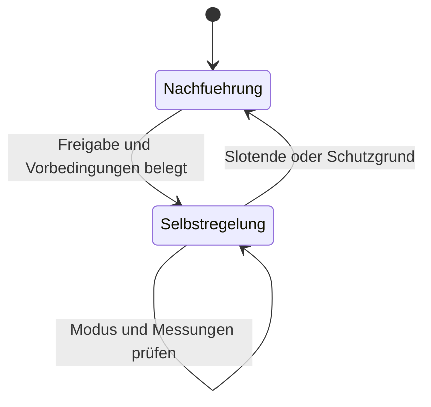

# Selbstregelung des Wechselrichters prüfen

Der normale `follow`-/`idle_follow`-Pfad führt Sollwerte im 10-Sekunden-Takt nach. Die Fähigkeit `native_charge_block_discharge_auto` übergibt die Regelung an den Wechselrichter: Laden bleibt gesperrt, spontane Last darf er selbst aus dem Speicher decken. Diese Fähigkeit folgt aus einem konkreten Modell-/Firmware-Nachweis.

## Aktueller Freigabestand im Code

Der native Katalog enthält einen Deye-Piloten: `deye / sun-30k-sg01hp3` mit **live erkannter** PR-978-Registerlage. Andere Deye-Modelle, ToU-only und andere Hersteller bleiben für diesen Modus gesperrt. Das ist eine eng begrenzte Pilotfreigabe; die vollständige Hardware-Abnahme wird dadurch nicht ersetzt.

Schreibfolgen: `inverter-control-routing.js` / `nativeSelfConsumption`. Der Nachweis muss exakt zu diesen Bytes passen (`certificateMatchesPlan`). Der Core überwacht weiter Reserve, Peak, Messfrische, Bestätigung, Anlagenpause und Slotende (`guards/nativemode.go`).

## Nachweis vor einer weiteren Freigabe

| Prüfung | Erfolgskriterium |
|---|---|
| Übergang hinein und zurück, auch nach Reboot | Schreibbytes, unabhängige Rücklesung und Latenz beider Richtungen aufzeichnen |
| Last zu-/abschalten | Reaktion jeweils innerhalb 2 Sekunden |
| PV-/Lastwechsel | Zusätzlicher Batterieexport höchstens 0,2 kW |
| Reserve und Leistung | Höchste gültige Untergrenze und Nennleistung einhalten |
| Ausfall | Veraltete/unbekannte Werte, Not-Aus, fehlende Freigabe, verlorene Antwort und Kommunikation verlassen den Modus sicher |
| Wirtschaftlicher Zweck | Lade-/Verkaufsslots nicht als Eigenregelung umdeuten |
| Watchdog | Mindestens 100 Zyklen unabhängig beobachten |
| Zustandsnachweis | Register muss Modi unterscheiden; sonst expliziter Verhaltensnachweis über mindestens 5 Minuten mit Lastwechsel |
| Anlage mit Netzladesperre | Sperre am vom Treiber benannten Register lesbar belegen |

Die Slot-PV-Kappe ist kein Teil der Batterieübergabe und darf deren Ende nicht überleben. Sie folgt ihrem eigenen regulären Schreib-/Schutzpfad.

## Adapterfolgen

Alle Zeilen außer dem benannten Deye-Piloten sind Prüfvorlagen, keine Hardwarefreigaben.

| Adapter | Hinein / zurück | Nachweis und Grenze |
|---|---|---|
| Deye Remote, PR-978 | `1100 ← 0`; zurück regulär `1101`, `1104`, `1105`, `1109`, zuletzt `1100 ← 1` | `1100 == 0`; `1121` nur Beobachtung. Netzladesperre: Program-1-Charging-Enum = Disabled |
| Deye ToU | Nicht unterstützt | Kein EEPROM-intensiver Moduswechsel für diese Funktion |
| Fronius, Modell 124 | `planStorage(0)` / `planStorage(kw)` | Entdecktes `StorCtl_Mod`; Netzladesperre `ChaGriSet`. Watchdog-Verhalten am Gerät offen |
| KOSTAL | Schreiben beenden / `1034` wieder schreiben | `1080 == 2` unterscheidet die Modi nicht. Batterie `582` muss Last folgen; kein geeigneter Netzladebeleg |
| KACO NH3 | `41104 ← 2` / `41104 ← 4` plus Grenzen | `41104 == 2`; kein belegter eigener Watchdog oder Netzladebeleg |
| Generischer Simulator | `41 ← 0`, `40 ← 0` / Sollwert + Freigabe; Fenster-Absichten (K4b) setzen vorher `43`/`44` (Lade-/Entladegrenze), E↓ löscht sie auf `0xFFFF` | Register 41/40 (+ 43/44); nur Softwarenachweis |

## Deye-Pilot: Voraussetzungen und Beobachtung

Vor der Übergabe müssen `0x0092` (ToU aktiv), `0x00A6` (Ziel-SoC höchstens effektive Reserveuntergrenze) und bei Netzladesperre `0x00AC` (Disabled) gelesen sein. Unbekannt verweigert den Übergang. Der erste Takt kann deshalb noch nachführen; erst nach gelesener Konfiguration ist die Übergabe möglich. An einer EEG-Anlage trägt der Readback dieses Lese-Takts `native_precondition.grid_charge_blocked` (aus `0x00AC`); `true` hält die Absicht bis zur Übergabe offen, `false` nimmt sie für den Slot zurück (`netzladen_am_geraet`).

Nach **einem** `1100 ← 0` folgen nur Lesungen. `mode: native` wird erst bei `1100 == 0` bestätigt; fehlender Netzladebeleg gilt nicht als Freigabe. Die Rücknahme verwendet ausschließlich den regulären Remote-Schreibplan, keine zweite Befehlsfolge.

1. Im Portal „Wechselrichter-Automatik“ und im Heartbeat `control.execution.mode == autonomous_discharge` prüfen.
2. Registerzustand, Ladestand, Lastantwort und Netzfluss zeitgleich beobachten. Keine weiteren Sollwertschreibungen während bestätigter Selbstregelung.
3. Slotende, Reserveboden plus Schutzmarge, Messlücke und verlorene Rücklesung müssen die begründete Rücknahme auslösen. Beide Übergangslatenzen protokollieren.
4. Reboot und 100 Watchdog-Zyklen gesondert prüfen; ein normaler Betriebstag liefert diese Nachweise nicht.

Offline-Belege: `deye-control.e2e.test.js`, `flows-sync.test.js` und native Go-Guard-Tests. Sie beweisen den Ablauf am Stub und die Sperren anderer Modelle, keine zusätzliche Live-Hardwareabnahme. [Deye-Referenz](DEYE.md) · [Allgemeiner Prüfstand](CONTROL-BENCH.md)
