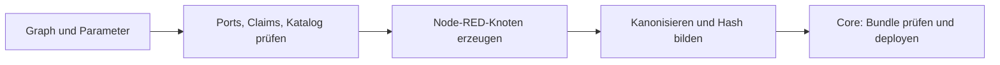

# Flow-Compiler

`compile()` übersetzt einen validierten [Flow-Graphen](../../../docs/contracts/v2/flow-graph.md) in ein [Node-RED-Artefakt](../../../docs/contracts/v2/flow-artifact.md). Läuft offline mit Node ≥ 18; Cloud-Aktivierung und Simulator verwenden dieselbe Bibliothek.



```js
// Vom Repository-Stamm aus:
const { compile, validate } = require('./edge-app/nodered/flowc/compile');
const artifact = compile(flowGraph, { compiledAt: new Date().toISOString() });
```

## Grenzen und Garantien

- Nur Katalogtypen aus `catalog.js`; Parameter und Runtime-Knoten werden geprüft. `vp.logic.function` ist ein begrenzter Funktionsknoten. `vp.modbus.*` ist die geregelte Register-/Transportausnahme. Deren Grenzen stehen im [Graphvertrag](../../../docs/contracts/v2/flow-graph.md#katalogausnahmen).
- Normale Entitätsaktionen publizieren Wünsche. Der Core arbitriert und begrenzt sie. Delegierte Strategien lassen den Cloud-Plan ausführen; generische Modbus-Schreibknoten müssen gesondert beurteilt werden.
- Gleicher Graph und gleiche Optionen ergeben identische Bytes und `content_hash`. `compiled_at` ist ohne Option eine feste Epoche; eine andere Aktivierungszeit ändert den Hash.
- SHA-256 über die RFC-8785-Kanonform; Go-Zwilling in `core/internal/flowdeploy/jcs.go`, gemeinsame Vektoren in `jcs-vectors.json`.
- Tab-/Knoten-IDs stammen aus Flow-ID und Version. `@vp-flow` markiert verwaltete Tabs; Reseed erhält sie und ersetzt die Vendor-Tabs.

## Auswertung und Validierung

Datenknoten reagieren auf Änderungen. Zeit-/Slot-Trigger können den letzten Wert erneut ausgeben, damit Wünsche ihre TTL erneuern. Bei mehreren Eingängen muss die Portidentität erhalten bleiben (`msg._vp_src`); `msg.topic` ist dafür kein zuverlässiger Ersatz. Datenfeeds verwenden freigegebene lokale Topics.

`validate()` prüft die compilerrelevanten Regeln V1–V5/V7/V8: Typen, Aritäten, Zyklen, Referenzen, Parameter, Claims, Trigger und Runtime-Whitelist. Plattformberechtigungen und Exklusivität **zwischen** Flows prüft die Cloud. Findings enthalten `{rule, nodes, edges, message}`.

```bash
node --test edge-app/nodered/flowc/
(cd edge-app/core && go test ./internal/flowdeploy/)
```

Hash-Pins und Cross-Language-Fixtures bewusst prüfen und einchecken. Tests dürfen fehlende Erwartungswerte nicht selbst erzeugen.
