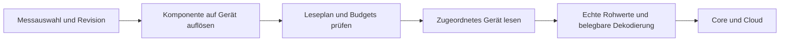

# Zusätzliche Messpunkte lesen

Dieser Runtime-Pfad liest ausgewählte Katalogpunkte zusätzlich zur Standardtelemetrie. Er besitzt keine Schreiboperation. Der Palette-Knoten `vp-measurements` verbindet Konfiguration, Gerätezuordnung, Scheduler und Lesetreiber.



## Lokale Topics

| Topic | Richtung | Retained |
|---|---|---|
| `edge/measurements/config` | Core → Runtime: vollständiger Leseplan | ja |
| `edge/measurements/config-status` | Runtime → Core: angenommene/abgelehnte Revision | ja |
| `edge/measurements/samples` | Runtime → Core: gelesene Proben | nein |

`edge/sources/config` und `edge/entities/+/config` werden zusätzlich gelesen. Ein neuer Plan ersetzt den aktiven erst nach vollständiger Validierung. Eine abgelehnte Revision lässt den vorherigen Plan weiterlaufen. Steueraufträge haben Vorrang vor Zusatzmessungen.

## Gerätezuordnung

| Auswahl | Leseziel |
|---|---|
| Kein `entity_id` oder Pin `inverter` | Primärer Wechselrichter |
| Pin einer gemeldeten Quelle | Verbindung dieser Quelle |
| Zusammengesetzter Typ ohne Pin | Primärer Wechselrichter als Kanalquelle |
| Nicht auflösbare Zuordnung | Ablehnen: `binding_unavailable` |

Die zusammengesetzten Typen `battery-hybrid`, `grid-meter`, `house-load` müssen mit Go `composedType` synchron bleiben. SunSpec benötigt eine eigene Modellerkennung **pro Ziel**. Verbindungen werden beim Lesen neu aufgelöst; eine inzwischen entfernte Quelle erzeugt eine Lücke, keinen Rückfall auf das Primärgerät. Änderungen an Quellen/Registry lösen eine erneute Prüfung aus.

OCPP-Messungen kommen vom Core; ihr Leseweg bleibt geräteweit. Jede Probe übernimmt eine explizite `entity_id` aus ihrer Auswahl, auch bei Modbus, HTTP und aufgefalteten Platzhaltern. Ohne eindeutige Bindung bleibt das Feld weg. Der lokale Batch trägt `applied_revision` vom tatsächlich aktiven Plan; ein Planwechsel während einer Lesung stempelt deren Ergebnis nicht um. Der Core sendet Herkunftsfelder unter Samples 2.1 und erhält alte Batches/Outbox-Umschläge. Der Cloud-Merge gleicher `point_key` bleibt vorerst bestehen; Details und Nachweise: [Box-Herkunft](../../../docs/agents/root/uems-measurement-samples-box-herkunft.md).

## Lastgrenzen und Datenqualität

- Warnung über 120 Proben/min; harte Grenzen: 600 Proben/min, 30 Geräteanfragen/min und 20 % geschätzte Busbelegung.
- Benachbarte Register in Blöcken von höchstens 120 Wörtern lesen; Grenzen bei Planannahme und im laufenden Zeitfenster prüfen.
- Keine Antwort: keine Probe. `raw` stammt aus tatsächlich gelesenen Wörtern/Feldern. Unbelegte Skalierung lässt `decoded` weg.
- SunSpec Model 160 verwendet die live ermittelte Modellbasis und Modulanzahl.

Der kanonische Katalog liegt unter [`catalog/measurement-points/dist`](../../../catalog/measurement-points/dist). `tools/package_edge_runtime.py` erzeugt daraus das lokale `catalog.json` und SQL-Metadaten; generierte Dateien nicht von Hand ändern. Neue SQL-Ausgaben dürfen keine bereits angewandte Migration überschreiben.

```bash
python3 catalog/measurement-points/tools/package_edge_runtime.py --check
node --test edge-app/nodered/measurements/*.test.js
```
