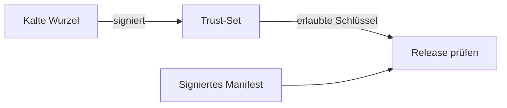

# Öffentliche OTA-Vertrauensdaten

| Datei | Inhalt |
|---|---|
| `trust-set.json` | Erlaubte öffentliche Release-Schlüssel |
| `trust-set.json.sig` | Signatur der kalten Wurzel über das Trust-Set |

Die Dateien sind öffentlich und versioniert. Private Schlüssel gehören nicht ins Repo. Der Release-Lauf verwendet sie zur Gegenprüfung des signierten Manifests.

Erzeugen und rotieren nach [OTA-Signierung](../../docs/ota-signing.md). Beide Dateien gemeinsam aktualisieren. Ein Commit verteilt noch keine neue Vertrauensbasis an bestehende Boxen: dort liegt das Set unter `/data/ota/` und wird über den vorgesehenen Einrichtungs-/Verteilweg übernommen. Der normale OTA-Downlink darf seine eigene Wurzel nicht austauschen.
