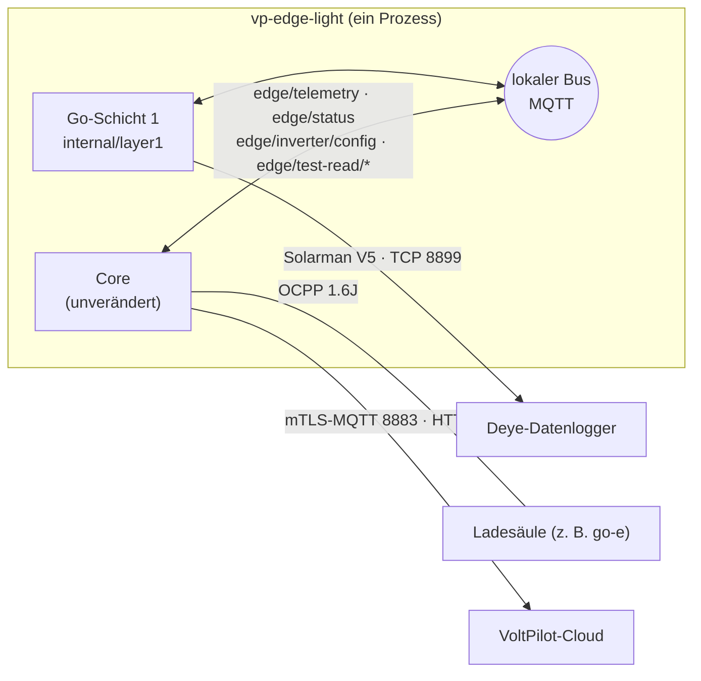

# Architektur

## Ein Programm statt drei Container

Die Docker-Box besteht heute aus drei Teilen:

| Teil | Sprache | Aufgabe |
|---|---|---|
| Core | Go | Kopplung, Cloud-Verbindung (mTLS-MQTT), Pufferung, Fahrplan, Schutzgrenzen, Arbitrierung, OCPP, lokale Web-App, interner MQTT-Bus |
| Schicht 1 | Node-RED | Geräte lesen und beschreiben (Deye, Fronius, SunSpec, KACO, KOSTAL, go-e …), Verbindungstests, Messwerte-Bibliothek, Kundenautomationen |
| Updater | Go | OTA über Docker-Images |

Edge Light ist **derselbe Core** plus eine **Schicht 1 in Go** in einem Prozess:

## Die tragende Regel: der lokale Bus ist der Vertrag

Die Go-Schicht 1 ist ein **Bus-Teilnehmer wie Node-RED**: Sie abonniert dieselben Topics (`edge/inverter/config` als retained Nachricht), beantwortet dieselben Anfragen (`edge/test-read/request`) und veröffentlicht dieselben Nachrichten (`edge/telemetry`, `edge/status`). Der Core weiß nicht, welche Schicht 1 mit ihm spricht.

Daraus folgt alles Weitere:

- **Der Core bleibt unverändert.** Jede Schutzregel, jeder Vertrag, jede Prüfung gilt auf Edge Light genauso. Die einzige Änderung am Core war, den Programmstart in `internal/edgemain` auszulagern, damit beide Programme denselben Rahmen nutzen.
- **Migration Funktion für Funktion.** Jede Node-RED-Funktion bekommt einen Go-Zwilling hinter demselben Topic. Was portiert ist, steht in der [Paritätsliste](paritaet.md).
- **Die Docker-Box kann später dieselben Go-Bausteine nutzen.** Läuft eine Funktion in Go zuverlässig, kann sie auch auf der Docker-Box Node-RED ablösen. Ob Node-RED dort ganz entfällt, ist offen: beide Edge-Arten bestehen vorerst nebeneinander ([Paritätsliste](paritaet.md)).

Die Go-Schicht 1 verbindet sich über MQTT auf `127.0.0.1` mit dem Bus, nicht über einen internen Funktionsaufruf. Damit kommen retained Nachrichten exakt so an wie bei Node-RED, und die Schicht könnte auch als eigener Prozess laufen.

## Node-RED bleibt Quelle der Wahrheit, bis eine Funktion umgezogen ist

Jeder Go-Zwilling ist an **gemeinsame Testvektoren** gebunden, die aus dem JavaScript-Modul **erzeugt** werden (das Muster von `goe-control-vectors.json`):

| Vektoren | Erzeuger | Prüfen |
|---|---|---|
| `nodered/deye/solarman-v5-vectors.json` | `solarman-v5-vectors.gen.js` | JS: `solarman-v5-vectors.test.js` · Go: `internal/solarmanv5` |
| `nodered/deye/deye-decode-vectors.json` | `deye-decode-vectors.gen.js` | JS: `deye-decode-vectors.test.js` · Go: `internal/deyedecode` |
| `nodered/goe/goe-api-vectors.json` | `goe-api-vectors.gen.js` | JS: `goe-api-vectors.test.js` · Go: `internal/goeapi` |

Wer das JS-Modul ändert, muss die Vektoren neu erzeugen (sonst ist der JS-Test rot) – und der Go-Test zeigt dann, ob der Zwilling nachziehen muss. Die Go-Seite rechnet dabei **JavaScript-treu**: gleiche Reihenfolge der Gleitkommaoperationen und `Math.round` („halb nach +∞") statt Gos `math.Round`. Sonst würde ein Grenzwert auf der Box anders gerundet als in Node-RED. Fünf eingebaute Abweichungen beim Deye (falsche Skala, vertauschte Wortreihenfolge, fehlende Klemmung …) und sieben bei der go-e (Phase statt Summe, fehlende Klemmung, Text als Zahl, erfundene 0, v1-Skala, unbekannter Fahrzeugzustand, `1e400` verwirft die Antwort) wurden von den Vektoren erkannt. Die go-e-Seite liest JSON dafür wie `JSON.parse`: eine Zahl außerhalb von float64 wird „unendlich" und damit kein Messwert, statt die ganze Antwort zu verwerfen.

## Ein Logger, ein Client

Deye-/Solarman-Logger bedienen nur **eine** TCP-Verbindung. Abfrage und Verbindungstest teilen sich deshalb eine **Spur je Logger-Adresse** (`layer1/runtime.go`, `lanes`): Eine Abfrage, die die Spur belegt vorfindet, überspringt den Takt („Logger belegt"); ein Verbindungstest wartet bis zu 4 Sekunden. Der Integrationstest prüft mit einem Logger-Simulator, der zweite Verbindungen abweist, dass das nie passiert.

## Verhalten wie Node-RED – bewusst

| Node-RED | Go-Schicht 1 |
|---|---|
| Abfrage nach 3 s, dann alle 5 s | gleich (`DefaultFirstPoll`, `DefaultPoll`) |
| `trigger` „15 s ohne Messwert → down" | gleich: `inverter_link=down` einmal, 15 s nach der letzten Messung |
| Router-Gründe („keine IP-Adresse", „Datenlogger-Seriennummer fehlt" …) | wörtlich gleich, im Protokoll statt im Knotenstatus |
| SoC-Regeln: `no_answer` / `out_of_range` verwerfen, `missing` nur mit Opt-in, BMS-SoC ohne Opt-in | identisch (gemeinsame Vektoren) |
| Verbindungstest: `unreachable` / `no_answer` / `invalid_response` / `implausible` mit Befund | identisch, ohne Opt-in (der Test sagt immer die Wahrheit) |

**Eine bewusste Abweichung:** Die Go-Schicht 1 gibt die BMS-Kanäle (`bms_*`) und die Herkunft des Ladestands (`soc_source`) auf dem lokalen Bus weiter. Der Core liest `bms_*` ausdrücklich aus `edge/telemetry` – auf der Docker-Box filtert der Node-RED-Knoten `vp-telemetrie` diese Felder heraus, sodass sie den Core dort nie erreichen. Das ist ein bestehender Fehler der Docker-Box, kein Merkmal, das Edge Light nachbilden sollte.

## Was nicht portiert ist, wird benannt

Eine Auswahl, die Edge Light noch nicht lesen kann, lässt die Schicht untätig und schreibt einen Grund ins Protokoll; der Core zeigt dann „keine aktuellen Daten" wie bei einem stummen Gerät. Ein Verbindungstest dafür antwortet sofort mit `invalid_request` und einem Satz, statt nach 10 Sekunden in eine Zeitüberschreitung zu laufen.
