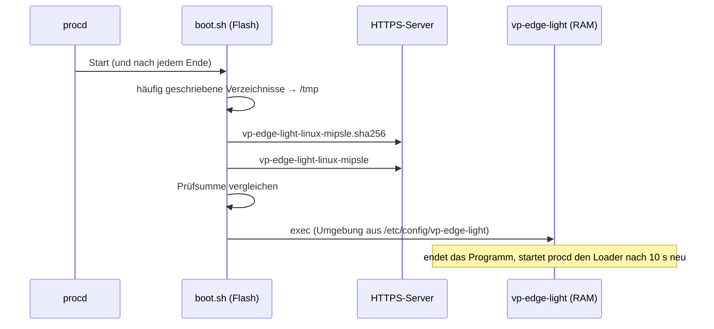
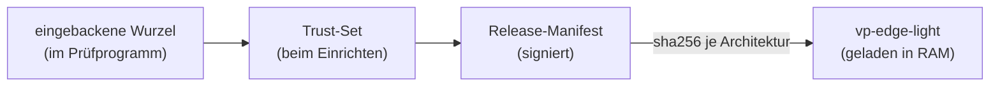

# Start aus dem RAM und Updates

## Stufe 1 (heute, Pilot)

- **Im Flash** liegen nur der Loader (~4 KB), der Dienst und die Konfiguration, dazu der dauerhafte Zustand der Box (Identität, Zertifikat, Auswahl, Freigaben, OCPP-Befehlsbuch).
- **Im RAM** liegen das Programm (~14 MB) und die häufig geschriebenen Verzeichnisse.
- Schlägt der Download fehl, versucht der Loader es mit Pausen (5 / 15 / 30 / 60 s). Liegt aus einem früheren Start noch eine Fassung im RAM (Neustart des Dienstes ohne Neustart des Geräts), wird sie weiterverwendet. Nach einem Neustart des Geräts ohne Internet startet die Box erst, wenn der Server wieder erreichbar ist. **Das ist die bewusste Kehrseite des RAM-Starts** und der Grund, warum der Download-Server hochverfügbar sein muss.
- **Grenze von Stufe 1:** Die Prüfsumme kommt vom selben Server wie das Programm. Sie schützt gegen abgebrochene Downloads, nicht gegen einen kompromittierten Server. Die Echtheit hängt allein an HTTPS.

## Stufe 2: signierte Kette wie bei der Docker-Box

Ziel: Edge Light vertraut einem Programm aus dem Netz nur, wenn es mit derselben Kette signiert ist wie die Releases der Docker-Box ([`docs/ota-signing.md`](../../docs/ota-signing.md)): kalte Wurzel → Trust-Set → Release-Manifest.

Bausteine:

1. **Kleines Prüfprogramm `vp-light-boot` im Flash** (Go, nur `internal/otaverify` + SHA-256, ~2 MB statt der ~14 MB des ganzen Programms). Es ersetzt die Prüfsummen-Prüfung in `boot.sh`: Manifest und Signatur laden, gegen die **eingebackene Wurzel** prüfen (exakt die Funktion, die Gerät und Werkzeug `vp-ota` schon teilen), Anti-Rollback-Boden prüfen, dann den SHA-256 des Programms mit dem Manifest vergleichen und erst dann starten. Es ändert sich selten und wird wie heute das Trust-Set beim Einrichten aufgespielt.
2. **Additive Vertragserweiterung** in `docs/contracts/ota-release-manifest.schema.json`: Das Feld `artifacts` ist ausdrücklich für weitere Typen vorgesehen. Neu: `{"type": "binary", "name": "vp-edge-light", "arch": "linux/mipsle", "sha256": "…", "size": …}` und `compat.backends: ["light"]`. Ein Docker-Gerät ignoriert Artefakte seines Backends nicht, die es nicht kennt – das muss der Vertragstest beweisen, bevor die Erweiterung gemergt wird.
3. **Verteilung:** Der Release-Lauf (`edge-images.yaml`) baut zusätzlich die drei Programme, signiert sie im selben Manifest und legt sie ab. Wo, ist zu entscheiden: als Forgejo-Release-Anhang (braucht ein Token auf dem Gerät – ungünstig) oder über eine Portal-Route, die die Dateien unauthentifiziert ausliefert (wie heute schon das Trust-Set). Da Echtheit über die Signatur entsteht, darf der Transport offen sein.
4. **Updates:** Der Core empfängt Zuweisungen bereits über `ems/…/v2/update` und schreibt `target.json`. Auf Edge Light lädt `vp-light-boot` beim nächsten Start die zugewiesene Fassung statt `latest`; der Core beendet sich nach einer neuen Zuweisung kontrolliert, procd startet neu. Kein Docker, keine Images, kein Updater-Container.
5. **Rückfall:** Startet die neue Fassung nicht sauber (Selbsttest des Cores, wie bei der Docker-Box), lädt `vp-light-boot` beim nächsten Versuch die zuletzt bestätigte Fassung (`current.json` im Flash). Der Selbsttest selbst existiert im Core schon (synthetischer Steuer-Trockenlauf).

## Offene Entscheidungen für Stufe 2

| Frage | Vorschlag |
|---|---|
| Wo liegen die Programme? | Portal-Route, unauthentifiziert, nur signierte Artefakte |
| Kommt `vp-light-boot` per OTA? | Nein – wie das Trust-Set beim Einrichten (es ist die Vertrauenswurzel des Geräts) |
| Was, wenn nach einem Stromausfall kein Internet da ist? | Die letzte bestätigte Fassung **komprimiert** im Flash halten: gemessen 4,4 MB (gzip) bei 9,4 MB freiem Flash auf Original-OpenWrt 25.12 – passt ([mango.md](mango.md)) |
