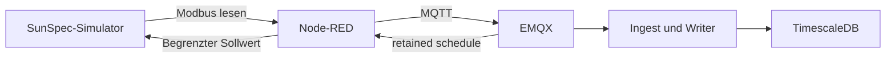

# Lokaler Node-RED-/SunSpec-Testpfad

Dieser Ordner enthält die simulierte Edge des lokalen Compose-Profils `edge`. Die ausgelieferte Kunden-Box mit Go-Core, mTLS, Geräteadaptern und OTA steht unter [edge-app](../../edge-app/README.md).



## Starten

Vom Repository-Stamm; `.env` einmal aus `.env.example` anlegen:

```bash
docker compose --profile edge up -d --build
# Editor: http://localhost:1880; Simulator: localhost:15020
docker compose logs -f edge-sim edge-nodered
```

Nur die Simulator-/Node-RED-Dienste starten: `docker compose --profile edge up -d --build edge-sim edge-nodered emqx`. Für Daten im Portal werden zusätzlich Ingest, Writer und Datenbank benötigt. [Lokale Entwicklung](../../docs/development.md)

## Fünf Flows

| Flow | Aufgabe |
|---|---|
| Acquisition | Register 0–8 alle 2 Sekunden lesen und skalieren |
| Publish | v1-Telemetrie mit Demo-Identität, QoS 1, plus Status |
| Schedule-Exec | Aktuellen Slot des retained Fahrplans ausführen |
| Default-Watchdog | Ohne frischen Plan einfacher Eigenverbrauch: Batterie folgt PV minus Last |
| Guards | Leistung, SoC und beobachtete Netzgrenze vor Schreibzugriff begrenzen |

Der Frischezeitraum des Plans beträgt 20 Minuten. Batterie: positiv Laden, negativ Entladen. Simulatorregister 40 trägt den Batteriesollwert; Register 42 die optionale PV-Kappe, `0xFFFF` hebt sie auf. Ein abgelaufener Plan hebt die PV-Kappe dieses Testpfads auf.

Registerkarte: [`sunspec-sim.js`](../sim/sunspec-sim.js). Payloads: [Telemetrie-Schema](../../docs/contracts/mqtt-telemetry.schema.json), [Fahrplan-Schema](../../docs/contracts/mqtt-schedule.schema.json), [Fixtures](../../docs/contracts/examples/README.md). Datumswerte aus Fixtures vor einem zeitabhängigen Live-Test aktualisieren.

Der Simulator belegt Ablauf und Skalierung dieser Testkarte, keine Hersteller-Hardwarefreigabe. [Nachweis bis TimescaleDB](../../tools/edge-simulator/proof/README.md)
