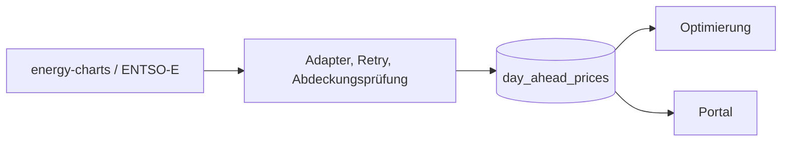

# Marktdaten

Lädt Day-Ahead-Preise und ergänzende Marktwerte hinter Provider-Adaptern. Standard für Preise ist `energy-charts` ohne Token; ENTSO-E bleibt über `--source entsoe` mit `ENTSOE_SECURITY_TOKEN` verfügbar.



## Start und Tests

```bash
python -m venv .venv
source .venv/bin/activate
pip install -e '.[dev]'
python -m voltpilot_market_data --help
python -m voltpilot_market_data fetch --zone DE-LU
pytest
```

`fetch` holt Preise; `--persist` schreibt in die konfigurierte Datenbank. `serve --persist` aktualisiert periodisch. Ohne Tagesangabe zielt `fetch` auf den nächsten Liefertag. Ein noch nicht veröffentlichter Folgetag ist kein erfundener Nullpreis.

## Daten und Konfiguration

| Thema | Maßgebliche Quelle |
|---|---|
| Quelle, Zone und CLI | `voltpilot_market_data/cli.py` |
| Vollständigkeit und Wiederholung | `refresh.py`, `resilience.py` |
| Liefertag, Zeitzone und Speicherung | `service.py`, `persistence.py` |
| Marktwerte und Solarerzeugung | `market_value_service.py`, `netztransparenz*.py`, `solar_generation.py` |

Die Dateinamen beziehen sich auf `voltpilot_market_data/`. Liefertage und Sommerzeit nicht mit pauschal 24 Stunden gleichsetzen. API/Flyway, Service-Migrationen und Bootstrap müssen kompatibel bleiben.

Compose-Profil: `feeds`. [Betriebsvertrag und Metriken](../../docs/k8s-readiness.md), [Optimierung](../optimization/README.md).
