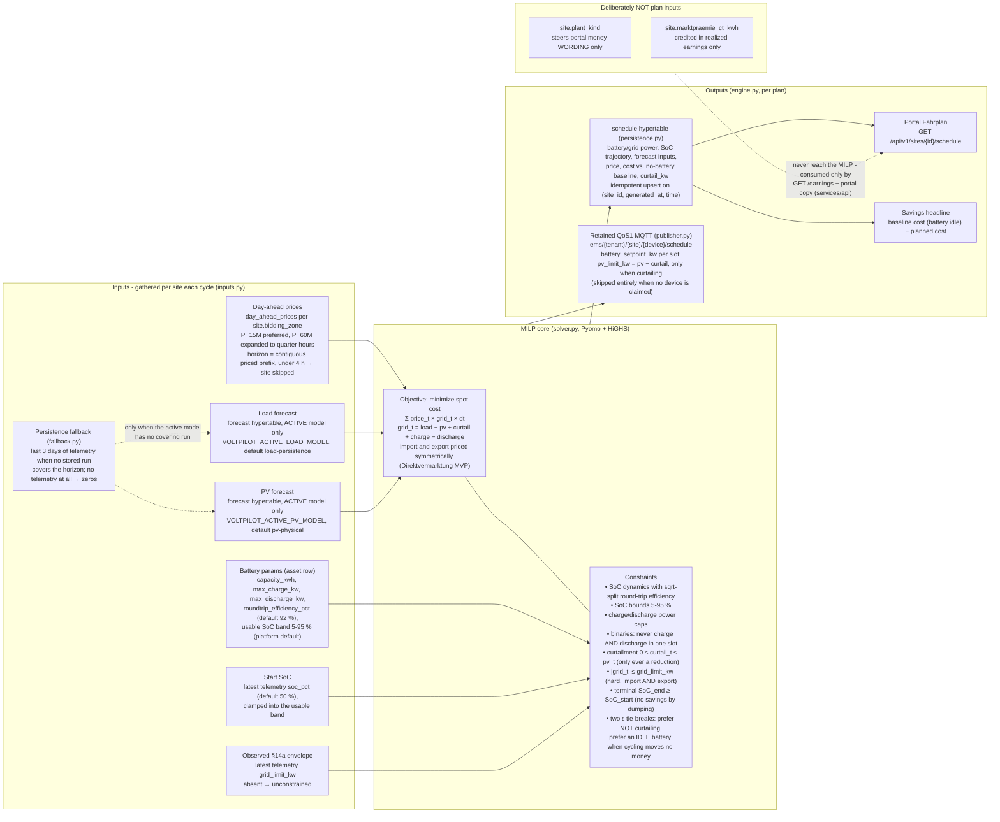

# services/optimization - Optimization Engine

**Language:** Python 3.10+ (Pyomo + HiGHS)
**State:** stateless (job)
**Responsibility (architecture section 8/11):** MILP/MPC-Fahrplan (HiGHS).

The heart of the system: a deterministic battery-dispatch MILP in MPC style (rolling 24h horizon, 15-min slots) that minimizes net energy cost subject to SoC limits, charge/discharge power, round-trip efficiency and the **observed §14a limit as a hard cap**.
**Predict-then-optimize:** forecasting is a separate layer (`services/forecast`) - the optimizer consumes plain price/forecast series, so learned forecast models slot in later without touching it. No ML in here, ever.

## How the optimizer thinks (all influences at a glance)

Everything that drives a dispatch plan, and everything a plan drives.
Every box below is verified against the current code; the file names in parentheses are where each piece lives.



Two influences people keep asking about are **deliberately absent** from the plan:
`site.plant_kind` (Direktvermarktung vs. Eigenverbrauch) only changes how the portal *words* the money, and `site.marktpraemie_ct_kwh` only enters the *realized-earnings* math in `services/api` (`EarningsRepository`).
Neither is read by `inputs.py`, so neither can change a single setpoint.
Under the symmetric-spot-price MVP assumption the cost-minimal dispatch is the same for both plant kinds, which is why the model does not need to know.

An infeasible §14a cap (the envelope is tighter than the site's residual load even with full battery support) does not kill the cycle: the engine retries without the grid constraint (`optimize_ignoring_grid_limit` in `solver.py`) - the physical limit is enforced by the grid operator and the edge guards regardless, and an advisory plan beats none.

### What happens when (plain language)

| Situation | What the plan does | Why |
|---|---|---|
| Cheap hours ahead of expensive ones | Charge (up to `max_charge_kw`, up to the 95 % SoC bound) | Buying low and discharging high beats importing at the high price - as long as the spread survives the round-trip loss. |
| Expensive hours | Discharge into load or export (up to `max_discharge_kw`, down to 5 % SoC) | Every discharged kWh replaces an import or earns export revenue at the same spot price. |
| Price spread below the round-trip losses | Battery stays idle | The efficiency terms eat the margin; the wear tie-break settles the exact tie toward idle. |
| Negative prices, surplus PV, battery full (or not worth storing) | Curtail PV feed-in; the published slot carries `pv_limit_kw` as an inverter cap | Feeding in costs money at a negative price. There is NO hard-coded price condition - under symmetric pricing the economics curtail exactly in the negative slots and never at positive prices. |
| Negative prices, battery has headroom | May charge - even from the grid, even paying round-trip losses | You are PAID to consume; paid import that covers the round-trip loss is genuinely profitable under symmetric spot pricing. Not a bug (the solver tests pin this). |
| §14a `grid_limit_kw` observed in telemetry | Every slot's net import AND export clamped to the envelope | Hard constraint in the model; the edge guards re-clamp on execution anyway. |
| §14a cap infeasible | Replan without the grid constraint, plan still ships | Advisory plan beats none; the physical limit is enforced by the grid operator + edge guards regardless. |
| Flat price curve | Battery idle, zero savings | Terminal condition `SoC_end ≥ SoC_start` plus the tie-breaks make idle the exact optimum. |
| Fewer than 4 h of priced slots (16 slots) | Site skipped this cycle | Prices are the binding input; the site is retried next cycle once the market-data collector caught up. |
| Active forecast model has no run covering the horizon | Persistence fallback over the last 3 days of telemetry | Never fails: with no telemetry at all it degrades to zeros, i.e. a pure price-arbitrage plan. |
| Battery asset not claimed to a device | Plan persisted, nothing published | There is no schedule topic without a device; the portal still shows the Fahrplan. |

### Known gap: grid charging is unconstrained (EEG plants)

> **⚠️ The model currently has NO constraint against charging the battery from the grid.**
> `charge_t` is bounded only by the power cap, the SoC band and the charge/discharge exclusivity - nothing ties it to PV surplus.
> With a big enough intra-day spread (high price × round-trip efficiency > low price) the optimizer WILL import cheap and export dear, for EVERY site - that is exactly what maximizes savings under symmetric spot pricing.
>
> For EEG-funded plants this violates the **Ausschließlichkeitsprinzip**: an EEG plant's storage must not be charged from the grid ("kein Graustrom" in the battery), or the plant risks its EEG remuneration.
> The planned follow-up (pending the captain's design discussion, deliberately NOT built yet) is a per-site grid-charging switch: EEG mode adds one extra constraint, `charge_t ≤ PV surplus`, everything else stays identical.

## What one cycle does (per site with a battery asset)

1. **Gather** (`inputs.py`): battery params from `asset` (+ `site.bidding_zone`), day-ahead prices from `day_ahead_prices` (written by `services/market-data`), load/PV forecasts from the `forecast` hypertable - reading ONLY the ACTIVE model's rows (`VOLTPILOT_ACTIVE_LOAD_MODEL`/`VOLTPILOT_ACTIVE_PV_MODEL`, defaults = the baselines; shadow challengers never reach a plan - see `docs/forecasting.md`) and falling back to the persistence baseline over recent telemetry when no stored run covers the horizon (REUSING `voltpilot_forecast`, see `fallback.py`), current SoC + observed `grid_limit_kw` from latest telemetry.
2. **Solve** (`solver.py`): cost minimization at the day-ahead spot price (symmetric for import/export - the Direktvermarktung MVP assumption). Binaries exclude the simultaneous-charge-discharge artifact (an LP would burn energy through the round trip at NEGATIVE prices, which DE-LU regularly has). Terminal condition `soc_end >= soc_start` so a plan cannot "earn" savings by dumping the battery. **PV curtailment is a decision variable** (`0 <= curtail_t <= pv_t` - only ever a reduction of feed-in): with a full battery at negative prices the plan discards surplus instead of paying to export; no price condition is hard-coded - the economics curtail exactly when feeding in would cost money (see the module docstring, incl. the two epsilon tie-breaks that keep degenerate optima deterministic and the battery idle when cycling moves no money). An infeasible §14a cap degrades to a plan without the grid constraint (the physical limit is enforced by the grid operator + edge guards regardless); a tight EXPORT cap that used to be infeasible now resolves via minimal curtailment.
3. **Persist** (`persistence.py`): the full plan - battery/grid power, SoC trajectory, forecast inputs used, projected cost vs. the no-battery baseline per slot, planned `curtail_kw` - upserted idempotently into the `schedule` hypertable (schema owned by the api migrations `V20260701020000` + `V20260706040000`, RLS-scoped for the portal read). This is the ML groundwork: plan-vs-actual against `telemetry` is a plain join.
4. **Publish** (`publisher.py`): retained QoS1 to `ems/{tenant}/{site}/{device}/schedule` per the **frozen contract** [`docs/contracts/mqtt-schedule.schema.json`](../../docs/contracts/mqtt-schedule.schema.json); curtailing slots additionally carry the OPTIONAL `pv_limit_kw` inverter cap (= `pv - curtail`, omitted when not curtailing - an additive contract extension, `schema_version` stays 1.0). The headline number - projected EUR savings vs. leaving the battery idle - is what the portal shows.

## Run / build / test

```bash
python -m venv .venv && source .venv/bin/activate
pip install -e '.[dev,solver]' -e ../forecast   # forecast = the fallback baseline (path dep)
pytest                                          # solver behavior + contract + engine tests
python -m voltpilot_optimization plan           # one cycle (needs [db]+[mqtt] extras + a live stack)
python -m voltpilot_optimization serve          # cycle on startup, then every 15 min
```

`highspy` (HiGHS) lives in the optional `solver` extra because its wheel isn't available on every platform; solver-dependent tests skip without it. `db` (psycopg) and `mqtt` (paho) extras gate the live-stack I/O the same way.

Config via env (same names as the sibling collectors): `POSTGRES_HOST/PORT/DB/USER/PASSWORD` (the trusted backend role - the optimizer reads assets/prices/forecasts across tenants and stamps each plan row's tenant, like the weather collector), `MQTT_HOST/PORT` (+ optional `MQTT_USERNAME/PASSWORD`), `OPTIMIZER_INTERVAL_SECONDS` (default 900), `OPTIMIZER_HORIZON_HOURS` (default 24), `VOLTPILOT_ACTIVE_LOAD_MODEL`/`VOLTPILOT_ACTIVE_PV_MODEL` (which forecast model to consume; keep in sync with the forecast collector).

In compose the service runs under the **`optimize` profile** (`docker compose --profile optimize up -d --build optimizer`); its Docker build context is the **repo root** (it installs `services/forecast` alongside - see the Dockerfile header).

## Status

**Built:** the full loop above, verified by offline tests (economic behavior on synthetic curves, constraint compliance, contract conformance, engine orchestration). **Future work:** the per-site EEG grid-charging switch (see the known-gap callout above), peak-shaving / capacity tariffs, multi-battery sites, dynamic supplier tariffs, feed-in spreads, plan-vs-actual KPIs from the persisted schedules.
