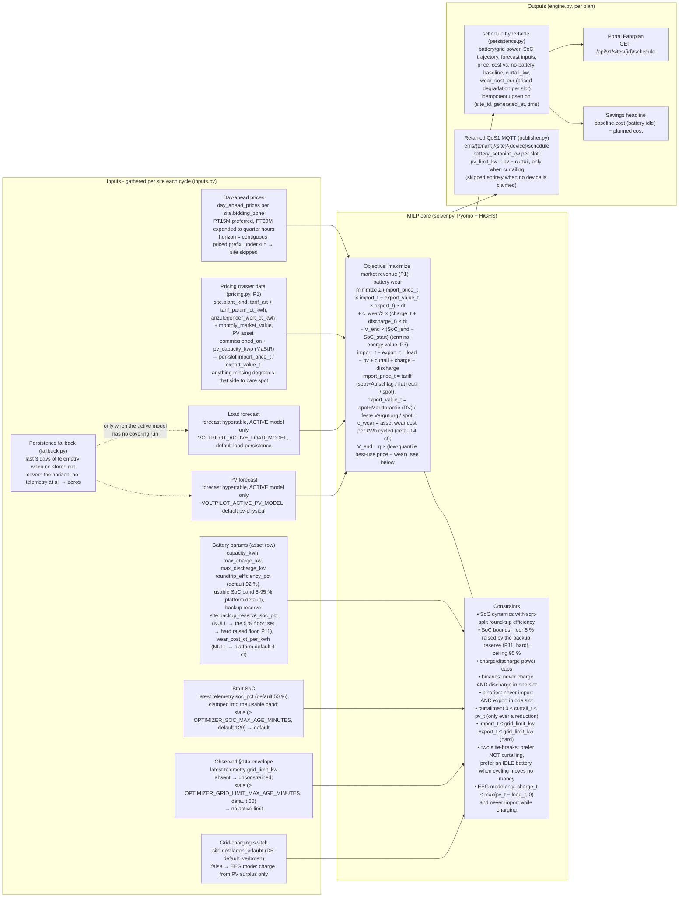

# services/optimization - Optimization Engine

**Language:** Python 3.10+ (Pyomo + HiGHS)
**State:** stateless (job)
**Responsibility (architecture section 8/11):** MILP/MPC-Fahrplan (HiGHS).

The heart of the system: a deterministic battery-dispatch MILP in MPC style (rolling 24h horizon, 15-min slots) that **maximizes what the site earns at the electricity market** - import priced at the site's real supply tariff, export at its real remuneration (spot + Marktprämie for Direktvermarktung, feste EEG-Einspeisevergütung for eigenverbrauch plants) - subject to SoC limits, charge/discharge power, round-trip efficiency, priced battery wear and the **observed §14a limit as a hard cap**.
**Predict-then-optimize:** forecasting is a separate layer (`services/forecast`) - the optimizer consumes plain price/forecast series, so learned forecast models slot in later without touching it. No ML in here, ever.

## How the optimizer thinks (all influences at a glance)

Everything that drives a dispatch plan, and everything a plan drives.
Every box below is verified against the current code; the file names in parentheses are where each piece lives.



**The P1 market-revenue objective (Stage 2 of the optimizer redesign)** replaced the old symmetric bare-spot model (critique finding F1: economically wrong for nearly every real DACH prosumer - the plan optimized a tariff almost no customer has). The optimizer now reads the same pricing master data `EarningsRepository` reports with (`site.plant_kind`, `tarif_art`/`tarif_param_ct_kwh`, `anzulegender_wert_ct_kwh` + `monthly_market_value`, the PV asset's MaStR `commissioned_on`/`pv_capacity_kwp`) and prices each slot asymmetrically (`voltpilot_optimization/pricing.py`):

- **Import** at the supply tariff: `dynamisch` = spot + Aufschlag, `fest` = the flat retail price, `ohne` = bare spot (a spot-settled load has no retail premium to protect - target report §2.3).
- **Export** at the remuneration: Direktvermarktung = spot + dynamic Marktprämie (`max(anzulegender_wert − Monatsmarktwert, 0)`, suspended in negative-price slots - byte-for-byte the EarningsRepository rule); eigenverbrauch = the feste EEG-Einspeisevergütung from the commissioning date + kWp (config-driven schedule in `config.py`, incl. the EEG-2023 degression steps, tranche-blended rates, 20-year expiry and the §51a Solarspitzengesetz negative-price suspension for plants commissioned ≥ 2025-02-25); anything else = spot.
- **EEG remuneration enters the objective only in EEG mode** (`netzladen_erlaubt = false`): the constraint pair makes the battery content provably solar there. A merchant (grid-charging) site exports at bare spot - crediting the Marktprämie on grid-charged energy would be an objective money pump AND illegal (Ausschließlichkeitsprinzip); the inconsistent config is flagged in the logs.
- **Every missing datum degrades that side to bare spot** (logged, never a skipped site, never an invented price) - so an unconfigured site behaves exactly like the pre-P1 optimizer, and the worst rollout case is "no regression".

This is what makes the dispatch genuinely market-revenue-maximizing: energy routes to whichever flow (self-consume, store, export) earns most per slot - including the reference scenario "midday: PV into the battery while the load imports cheap grid power; evening: discharge into the expensive hours" (target report §2.2, pinned by `tests/test_objective.py`). There is no hard-coded self-consumption preference anywhere; where self-consumption wins (retail-billed load), it wins on price.

An infeasible §14a cap (the envelope is tighter than the site's residual load even with full battery support) does not kill the cycle: the engine retries without the grid constraint (`optimize_ignoring_grid_limit` in `solver.py`) - the physical limit is enforced by the grid operator and the edge guards regardless, and an advisory plan beats none.

**The P3 terminal energy value (Stage 3)** replaced the old hard terminal floor `SoC_end ≥ SoC_start`, which froze an EEG battery on every low-PV day (critique F3: no PV surplus → nothing may charge → nothing was ALLOWED to discharge - a full battery idled through a 250 EUR/MWh evening, and through whole German winters) and forced merchant plans into uneconomic end-of-horizon buy-backs. The objective now credits `V_end × (SoC_end − SoC_start)`: stored energy left at the horizon end is worth money, so the plan discharges whenever a slot genuinely beats that value and holds otherwise. `V_end` = `η × (P_q − wear)` per stored kWh, floored at 0, where `P_q` is a conservative low quantile (default the 30th percentile, `OPTIMIZER_TERMINAL_VALUE_QUANTILE`) of the horizon's own per-slot best-use price `max(import_price_t, export_value_t)` - deliberately below the median (the estimate must stay under typical in-horizon discharge opportunities, or the plan defers real value to "tomorrow") and above trough prices (or the plan dumps at the tail). Because the same η/wear terms price the in-horizon discharge, "discharge at exactly `P_q`" is an exact tie broken toward holding - a flat curve still plans an idle battery with zero savings. `OPTIMIZER_TERMINAL_VALUE_CT_PER_KWH` pins a fixed platform value instead. Note the plan may now realize energy stored BEFORE the horizon (that IS the F3 fix); the realized-earnings engine remains the honest money number.

**The P11 backup-reserve floor** (`site.backup_reserve_soc_pct`, nullable, api migration `V20260710010000`): a customer-configured minimum SoC the plan NEVER discharges below - a hard constraint (`BatteryParams.soc_floor_kwh`), never a soft preference, distinct from the soft V_end (the Deye-Copilot scout documented that product silently draining below its configured min-SoC). NULL = the 5% technical floor unchanged; a battery currently below its reserve relaxes the floor to the actual start (feasibility - it may not discharge further, and the rolling MPC re-plan ratchets the floor back up as it recovers); a reserve above the 95% ceiling pins the battery at the ceiling instead of going infeasible. The portal/admin UI for editing the column is follow-up work.

### What happens when (plain language)

| Situation | What the plan does | Why |
|---|---|---|
| Cheap hours ahead of expensive ones | Charge (up to `max_charge_kw`, up to the 95 % SoC bound) | Buying low and discharging high beats importing at the high price - as long as the spread survives the round-trip loss. Cheap/expensive are measured at the site's REAL prices: a flat retail tariff has no spread at all, so spot arbitrage alone never grid-charges it (F7). |
| Expensive hours | Discharge into load or export (up to `max_discharge_kw`, down to the SoC floor) | Every discharged kWh goes to whichever flow earns more THAT slot: avoided import at the tariff, or export at the remuneration - a per-slot comparison, not a self-consumption rule. |
| Full battery, cloudy 24 h ahead, expensive evening (EEG site) | Discharges the stored energy into the peak | The F3 fix (P3): the old `SoC_end ≥ SoC_start` floor froze exactly this battery all winter. Stored energy now carries a terminal VALUE; a peak above it discharges, a trough below it holds. |
| Prices decline into a cheap end-of-horizon tail | Stored energy is HELD, not dumped | The terminal value (anchored on the horizon's typical prices) beats realizing a trivial gain at the tail - no dump-to-earn. |
| Customer configured a backup reserve (`site.backup_reserve_soc_pct`) | No slot ever schedules SoC below it | A HARD floor (P11), regardless of prices or terminal value. A battery currently below its reserve never discharges further and recovers via normal economics. |
| Cheap midday spot + abundant PV before an expensive evening | May charge BEYOND the PV surplus: PV feeds the battery while the load imports cheap grid power (merchant sites) | The captain's reference scenario (target §2.2): under asymmetric pricing the two routings are no longer indistinguishable, and the decoupled one wins whenever the evening value clears the cheap import + losses + wear. |
| Price spread below the round-trip losses | Battery stays idle | The efficiency terms eat the margin; the ε tie-break settles the exact tie toward idle. |
| Price spread beats the losses but not the **wear cost** | Battery stays idle | Degradation is PRICED (P2): every kWh cycled costs `wear_cost_ct_per_kwh` (per-asset `asset.wear_cost_ct_per_kwh`, NULL → `OPTIMIZER_WEAR_COST_CT_PER_KWH`, default 4 ct ≈ 250 €/kWh replacement / 6,000 cycles). A cycle needs `eta² × p_discharge − p_charge` > ~38 EUR/MWh at the default - no more ~3 cycles/day chasing sub-cent spreads. The spent wear lands per slot in `schedule.wear_cost_eur`. |
| Stale telemetry (`grid_limit_kw` older than 60 min / `soc_pct` older than 120 min, both env-tunable) | Limit treated as ABSENT / SoC falls back to the 50 % default, discard logged | A §14a dimming event is temporary and re-asserts itself in live telemetry - one old reading must never become a standing cap on every future plan (it once forced 67 % PV curtailment at positive prices); a battery that stopped reporting must not plan from yesterday's SoC. |
| Negative prices, surplus PV, battery full (or not worth storing) | Curtail PV feed-in EXACTLY when the export VALUE is negative; the published slot carries `pv_limit_kw` as an inverter cap | No hard-coded price condition: a DV plant curtails at negative spot (premium suspended, export value = spot < 0); a pre-Solarspitzengesetz feste-Vergütung plant NEVER curtails (its export value stays ~8 ct regardless of spot - F6 fixed); a post-2025-02-25 plant earns 0 there and the tie-break keeps it feeding in. |
| Negative prices, battery has headroom | May charge - with `netzladen_erlaubt` even from the grid, even paying round-trip losses | You are PAID to consume when the site's import price is genuinely negative (spot-settled). A retail-billed site's import price stays positive at negative spot (spot + Aufschlag / flat), so it no longer sees phantom "paid import". EEG sites still charge only their own PV surplus. |
| §14a `grid_limit_kw` observed in telemetry (fresh) | Every slot's net import AND export clamped to the envelope | Hard constraint in the model; the edge guards re-clamp on execution anyway. NOTE: mirroring the observed IMPORT envelope onto EXPORT is a known modeling question (§14a is import-side dimming; critique F4 part 2 / D5) - deliberately unchanged pending the captain's decision. |
| §14a cap infeasible | Replan without the grid constraint, plan still ships | Advisory plan beats none; the physical limit is enforced by the grid operator + edge guards regardless. |
| Flat price curve | Battery idle, zero savings | Discharging at exactly the terminal-value anchor is an exact tie with holding; the ε tie-breaks settle it toward idle. |
| EEG site (`netzladen_erlaubt = false`, the default) | Battery charges ONLY from the site's own PV surplus - a cheap or even negative-price night with no sun leaves it idle | Ausschließlichkeitsprinzip: grid power in an EEG plant's storage risks the EEG remuneration. See the switch section below. |
| Fewer than 4 h of priced slots (16 slots) | Site skipped this cycle | Prices are the binding input; the site is retried next cycle once the market-data collector caught up. |
| Active forecast model has no run covering the horizon | Persistence fallback over the last 3 days of telemetry | Never fails: with no telemetry at all it degrades to zeros, i.e. a pure price-arbitrage plan. |
| Battery asset not claimed to a device | Plan persisted, nothing published | There is no schedule topic without a device; the portal still shows the Fahrplan. |

### Per-site grid-charging switch (`site.netzladen_erlaubt`)

The former "grid charging is unconstrained" known gap is CLOSED (captain decisions 2026-07-07): every site carries the boolean `netzladen_erlaubt`, **default FALSE** - no existing plant is accidentally non-compliant, and only a Portal-Admin may flip it (enforced server-side in `services/api`).

- **Merchant mode (`true`):** the exact model described above - grid arbitrage allowed. Deliberately regression-identical to the pre-switch optimizer (the untouched solver tests pin it; `test_eeg_constraints_exist_only_in_eeg_mode_and_in_both_builds` pins the model structure).
- **EEG mode (`false`):** the Ausschließlichkeitsprinzip as two extra constraints, present in the primary AND the infeasible-§14a fallback build:
  1. `charge_t ≤ max(pv_t − load_t, 0)` - charge only from the forecast PV surplus.
  2. `import_t ≤ M_t × (1 − is_charging_t)` - never an importing slot while charging. This closes the curtailment loophole: without it the model could curtail the PV fully at negative prices and cover the "solar" charge with paid grid import (Graustrom). Curtailment itself stays available - it limits feed-in, not charge availability. It is also why EEG remuneration may be credited on ALL export in EEG mode (the stored energy is provably solar - see the P1 section above).

Everything else (prices, forecasts, §14a, efficiency, curtailment, tie-breaks, persistence, publishing) is shared between the modes - one optimizer, one conditional constraint pair, never two code paths.
The portal derives the visible proof from the persisted plan: a slot that charges while net-importing is a grid-charge slot (own color in the Fahrplan chart); on an EEG site that color can never appear.
Since Stage 4 (P5) the constraint is no longer forecast-only: the published payload carries the OPTIONAL `grid_charge_allowed` field (= `netzladen_erlaubt`; contract-additive, `schema_version` stays 1.0) and the customer edge clamps commanded charge to the MEASURED PV surplus (`edge-app/core` `guards.Limits.SolarOnlyCharge`) - so a PV forecast overshoot can no longer turn a planned "solar" charge into real grid import at execution time (critique F5).

## What one cycle does (per site with a battery asset)

1. **Gather** (`inputs.py`): battery params from `asset` (+ `site.bidding_zone`; the per-asset `wear_cost_ct_per_kwh` override, NULL → platform default), the pricing master data (`site.plant_kind`/`tarif_art`/`tarif_param_ct_kwh`/`anzulegender_wert_ct_kwh`, the PV asset's `commissioned_on`/`pv_capacity_kwp`, plus `monthly_market_value` rows for DV sites), day-ahead prices from `day_ahead_prices` (written by `services/market-data`), load/PV forecasts from the `forecast` hypertable - reading ONLY the ACTIVE model's rows (`VOLTPILOT_ACTIVE_LOAD_MODEL`/`VOLTPILOT_ACTIVE_PV_MODEL`, defaults = the baselines; shadow challengers never reach a plan - see `docs/forecasting.md`) and falling back to the persistence baseline over recent telemetry when no stored run covers the horizon (REUSING `voltpilot_forecast`, see `fallback.py`), current SoC + observed `grid_limit_kw` from latest telemetry - each behind a FRESHNESS window (stale = ignored + logged, see the behavior table), the site's `netzladen_erlaubt` grid-charging switch and its `backup_reserve_soc_pct` reserve floor (P11). The spot series is turned into per-slot import/export price series by `pricing.py` (see the P1 section above).
2. **Solve** (`solver.py`): market-revenue maximization - minimize `Σ (import_price_t × import_t − export_value_t × export_t)` PLUS the priced battery wear on every kWh of throughput (see the behavior table). Binaries exclude the simultaneous-charge-discharge artifact (an LP would burn energy through the round trip at NEGATIVE prices, which DE-LU regularly has) AND simultaneous import+export (load-bearing whenever the export value exceeds the import price, e.g. a spot-settled DV site's premium - an LP would otherwise farm the difference without any physical flow). The terminal energy value `V_end × (SoC_end − SoC_start)` (P3, see its section above) credits stored energy at the horizon end, so the plan neither dumps the battery for a trivial end-of-horizon gain nor freezes it when discharging is clearly more valuable; the customer's backup reserve raises the SoC floor as a hard bound (P11). **PV curtailment is a decision variable** (`0 <= curtail_t <= pv_t` - only ever a reduction of feed-in): with a full battery the plan discards surplus instead of paying to export; no price condition is hard-coded - the economics curtail exactly when feeding in would cost money at the site's EXPORT VALUE (see the module docstring, incl. the two epsilon tie-breaks that keep degenerate optima deterministic and the battery idle when cycling moves no money). An infeasible §14a cap degrades to a plan without the grid constraint (the physical limit is enforced by the grid operator + edge guards regardless); a tight EXPORT cap that used to be infeasible now resolves via minimal curtailment.
3. **Persist** (`persistence.py`): the full plan - battery/grid power, SoC trajectory, forecast inputs used, projected cashflow (`cost_eur`, at the asymmetric prices) vs. the no-battery baseline per slot (same pricing - the baseline plant imports its residual at the tariff and feeds its surplus in at the remuneration), planned `curtail_kw`, spent `wear_cost_eur` - upserted idempotently into the `schedule` hypertable (schema owned by the api migrations `V20260701020000` + `V20260706040000` + `V20260710000000`, RLS-scoped for the portal read; `price_eur_mwh` stays the SPOT price for the portal's price curve). This is the ML groundwork: plan-vs-actual against `telemetry` is a plain join.
4. **Publish** (`publisher.py`): retained QoS1 to `ems/{tenant}/{site}/{device}/schedule` per the **frozen contract** [`docs/contracts/mqtt-schedule.schema.json`](../../docs/contracts/mqtt-schedule.schema.json); curtailing slots additionally carry the OPTIONAL `pv_limit_kw` inverter cap (= `pv - curtail`, omitted when not curtailing - an additive contract extension, `schema_version` stays 1.0). The headline number - projected EUR savings vs. leaving the battery idle - is what the portal shows.

## Run / build / test

```bash
python -m venv .venv && source .venv/bin/activate
pip install -e '.[dev,solver]' -e ../forecast   # forecast = the fallback baseline (path dep)
pytest                                          # solver behavior + contract + engine tests
python -m voltpilot_optimization plan           # one cycle (needs [db]+[mqtt] extras + a live stack)
python -m voltpilot_optimization serve          # cycle on startup, then every 15 min
```

`highspy` (HiGHS) lives in the optional `solver` extra because its wheel isn't available on every platform; solver-dependent tests skip without it. `db` (psycopg) and `mqtt` (paho) extras gate the live-stack I/O the same way.

Config via env (same names as the sibling collectors): `POSTGRES_HOST/PORT/DB/USER/PASSWORD` (the trusted backend role - the optimizer reads assets/prices/forecasts across tenants and stamps each plan row's tenant, like the weather collector), `MQTT_HOST/PORT` (+ optional `MQTT_USERNAME/PASSWORD`), `OPTIMIZER_INTERVAL_SECONDS` (default 900), `OPTIMIZER_HORIZON_HOURS` (default 24), `VOLTPILOT_ACTIVE_LOAD_MODEL`/`VOLTPILOT_ACTIVE_PV_MODEL` (which forecast model to consume; keep in sync with the forecast collector). Economic/freshness tunables (all in `voltpilot_optimization/config.py`, garbage values fail loudly): `OPTIMIZER_WEAR_COST_CT_PER_KWH` (platform battery wear cost per kWh cycled, default 4.0; per-asset override via `asset.wear_cost_ct_per_kwh`), `OPTIMIZER_GRID_LIMIT_MAX_AGE_MINUTES` (default 60) and `OPTIMIZER_SOC_MAX_AGE_MINUTES` (default 120) - telemetry readings older than their window are ignored (no §14a cap / default SoC) - `OPTIMIZER_TERMINAL_VALUE_QUANTILE` (default 0.3, the anchor of the derived terminal energy value) and `OPTIMIZER_TERMINAL_VALUE_CT_PER_KWH` (fixed platform terminal value per stored kWh; unset = derive per plan, see the P3 section), and `OPTIMIZER_EEG_RATES_JSON` (wholesale replacement of the feste-Vergütung schedule, a JSON array of `{"from": "YYYY-MM-DD", "le10": ct, "le40": ct, "le100": ct}` bands; the built-in default encodes EEG 2023 exactly and pre-2022 years as documented annual approximations).

In compose the service runs under the **`optimize` profile** (`docker compose --profile optimize up -d --build optimizer`); its Docker build context is the **repo root** (it installs `services/forecast` alongside - see the Dockerfile header).

## Status

**Built:** the full loop above, verified by offline tests (economic behavior on synthetic curves, constraint compliance, contract conformance, engine orchestration). **Built too:** the per-site grid-charging switch (see its section above), priced battery degradation (P2) and the telemetry freshness windows (F4 freshness half) - Stage 1 of the market-revenue optimizer redesign - **the P1 tariff/Marktprämie-aware market-revenue objective (Stage 2, see the P1 section above)**: import/export split with per-slot asymmetric pricing, Marktprämie + feste EEG-Vergütung on the export side, the supply tariff on the import side, everything-missing-degrades-to-spot - and **Stage 3: the P3 terminal energy value** (replaces the hard `SoC_end ≥ SoC_start` floor; fixes the F3 EEG winter-freeze and merchant forced buy-backs, see its section above) **plus the P11 customer backup-reserve SoC floor** (`site.backup_reserve_soc_pct`, a hard constraint). **Future work:** the §14a export-cap semantics question (D5 - the observed import envelope is still mirrored onto export, deliberately unchanged), the portal/admin UI for the backup reserve, horizon extension to all priced slots (P8a), peak-shaving / capacity tariffs, multi-battery sites, plan-vs-actual KPIs from the persisted schedules; the pre-2022 feste-Vergütung anchors are documented approximations awaiting captain-confirmed rates (D2), and a merchant-mode DV site deliberately earns NO premium in the objective pending a Messkonzept concept (see the P1 section).
