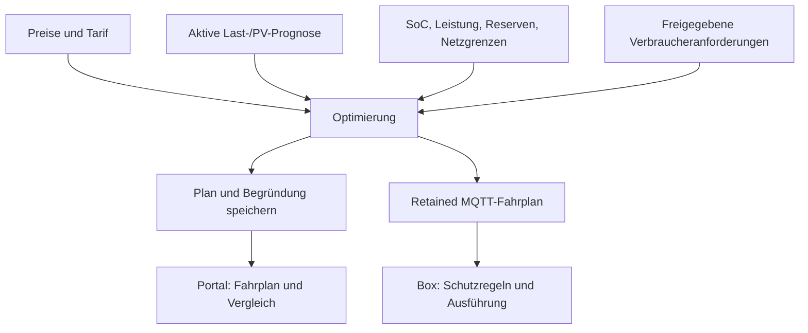

# Optimierung

Der Python-Dienst berechnet wiederkehrend kosten-/erlösorientierte Fahrpläne aus Preisen, Prognosen und Anlagenzustand. Pyomo/HiGHS löst Speicher- und gegebenenfalls Verbraucherplanung; der Go-Core prüft die tatsächliche Ausführung lokal.



## Verhalten

- Rollierender Horizont mit Viertelstunden-Slots; Preisabdeckung kann ihn verkürzen. Unzureichende Eingaben dürfen keinen erfundenen erfolgreichen Plan ergeben.
- Bezug und Einspeisung werden getrennt anhand der vorhandenen Tarif-/Vergütungsdaten bewertet. Verschleiß und Terminalwert fließen in die Optimierung ein.
- Lade-/Entladeleistung, SoC-Band, Reserve und Netzgrenzen begrenzen den Plan. Widersprüchliche gleichzeitige Lade-/Entladeentscheidungen werden verhindert.
- Sonnenstrom-Laden folgt dem aktuellen PV-Bus-Modell: Laden kann bis zur verfügbaren PV-Leistung reichen, während die Last parallel aus dem Netz versorgt wird. Nicht auf die alte reine Überschussformel zurücksetzen.
- Ehrliche Marge (Captain-Entscheid E6 A): an Festpreis-Anlagen muss der Netzanteil einer Ladung (Laden über den PV-Überschuss hinaus, auch über den PV-Bus) nach vollem Rundlauf `FEST_GRID_CHARGE_HURDLE_CT_PER_KWH` (2 ct/kWh) verdienen. Dieselbe Konstante steht im LP (`grid_charge_hurdle`) und in `slot_trim.grid_charge_uneconomic`; nur eine Stelle zu ändern hebt die andere auf. Spot-Anlagen: kein Term.
- Last-/PV-Prognose ist getrennt vom Solver. Die gewählte Modellreihe, Ersatzpfade und der PV-Nowcast werden in `inputs.py` zusammengeführt.
- Live-Eingänge je Box (AP-15 P5): Speicherstand (≤ 120 min), §14a-Vorgabe (≤ 60 min) und Last/PV des laufenden Slots (≤ 30 s) kommen von der Box der geplanten Batterie (`asset.device_id`). Fehlt der Wert dort oder ist er veraltet, gilt er als unbekannt, nie als Wert einer anderen Box. Ohne Box bleibt die Anlagen-Abfrage wortgleich. Rückfall-Historie, PV-Anker, Lastspitze und Nachtfehler sind Anlagen-Größen (nächste Zeile). Nachweis: `tests/test_eingang_je_box.py` (R8).
- Anlagen-Größen einer Mehr-Box-Anlage (AP-15 Folgepunkt, W2, B1): ist die führende Box bestimmt (`site.lead_device_id`, in der Anlage angemeldet, nicht ausgebaut, und mindestens eine weitere Box ist es auch — `load_fuehrende_boxen`, dieselbe Bedingung wie die Rollup-Prozedur der api `V20260922020000`), liest die laufende Lastspitze nur ihre Zeilen (sie liest den Netzzähler), die Rückfall-Historie und der PV-Anker bilden Viertelstunden der ANLAGE (`_anlagen_slot_werte`): PV = Summe der Boxen, Last = Last der führenden Box + je weiterer Box ihr `load_kw − power_kw` (ihre Nettoabgabe, die die führende Box nicht sieht; fehlt dieses Paar einer sendenden Box, ist die Viertelstunde unbekannt). Nachtfehler und abgeschlossene Viertelstunden der Lastspitze lesen das Rollup, das seit `V20260922020000` dasselbe rechnet. Ein-Box-Anlage und Anlage ohne gespeicherte Wahl: Abfragen wortgleich. Nachweis: `tests/test_leser_je_anlage.py`, api `UemsRollupMehrBoxMigrationTest`.
- Planlauf mit Anteilen (AP-15 IP-14, P4, B5, Y4, E7 = A): nur in einer Anlage in `anteile_aktiv` liest `verbund.load_verbund` je mitsteuernder Box ihren Anteil (je Richtung das Kleinere aus quittiertem und gesendetem Dokument), ihren Herzschlag und ihre Verbraucher. Nebenbedingung: PV-Grenze der Box (+ Entladung, wenn der EINE Speicher an ihr hängt, LA1) ≤ Einspeise-Anteil; Verbraucher der Box ≤ Bezugs-Anteil (+ Netzladen des Speichers an ihr). Die führende Box bekommt keine. Stumm (90 s) oder ohne Wert: voller Anteil belegt, ihr Rest geht an niemanden. Die PV einer Box ist ihr kWp-Teil der Anlagen-Prognose. Ohne scharfen Verbund kommt nichts ins Modell (Paarbeweis NW-6). Nachweis: `tests/test_planlauf_anteile.py` (R1, R2, R3, R7).
- Plan je Box (AP-15 IP-15, P1, P2, W8): in `anteile_aktiv` schneidet `publisher_v2.plan_je_box` den EINEN Lauf in je ein Dokument pro steuernder Box (dieselbe `plan_id`/`generated_at`, `lauf_nr`, Block `gemeinsame_steuerung.rolle`); Speicher → Box seines Assets, PV/Verbraucher einer mitsteuernden Box → sie (dieselbe Zuordnung wie ihre Nebenbedingung), Rest → führende; `grid_import_limit_kw` nur bei der führenden. Eine als belegt gerechnete Box (stumm, unbestätigt, ohne `steuerungsverbund_anteil`) bekommt nichts; eine Box ohne Entität bekommt die leere retained Nachricht (Rücknahme, kein „veröffentlicht“). Die scharfe Anlage braucht `VOLTPILOT_V2_PLAN_SITES` nicht. Laufnummer für jeden v2-Lauf in `site_plan_run.lauf_nr` (V20260922000000), gesendet nur in der scharfen Anlage. Ohne sie: Byte für Byte wie vorher. Nachweis: `tests/test_plan_je_box.py`; [Vertrag](../../docs/contracts/v2/mqtt-schedule-2.0.md).
- v1 und v2 verwenden getrennte Publishpfade. v2 plant mehrere Entitäten; Verbraucherplanung benötigt ihre Freigaben. Schattenplanung ist keine physische Ausführung.
- Historische Erlöse werden aus Messwerten ermittelt; der Vergleich im Fahrplan ist ein Planungsergebnis.

## Code finden

| Aufgabe | Quelle |
|---|---|
| Eingaben und Frische | `voltpilot_optimization/inputs.py`, `fallback.py` |
| Tarif und Bewertung | `pricing.py`, `config.py` |
| Solver | `solver.py`, `co_solver.py` |
| Planzeitkorrektur | `nowcast.py` |
| Speicherung / MQTT | `persistence.py`, `publisher.py`, `engine.py` |
| Laufzeit / CLI | `cli.py`, `runtime.py` |

Dateinamen in der Tabelle beziehen sich auf `voltpilot_optimization/`. Verbindliche Defaults stehen im Code und in der Deployment-Konfiguration.

## Start und Tests

```bash
python -m venv .venv
source .venv/bin/activate
pip install -e '.[dev,solver]' -e ../forecast
python -m voltpilot_optimization --help
pytest -m 'not slow'
```

`plan` führt einen Zyklus aus, `serve` den periodischen Betrieb; beide benötigen die konfigurierten Daten-/Brokerzugänge. `pytest` ohne Filter ergänzt die langsamen Szenarien. Im Gesamtstack startet das Profil `optimize` den Dienst.

[Prognosen](../../docs/forecasting.md), [Verbraucher](../../docs/verbrauchssteuerung.md), [Golden-Suite](tests/golden/README.md), [Betriebsvertrag](../../docs/k8s-readiness.md).

## Horizont und kurzfristige Korrektur

`OPTIMIZER_HORIZON_SLOTS` fragt 16–192 Viertelstunden an (Vorgabe 192 = 48 h). Preise und reale Prognosen begrenzen das Ergebnis. `96` stellt den früheren 24-h-Horizont wieder her. `OPTIMIZER_HORIZON_HOURS` wird noch mit Warnung umgerechnet; widersprüchliche Werte werden abgelehnt. MQTT überträgt weiterhin die ersten 24 h.

| Korrektur | Wirkung |
|---|---|
| `load_nowcast.py` | Aktuelle Last verankert Slot 0, Ausblendung über acht Slots |
| `nowcast.py` | Verhältnis aus abgeschlossenen PV-Slots, Ausblendung über acht Slots |
| `pv_nowcast.py` | PV-Mittel der letzten 120 s, jüngster Wert höchstens 30 s alt; Ausblendung über zwei Slots |

Bei Abregelung darf PV-Nowcast die Prognose nur anheben; die Nachtgrenze bleibt wirksam. Schalter: `OPTIMIZER_PV_NOWCAST_ENABLED` (true), `…_DECAY_SLOTS` (2), `…_MAX_AGE_SECONDS` (30), `…_LOOKBACK_SECONDS` (120). Fehler lassen die ursprüngliche Prognose bestehen.

`night_reserve.py` bewertet Energie am ersten PV-Überschussslot nach der Nacht anhand der eigenen historischen Nachtfehler. Das ist ein ökonomischer Wertterm, keine zusätzliche harte SoC-Reserve. Ohne geeignete Daten, Preisdifferenz oder Sonnenaufgang im Horizont entsteht kein Term; `OPTIMIZER_NIGHT_RESERVE_ENABLED=false` schaltet ihn ab. Begründungsfelder: `why_night_reserve_kwh` und `why_night_reserve_q`.
