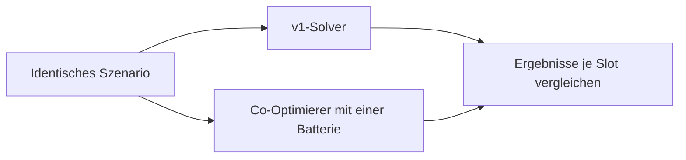

# Golden-Tests des Co-Optimierers

Acht eingecheckte Szenarien vergleichen v1-Solver und Co-Optimierer über den N=1-Adapter mit identischen Eingaben. Geprüft werden Zielfunktion, Slots, Batterie, Netz, SoC, Abregelung, Kosten, Verschleiß, Peak-Ziel und Endwert. Tests: [`test_golden_cooptimizer.py`](../test_golden_cooptimizer.py).



| Szenario | Schwerpunkt |
|---|---|
| `excel-reference-day` | Excel-Referenztag, Einspeisegrenze und Festpreis |
| `eeg-household-pv-summer` | Solar-only, dynamischer Tarif und feste Vergütung |
| `merchant-arbitrage-winter` | Spotpreise und Reserve |
| `peak-shaving-ci` | Lastspitzen und Peak-Reserve |
| `dv-negative-prices` | Negative Preise, Abregelung und Einspeisegrenze |
| `grid-limit-14a` | Netzgrenze und Fallback-Modell |
| `custom-soc-band-reserves` | Geändertes SoC-Band, Reserve und Verschleiß |
| `kitchen-sink-all-modules` | Kombination aller erfassten Module |

## Regeln

- Toleranzen: Zielfunktion `1e-5 EUR`, Slots `1e-3 kW/kWh`. Nicht zum Verbergen fachlicher Unterschiede erhöhen.
- Verhalten bewusst ändern: Szenario, erwartete Änderung und Vertragsfolgen gemeinsam prüfen. Ein grüner Lauf belegt die geprüften Szenarien, nicht die Gleichheit aller möglichen Pläne.
- Eingaben sind deterministische Repo-Fixtures, keine Kundendatenbank-Auszüge. Neue Module in die Abdeckungsprüfung aufnehmen.

Aus `services/optimization`:

```bash
.venv/bin/python tests/golden/generate_scenarios.py
.venv/bin/python -m pytest tests/test_golden_cooptimizer.py -q
```

Der Generator verwendet weder Uhrzeit noch Zufall. `test_fixtures_match_the_generator` vergleicht eingecheckte Daten mit seiner Ausgabe.
