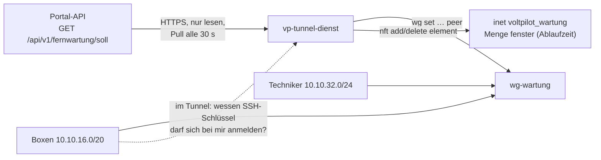

# Tunnel-Dienst (Fernwartung)

`vp-tunnel-dienst` läuft auf der Wartungs-VM (Vorgabe `wartung.voltpilot.de`). Er holt alle 30 s den Soll-Stand der Fernwartung aus dem Portal und setzt ihn um:

- **Peers** auf der WireGuard-Schnittstelle `wg-wartung`: Boxen und Techniker-Zugänge, je genau eine `/32`.
- **Fenster** in der nftables-Menge `fenster` der eigenen Tabelle `voltpilot_wartung`: Techniker → Box nur, solange das Fenster offen ist. Jedes Element hat eine **Ablaufzeit**; das Fenster schließt im Kernel, auch wenn API oder Dienst ausfallen.
- **Schlüsselausgabe** (wenn eingestellt): Eine Box fragt im Tunnel, wessen SSH-Schlüssel sich gerade bei ihr anmelden darf, und bekommt die Schlüssel der Techniker, für die ein Fenster zu ihr offen ist. Siehe [Schlüsselausgabe](#schlüsselausgabe).

Fachliche Grundlage, Rollen und Datenmodell: [Fernwartung](../../docs/fernwartung.md). `vpn.voltpilot.de` mit WireGuard UI ist davon nicht berührt.



## Was die Firewall erlaubt

Die Tabelle regelt nur Verkehr, der `wg-wartung` berührt, und verwirft davon alles, was nicht ausdrücklich erlaubt ist. `vp-tunnel-dienst basis` gibt den Regelsatz aus.

| Weg | Regel |
|---|---|
| Techniker → Box | nur wenn das Paar in `fenster` steht; TCP `VP_TUNNEL_PORTS` (2222, 8484) und Ping. Geprüft wird **jedes** Paket: läuft ein Fenster ab oder wird es geschlossen, reißt auch eine laufende Sitzung ab |
| Box → Techniker | nur Antworten auf erlaubte Verbindungen, ebenfalls nur bei offenem Fenster |
| Box ↔ Box, Techniker ↔ Techniker | verworfen |
| Tunnel → Internet, altes VPN, andere Netze der VM | verworfen |
| Tunnel → VM selbst | nur Ping. Ist die Schlüsselausgabe eingestellt, außerdem von einer Box zur Server-Adresse im Techniker-Netz auf deren Port, und nur Verbindungen, die die Box aufbaut |
| VM → Box | keine Verbindung: Die Antworten einer Box werden verworfen |

Neue Techniker-Verbindungen landen mit dem Präfix `vp-wartung neu:` im Kernel-Log (`journalctl -k`).

## Verhalten bei Störungen

Die Grundregel: im Zweifel nichts öffnen.

| Lage | Verhalten |
|---|---|
| API nicht erreichbar, HTTP-Fehler, ungültiges JSON | letzter Stand bleibt; kein neues Fenster; offene Fenster laufen von selbst ab. Im Log `WARN … API nicht erreichbar`, ab dem zehnten Fehllauf in Folge `ALARM`. Gelingt der Abruf wieder, steht dort einmal `INFO msg="API wieder erreichbar" fehllaeufe=… seit=… dauer=…` |
| Keycloak lehnt die Anmeldung ab (HTTP 401 oder 403 am Token-Endpunkt) | dasselbe Verhalten, aber sofort als Fehler mit eigenem Wortlaut: `ERROR … Anmeldung abgelehnt: Client oder Secret prüfen` |
| Netze der API weichen von der Konfiguration ab, unbekannte Version | Soll-Stand verworfen, `ALARM` im Log |
| einzelner fehlerhafter Eintrag (Adresse außerhalb des Netzes, doppelter Schlüssel, Fenster ohne gültige Box) | Eintrag übersprungen, Warnung, der Rest gilt |
| mehr als `VP_TUNNEL_MAX_ENTFERNEN` Peers sollen auf einmal weg | keiner wird entfernt, `ALARM` |
| ein Fenster ist länger als `VP_TUNNEL_MAX_FENSTER` | auf diese Dauer gekürzt, `ALARM` |
| nft-Tabelle fehlt oder weicht ab (z. B. `nft flush ruleset`) | beim nächsten Lauf neu geladen, der frische Stand desselben Laufs öffnet die Fenster wieder. **Bis dahin, also bis zu ein Abrufintervall lang, filtert die Tabelle nichts** (siehe [Betrieb](#betrieb)) |
| Neustart der VM ohne erreichbare API | Peers aus dem letzten gültigen Stand (`/var/lib/vp-tunnel-dienst/letzter-soll.json`), **nie** ein Fenster und nie ein SSH-Schlüssel |
| Neustart der VM, Netz noch ohne Adresse | Unter Debian 13 mit dhcpcd ist `network-online.target` erreicht, bevor DHCP geantwortet hat; der erste Abruf scheitert dann (`lookup … connection refused`). Solange seit dem Start kein Abruf gelungen ist, wiederholt der Dienst ihn bis zu fünfmal im Abstand von 5 s statt erst nach einem ganzen Intervall. Die Fehlläufe zählen mit; fehlt die API beim Start länger, kommt der `ALARM` entsprechend früher |
| ein Fenster läuft im Kernel ab | der Kernel schließt es, nicht der Dienst. Der nächste Lauf schreibt `INFO msg="Fenster abgelaufen" techniker=… box=… kennung=… ablauf=…`, auch wenn die API gerade fehlt. `Fenster geschlossen` steht nur da, wo der Dienst es wegen des Soll-Stands entfernt hat |
| ein Fenster fehlt in der Menge, obwohl es weder abgelaufen ist noch vom Dienst geschlossen wurde (von Hand entfernt) | `WARN msg="Fenster fehlt vor seiner Ablaufzeit …"`; verlangt der Soll-Stand es weiter, öffnet derselbe Lauf es wieder |
| Dienst wird beendet | nichts wird abgebaut; Fenster laufen von selbst ab. Die Schlüsselausgabe endet mit ihm: Keine Box bekommt eine Antwort, und was sie hat, verfällt bei ihr zur Frist |
| Dienst neu gestartet, API noch nicht erreicht | die Schlüsselausgabe antwortet mit 503, auch wenn noch Fenster im Kernel stehen: Ohne frischen Soll-Stand gibt es keine Liste, auch keine leere |
| der Prozess der Schlüsselausgabe endet oder startet nicht | `ERROR msg="Schlüsselausgabe: Schalter beendet, neuer Start folgt"`, neuer Start nach 5 s, bei wiederholtem Scheitern in wachsendem Abstand bis 5 min. Peers und Fenster gleicht der Dienst unverändert weiter ab |

Peers allein öffnen keinen Weg; erst ein Element in `fenster` tut das.

## Installation auf der VM

Voraussetzungen:

- Linux ab 5.6 (WireGuard im Kernel), `wireguard-tools`, `nftables` ab 1.0.6, systemd, Zeitabgleich (NTP).
- Kein Docker auf dieser VM: Docker setzt die Weiterleitung auf `DROP` und mischt eigene Regeln ein.
- **Feste Adresse der VM** (statisch oder als feste DHCP-Zuweisung im Router). Steht die VM hinter NAT, hängt die Portweiterleitung UDP 51820 an dieser Adresse; wechselt sie, zeigt die Weiterleitung ins Leere.
- Der Servername (Vorgabe `wartung.voltpilot.de`) zeigt **direkt** auf die öffentliche Adresse. Ein HTTP-Proxy davor (Cloudflare „proxied“) leitet kein UDP weiter.

Geprüft: Debian 13 auf einer echten VM unter systemd (Kernel 6.12, nftables 1.1.3, systemd 257, wireguard-tools 1.0.20210914; Einrichtung am 08.10.2026). Debian 12 (nftables 1.0.6) und Alpine 3.20 (nftables 1.0.9) nur in Containern mit der Integrationsprobe (siehe [Prüfen](#prüfen)).

**Die Schritte 1 bis 6 richten keine eigene Firewall der VM ein.** Sie laden nur die Tabelle des Dienstes, und die regelt ausschließlich Verkehr, der `wg-wartung` berührt. Alles andere (SSH, weitere Dienste, Verkehr zwischen anderen Schnittstellen) bleibt so offen oder geschlossen, wie die VM es vorher war. Ein frisches Debian 13 bringt in `/etc/nftables.conf` nur drei leere Ketten mit `policy accept` mit, also keinen Schutz. Ein Muster für die eigene Firewall steht unter [Eigene Firewall der VM](#eigene-firewall-der-vm).

1. **Pakete und Weiterleitung**

   ```bash
   apt install wireguard-tools nftables
   cat > /etc/sysctl.d/90-vp-wartung.conf <<'EOF'
   net.ipv4.ip_forward = 1
   net.ipv4.conf.all.send_redirects = 0
   EOF
   sysctl --system
   ```

   Unter Debian 13 ist `nftables` schon installiert, sein Dienst aber abgeschaltet; er wird in Schritt 5 aktiviert. Was eine spätere Aktualisierung dieses Pakets auslöst, steht unter [nftables neu laden oder stoppen](#nftables-neu-laden-oder-stoppen). `send_redirects` ist damit für `wg-wartung` aus (gemessen: `all=0`, `wg-wartung=0`). Auf der Netzwerkkarte der VM bleibt der Wert 1 und wirkt dort weiter, weil der Kernel `all` und den Wert der Schnittstelle mit ODER verknüpft; für den Tunnel ist das ohne Belang.

2. **WireGuard-Schnittstelle** nach [`deploy/wg-wartung.conf.beispiel`](deploy/wg-wartung.conf.beispiel): Server-Schlüssel auf der VM erzeugen, Datei nach `/etc/wireguard/wg-wartung.conf`, dann `systemctl enable --now wg-quick@wg-wartung`. Den öffentlichen Server-Schlüssel bekommt die API als `VP_FERNWARTUNG_SERVER_PUBLIC_KEY`.

3. **Programm bauen und ablegen** (Go laut [`go.mod`](go.mod), keine Fremdabhängigkeiten). Der Bau trägt den Commit als Version ein:

   ```bash
   cd services/tunnel-dienst
   CGO_ENABLED=0 GOOS=linux GOARCH=amd64 go build -trimpath \
     -ldflags "-X main.version=$(git rev-parse --short=12 HEAD)" \
     -o vp-tunnel-dienst ./cmd/vp-tunnel-dienst
   install -o root -g root -m 0755 vp-tunnel-dienst /usr/local/bin/
   vp-tunnel-dienst version    # vp-tunnel-dienst Version <commit>
   ```

   Die Version steht außerdem in der Startzeile im Journal (`msg="Tunnel-Dienst läuft" version=…`) und in `vp-tunnel-dienst status`. Ohne `-ldflags` nimmt das Programm den Commit, den Go beim Bau aus einem Git-Checkout selbst einträgt; fehlt auch der, steht dort `unbekannt`.

   **Ohne lokales Go** auf einem anderen Rechner im Container bauen (nicht auf der VM, dort läuft kein Docker) und die Datei auf die VM kopieren. Die **Repo-Wurzel** einhängen, nicht nur dieses Verzeichnis: Der Test des Vertragsvektors liest `docs/contracts/`. `-buildvcs=false` ist in einem Git-Worktree nötig und schadet sonst nicht.

   ```bash
   # in der Repo-Wurzel
   V="$(git rev-parse --short=12 HEAD)"
   docker run --rm --user "$(id -u):$(id -g)" -e HOME=/tmp -e GOCACHE=/tmp/gocache -e GOFLAGS=-buildvcs=false \
     -v "$PWD":/repo -w /repo/services/tunnel-dienst golang:1.24 sh -c \
     "go vet ./... && go test -race ./... && CGO_ENABLED=0 GOOS=linux GOARCH=amd64 go build -trimpath -ldflags '-X main.version=$V' -o vp-tunnel-dienst ./cmd/vp-tunnel-dienst"
   scp services/tunnel-dienst/vp-tunnel-dienst root@<vm>:/root/
   # auf der VM:
   install -o root -g root -m 0755 /root/vp-tunnel-dienst /usr/local/bin/
   ```

4. **Benutzer und Konfiguration**

   ```bash
   useradd --system --no-create-home --shell /usr/sbin/nologin vp-tunnel
   install -d -o root -g root -m 0700 /etc/vp-tunnel-dienst
   install -o root -g root -m 0600 deploy/tunnel-dienst.env.beispiel /etc/vp-tunnel-dienst/tunnel-dienst.env
   # Secret des Keycloak-Clients voltpilot-tunnel-dienst:
   (umask 077; printf '%s\n' '<secret>' > /etc/vp-tunnel-dienst/client-secret)
   ```

   Die Datei [`tunnel-dienst.env.beispiel`](deploy/tunnel-dienst.env.beispiel) beschreibt jede Einstellung. Die Netze müssen zur API passen. `VP_TUNNEL_SCHLUESSEL_PORT` schaltet die [Schlüsselausgabe](#schlüsselausgabe) ein; das Beispiel setzt ihn auf 8022.

5. **Firewall-Basis ab dem Systemstart** (empfohlen): Dann ist der Weg schon zu, bevor der Dienst läuft.

   ```bash
   install -d /etc/nftables.d
   set -a; . /etc/vp-tunnel-dienst/tunnel-dienst.env; set +a
   vp-tunnel-dienst basis > /etc/nftables.d/voltpilot-wartung.nft
   grep -qF 'voltpilot-wartung.nft' /etc/nftables.conf ||
     echo 'include "/etc/nftables.d/voltpilot-wartung.nft"' >> /etc/nftables.conf
   systemctl enable --now nftables
   ```

   Der Block ist wiederholbar: Die Include-Zeile kommt nur einmal in die Datei. Stünde sie doppelt, stünden auch die Regeln doppelt in den Ketten.

   Die Basis hängt an der Konfiguration. Wer später Netze, Ports oder `VP_TUNNEL_SCHLUESSEL_PORT` ändert, schreibt die Datei mit denselben drei mittleren Zeilen neu. Sonst lädt `nftables` beim nächsten Systemstart die alte Basis, und der Dienst ersetzt sie bei seinem ersten Lauf.

   Die Tabelle `voltpilot_wartung` gehört dem Dienst; nichts anderes schreibt hinein. Eine eigene Firewall der VM gehört in eine weitere Datei daneben ([Muster](#eigene-firewall-der-vm)). Was `flush ruleset` in `/etc/nftables.conf` und ein gestoppter `nftables`-Dienst bedeuten, steht unter [Betrieb](#betrieb).

6. **Dienst** nach [`deploy/vp-tunnel-dienst.service`](deploy/vp-tunnel-dienst.service):

   ```bash
   install -m 0644 deploy/vp-tunnel-dienst.service /etc/systemd/system/
   systemctl daemon-reload
   systemctl enable --now vp-tunnel-dienst
   journalctl -u vp-tunnel-dienst -f
   ```

   Der Dienst läuft als `vp-tunnel` mit nur `CAP_NET_ADMIN`. Das Secret kommt über `LoadCredential`, nie über eine Umgebungsvariable. Ist die Schlüsselausgabe eingestellt, startet der Dienst dafür einen zweiten Prozess desselben Programms; die Unit braucht dafür nichts Eigenes.

   Was im Journal stehen kann:

   | Journal | Bedeutung |
   |---|---|
   | `msg="Tunnel-Dienst läuft" version=… api=… schluesselausgabe=…`, danach keine Warnung | läuft; im Portal steht unter **Geräte › Fernwartung** „Tunnel-Dienst holt ab“. `schluesselausgabe=aus` oder die Adresse, auf der sie lauscht |
   | `msg="Schlüsselausgabe lauscht" adresse=10.10.32.1:8022 … rechte=keine dateizugriff=gesperrt` | der Prozess der Schlüsselausgabe läuft, ohne Capabilities und ohne Zugriff auf das Dateisystem |
   | `Failed to set up credentials: Protocol error`, `status=243/CREDENTIALS`, Neustart alle 10 s | die Datei `/etc/vp-tunnel-dienst/client-secret` fehlt (Schritt 4). `systemctl start` meldet trotzdem Erfolg; nur das Journal und `systemctl is-active` zeigen es |
   | `ERROR … Anmeldung abgelehnt: Client oder Secret prüfen (Token-Endpunkt: HTTP 401)` | Secret oder Client-ID stimmen nicht mit Keycloak überein |
   | `WARN … API nicht erreichbar … Soll-Stand: HTTP 403` | die Anmeldung gelingt, dem Dienstkonto fehlt die Rolle `tunnel-dienst` |
   | `WARN … API nicht erreichbar … dial tcp …` oder `… no such host` | kein Weg zu Portal oder Keycloak (Netz, DNS, Adresse in der Konfiguration) |

## Eigene Firewall der VM

Die Tabelle des Dienstes schützt den Tunnel, nicht die VM. Die zweite Schranke ist eine eigene Tabelle der VM mit `policy drop` für Eingang und Weiterleitung. Muster: [`deploy/vm-firewall.nft.beispiel`](deploy/vm-firewall.nft.beispiel), entstanden aus der Firewall, die seit dem 08.10.2026 auf der Wartungs-VM geladen ist. Anzupassen ist das Verwaltungsnetz für SSH; eine falsche Angabe dort sperrt aus.

```bash
install -m 0644 deploy/vm-firewall.nft.beispiel /etc/nftables.d/vm-firewall.nft
# Verwaltungsnetz anpassen, dann prüfen und einzeln laden:
nft -c -f /etc/nftables.d/vm-firewall.nft && nft -f /etc/nftables.d/vm-firewall.nft
grep -qF 'vm-firewall.nft' /etc/nftables.conf ||
  echo 'include "/etc/nftables.d/vm-firewall.nft"' >> /etc/nftables.conf
```

Wer die Firewall aus der Ferne lädt, sichert sich vorher eine Rücknahme, die ohne ihn auslöst (bei der Einrichtung der VM: ein Auftrag mit `systemd-run --on-active=6min`, der die Tabelle wieder entfernt), und nimmt sie erst nach einer **neuen** Anmeldung zurück.

Vier Dinge muss eine eigene Firewall beachten, gleich wie sie aussieht:

| Punkt | Warum |
|---|---|
| Weiterleitung `iifname "wg-wartung" oifname "wg-wartung" accept` | ohne diese Ausnahme verwirft `policy drop` jeden Tunnel-Verkehr, auch im offenen Fenster. Was davon durchgeht, entscheidet vorher die Tabelle des Dienstes |
| Eingang `iifname "wg-wartung" ip saddr <Box-Netz> ip daddr <Server-Adresse im Techniker-Netz> tcp dport <VP_TUNNEL_SCHLUESSEL_PORT> accept` | ohne diese Freigabe bekommt keine Box einen Fenster-Schlüssel, obwohl der Dienst lauscht. `ct state established,related accept` allein genügt nicht: Die Box baut die Verbindung auf |
| einzeln ladbar: die Datei beginnt mit `table inet filter` / `delete table inet filter` | so ersetzt `nft -f <datei>` nur diese Tabelle. `systemctl reload nftables` leert dagegen den ganzen Regelsatz und schließt jedes offene Fenster |
| Priorität `filter + 10` | zwei Ketten am selben Haken mit gleicher Priorität laufen in der Reihenfolge, in der sie geladen wurden. Mit 10 urteilt immer erst die Tabelle des Dienstes; ein `drop` dort ist endgültig |

Belegt ist das Muster in der Integrationsprobe (Schritt 20): Es lädt, ohne die Tabelle des Dienstes und offene Fenster zu berühren; Schlüsselausgabe und Fenster-Verkehr gehen hindurch, ohne die Zeile für die Schlüsselausgabe bekommt die Box keine Antwort. Auf der VM ist die Zeile für die Schlüsselausgabe seit dem 09.10.2026 geladen; die Abfrage der Labor-Mango geht hindurch (am Zähler der Regel abgelesen).

## Schlüsselausgabe

Ein offenes Fenster öffnet den Netzweg zur Box. Anmelden kann sich dort nur, wessen öffentlicher SSH-Schlüssel auf der Box liegt. Der Techniker hinterlegt ihn einmal im Portal; die Box holt ihn für die Dauer des Fensters beim Wartungsserver ab ([Fernwartung](../../docs/fernwartung.md#anmeldung-an-der-box-fenster-schlüssel)). Dieser Abschnitt beschreibt die Seite des Servers. Anfrage und Antwort sind ein Vertrag: [`fernwartung-schluessel-v1.md`](../../docs/contracts/fernwartung-schluessel-v1.md).

**Abgeschaltet, solange `VP_TUNNEL_SCHLUESSEL_PORT` nicht gesetzt ist.** Dann lauscht nichts, und die Firewall-Basis ist Byte für Byte die bisherige.

### Was eine Box bekommt

- Die Box fragt `http://10.10.32.1:<Port>/v1/schluessel`, die Server-Adresse im **Techniker-Netz**. Nur sie erreicht eine Box: Ihr Tunnel führt nur das Techniker-Netz als erlaubtes Netz.
- Der Dienst erkennt die Box am Absender. WireGuard lässt von einem Peer nur dessen eigene Adresse durch.
- Die Antwort nennt die Techniker-Schlüssel der Paare, die **jetzt in der Kernel-Menge `fenster`** stehen, mit der Restlaufzeit des Elements. Die Menge ist die einzige Wahrheit: Was dort abgelaufen ist oder nie hineinkam, wird nicht genannt. Gelesen wird sie für jede Antwort; wer gleichzeitig fragt, teilt sich eine Lesung, die höchstens 2 s alt ist.
- Den Schlüssel nimmt der Dienst aus dem letzten **frisch abgeholten** Soll-Stand, nie aus dem Zwischenstand auf der Platte. Er prüft ihn selbst, auch wenn die API das schon tut: genau eine Zeile `ssh-rsa <Base64>` in Normalform, innen ein RSA-Schlüssel von 2048 bis 4096 Bit, keine Optionen davor, kein Kommentar. Alles andere geht nicht hinaus; der Peer und sein Fenster bleiben, im Journal steht `Eintrag übersprungen`.
- Wird ein Schlüssel im offenen Fenster ersetzt oder entfernt, nennt die Ausgabe den alten ab dem nächsten Abruf des Soll-Stands nicht mehr. Eine wartende Box erfährt es sofort.
- Setzt der Dienst das Ende eines Fensters neu (verlängert oder gekürzt), erfährt eine wartende Box auch das sofort: gleiche Liste, neue Restlaufzeit.
- Die Restlaufzeit ist abgerundet. Einen Schlüssel mit weniger als einer Sekunde Rest nennt die Liste nicht mehr; sie ist deshalb bis zu zwei Sekunden vor dem Ablauf im Kernel leer.
- API nicht erreichbar: Der letzte Stand bleibt, wie bei Peers und Fenstern. Für ein Fenster, das noch im Kernel steht, wird der bekannte Schlüssel weiter genannt; ein neuer kommt nicht dazu, weil kein neues Fenster aufgeht und kein neuer Stand ankommt.

### Grenzen

| Grenze | Wert |
|---|---|
| Antwort | nur an eine Box-Adresse; jeder andere Absender bekommt 403 ohne Inhalt |
| offene Anfragen | eine je Box; eine neuere löst die ältere ab (429) |
| Wartezeit einer offenen Anfrage | höchstens 300 s |
| Schlüssel je Antwort | höchstens 8; mehr offene Fenster zu einer Box stehen als Warnung im Journal |
| Verbindungen | höchstens 4 je Absender und 8192 insgesamt; was darüber liegt, wird geschlossen, bevor ein Byte gelesen ist |
| Kopfzeilen der Anfrage | 5 s und 4 kB; eine Anfrage je Verbindung |
| Firewall | Box-Netz → `10.10.32.1`, dieser eine Port, nur von der Box aufgebaute Verbindungen. Eine Techniker-Adresse wird schon dort verworfen und bekommt keine Antwort |

### Zwei Prozesse

Was aus dem Tunnel erreichbar ist, läuft **ohne die Netzrechte des Dienstes**:

- Der Dienst selbst (`CAP_NET_ADMIN`) liest Kernel-Menge und Soll-Stand und entscheidet, was eine Box bekommt.
- Der **Schalter** ist ein zweiter Prozess desselben Programms (`vp-tunnel-dienst schluessel-schalter`, kein Befehl für die Hand). Er nimmt die HTTP-Anfragen der Boxen an. Vor dem ersten Byte aus dem Tunnel legt er alle Capabilities ab und verbietet sich, je wieder welche zu bekommen; danach nimmt er sich mit Landlock jeden Zugriff auf das Dateisystem. Er läuft unter demselben Benutzer wie der Dienst, bekommt aber dessen Umgebung nicht mit. Fehlt Landlock im Kernel, läuft er ohne die Dateisperre und nennt das in seiner Startzeile (`dateizugriff="nicht gesperrt (…)"`); er könnte dann die Dateien dieses Benutzers lesen, darunter das Secret für den Abruf des Soll-Stands.
- Zwischen beiden liegt ein Kanal mit fester Zeilenform. Der Schalter kann dem Dienst nur sagen, welche Box-Adresse fragt, wie lange sie warten will und welchen Prüfwert sie kennt. Hält er sich nicht an die Form, beendet ihn der Dienst.

Der Schalter braucht ein Programm ohne cgo (`CGO_ENABLED=0`, wie in Schritt 3): Nur dann kann Go die Rechte für alle seine Threads ablegen. Mit einem anders gebauten Programm startet er nicht und sagt das im Journal.

Was der Schalter könnte, wenn jemand ihn über eine Box übernähme: einer Box eine falsche Liste schicken. Einen Weg zu dieser Box hat er damit nicht, denn vom Server aus kommt keine Verbindung zu einer Box zustande; ein untergeschobener Schlüssel nützt nur jemandem, der schon einen Netzweg hat, also einem Techniker mit offenem Fenster. Wer dagegen die VM als root übernimmt, kann Schlüssel ausgeben **und** Wege öffnen; das ändert diese Trennung nicht ([Fernwartung](../../docs/fernwartung.md#anmeldung-an-der-box-fenster-schlüssel)).

### Was man sieht

`vp-tunnel-dienst status` nennt je Box, wann sie zuletzt gefragt hat und welche Schlüssel ihr die letzte Antwort genannt hat. Die Angabe stammt aus `/var/lib/vp-tunnel-dienst/schluessel.json`, die der Dienst nach jedem Lauf schreibt; sie ist bis zu ein Abrufintervall alt und beginnt mit jedem Start des Dienstes neu.

```
Schlüsselausgabe: 10.10.32.1:8022, lauscht, Dienst gestartet 09.10. 13:02:11
  edge-5t2dcy6                 10.10.16.2      zuletzt gefragt vor 12s, 1 Schlüssel in der letzten Antwort
      Max (ASUS Duo Laptop)  SHA256:TDOx3bpPNtPLIdd+juZoGcDMz3ZRCklaP5G6aBrp9Zc  bis 14:02:05
  edge-zay5sdd                 10.10.16.3      seit dem Start nicht gefragt
```

Im Journal steht, welcher Box wann welcher Schlüssel ausgegeben wurde, mit dem Fingerabdruck von `ssh-keygen -lf`, nie mit dem Schlüssel:

| Journal | Bedeutung |
|---|---|
| `msg="Schlüssel ausgegeben" box=… kennung=… techniker=… zugang=… fingerabdruck=SHA256:… sekunden=…` | eine Antwort an diese Box nennt den Schlüssel zum ersten Mal |
| `msg="Schlüssel nicht mehr ausgegeben" box=… … fingerabdruck=SHA256:…` | eine Antwort an diese Box nennt ihn nicht mehr: Fenster geschlossen oder abgelaufen, Schlüssel ersetzt oder entfernt |
| `msg="Schlüsselausgabe: Anfrage abgewiesen, keine Box-Adresse" absender=… anzahl=…` | höchstens eine Zeile je zehn Sekunden |

Eine unveränderte Antwort steht nicht noch einmal im Journal. Ob die Antwort bei der Box angekommen ist und ob die Box den Schlüssel übernommen hat, weiß der Dienst nicht.

### Auf einer laufenden VM einschalten

**Nicht während einer Fernwartung.** Mit dem Port ändert sich der Prüfwert der Firewall-Basis. Der Dienst lädt die Tabelle bei seinem ersten Lauf neu; die Menge `fenster` ist dann leer, bis derselbe Lauf die Fenster aus dem frischen Soll-Stand wieder einträgt. In der Integrationsprobe hat eine laufende Sitzung das überstanden, weil die Menge nur für die Dauer eines Abrufs leer war. Scheitert genau dieser Abruf, bleiben die Fenster bis zum nächsten gelungenen zu.

1. Neues Programm ablegen (Schritt 3 der Installation). Allein ändert es nichts: Ohne den Port bleibt die Basis bytegleich.
2. Eigene Firewall der VM: die Zeile für die Schlüsselausgabe aus dem [Muster](#eigene-firewall-der-vm) in `/etc/nftables.d/vm-firewall.nft` eintragen und die Datei einzeln laden (`nft -f /etc/nftables.d/vm-firewall.nft`). Das schließt kein Fenster.
3. `VP_TUNNEL_SCHLUESSEL_PORT=8022` in `/etc/vp-tunnel-dienst/tunnel-dienst.env` eintragen.
4. Die Basis für den Systemstart neu schreiben: `set -a; . /etc/vp-tunnel-dienst/tunnel-dienst.env; set +a; vp-tunnel-dienst basis > /etc/nftables.d/voltpilot-wartung.nft`.
5. `systemctl restart vp-tunnel-dienst`.

Danach:

| Probe | Erwartung |
|---|---|
| Journal | `Firewall-Basis geladen` (einmal), `Tunnel-Dienst läuft … schluesselausgabe=10.10.32.1:8022`, `Schlüsselausgabe lauscht … rechte=keine dateizugriff=gesperrt` |
| `vp-tunnel-dienst status` (Umgebung geladen) | `Firewall-Basis stimmt: ja`, `Schlüsselausgabe: 10.10.32.1:8022, lauscht …` |
| auf einer verbundenen Box ohne offenes Fenster: `uclient-fetch -q -O - 'http://10.10.32.1:8022/v1/schluessel?warte=0&stand='` | zwei Zeilen: `vp-wartung-schluessel 1 99ba3c5f3272c926` und `ende 0` |
| von einem Techniker-Gerät: `curl -m 5 'http://10.10.32.1:8022/v1/schluessel'` | keine Antwort (Zeitüberschreitung). Die WireGuard-Konfiguration aus dem Portal führt als erlaubtes Netz nur das Box-Netz; die Anfrage verlässt das Gerät dann gar nicht durch den Tunnel. Wer die Ablehnung am Server sehen will, trägt `10.10.32.1/32` für die Probe zusätzlich unter `AllowedIPs` ein: Dann steigt auf der VM der Zähler `counter … drop` in `nft list chain inet voltpilot_wartung eingang_wartung`, und es kommt weiter keine Antwort |

Zurück: die Zeile `VP_TUNNEL_SCHLUESSEL_PORT` auskommentieren, Schritt 4 und 5 wiederholen. Der Dienst lädt die bisherige Basis, offene Fenster schließen dabei wieder einmal. Die Zeile in der Firewall der VM kann stehen bleiben; ohne Lauscher ist sie ohne Wirkung. Das alte Programm zurückzulegen ist nicht nötig, geht aber wie bisher.

## Von Hand, solange der Dienst noch nicht läuft (E1)

Die zweite Testanlage soll nicht auf den Dienst warten. Auf der VM (Schritte 1, 2 und 5 der Installation erledigt) geht derselbe Zustand von Hand, ohne dass später etwas umzuziehen ist:

1. Box-Schlüssel trotzdem im Portal hinterlegen: Das reserviert die Adresse und steht im Protokoll.
2. Peer mit genau dieser Adresse setzen: `wg set wg-wartung peer <öffentlicher Box-Schlüssel> allowed-ips 10.10.16.x/32`; ebenso jeder Techniker-Zugang mit seiner Adresse aus dem Portal.
3. Fenster öffnen, mit Ablaufzeit: `nft add element inet voltpilot_wartung fenster '{ 10.10.32.y . 10.10.16.x timeout 1h }'`; vorzeitig schließen mit `nft delete element …` ohne `timeout`.

Startet der Dienst später, findet er dieselben Peers vor und ändert an ihnen nichts. Von Hand geöffnete Fenster schließt er beim ersten Abruf, weil sie nicht im Soll-Stand stehen. Sie stehen auch nicht im Protokoll: In dieser Zeit Grund, Techniker und Zeit selbst notieren.

## Betrieb

| Befehl | Zweck |
|---|---|
| `vp-tunnel-dienst status` (als root) | Version, ob die geladene Firewall-Basis stimmt, letzter Lauf, Peers mit letztem Handshake, offene Fenster mit Restzeit, [Schlüsselausgabe](#was-man-sieht) je Box |
| `vp-tunnel-dienst version` | der Commit, aus dem das abgelegte Programm gebaut wurde |
| `vp-tunnel-dienst einmal` | ein Abgleich von Hand, Rückgabe 0/1 |
| `vp-tunnel-dienst basis` | der nft-Regelsatz, wie der Dienst ihn erzwingt |
| `vp-tunnel-dienst pruefen <datei>` | einen Soll-Stand offline prüfen |
| `journalctl -u vp-tunnel-dienst` | Peers angelegt/entfernt, Fenster geöffnet/geschlossen/abgelaufen, Schlüssel ausgegeben, `API wieder erreichbar`, `ALARM` |
| `/var/lib/vp-tunnel-dienst/status.json` | letzter Lauf, letzter Erfolg, Fehlläufe in Folge - für eine Überwachung |
| `/var/lib/vp-tunnel-dienst/schluessel.json` | Schlüsselausgabe: je Box die letzte Anfrage und die zuletzt genannten Schlüssel (Fingerabdruck) |

Ein bewusst großes Aufräumen (mehr als `VP_TUNNEL_MAX_ENTFERNEN` Peers) geht über einen einmaligen Lauf mit erhöhtem Wert: `VP_TUNNEL_MAX_ENTFERNEN=50 vp-tunnel-dienst einmal` mit der Umgebung des Dienstes.

`status`, `basis` und `pruefen` lesen dieselbe Konfiguration wie der Dienst. Weicht `/etc/vp-tunnel-dienst/tunnel-dienst.env` von den Vorgaben ab, vorher laden (`set -a; . /etc/vp-tunnel-dienst/tunnel-dienst.env; set +a`); sonst meldet `status` eine Basis als abweichend, die zur echten Konfiguration passt.

`status` und `version` nennen die Version der Datei unter `/usr/local/bin`. Welche Version gerade **läuft**, sagt die Startzeile im Journal; nach dem Ablegen eines neuen Programms gilt es erst ab `systemctl restart vp-tunnel-dienst`.

Secret wechseln: neues Secret in Keycloak, Datei `client-secret` ersetzen, `systemctl restart vp-tunnel-dienst`.

### nftables neu laden oder stoppen

Unter Debian beginnt `/etc/nftables.conf` mit `flush ruleset`, und `nftables.service` führt beim Stoppen `nft flush ruleset` aus. Das trifft auch die Tabelle des Dienstes:

| Aktion | Folge |
|---|---|
| `systemctl reload nftables` oder `restart nftables` | die Tabelle wird neu geladen, die Menge `fenster` ist danach leer: **alle offenen Fenster sind zu**, laufende Sitzungen reißen ab. Der Dienst öffnet sie beim nächsten Abruf wieder (höchstens ein Abrufintervall) |
| `nft flush ruleset` von Hand, Dienst läuft | die Tabelle ist weg, bis der Dienst sie beim nächsten Lauf neu lädt (auf der VM gemessen: 27 s). **In dieser Zeit filtert nichts:** Bei eingeschalteter Weiterleitung ist der Weg zwischen allen Peers und aus dem Tunnel in die anderen Netze der VM offen |
| `systemctl stop nftables`, Dienst läuft nicht | die Tabelle ist weg und **bleibt** weg: Die Weiterleitung ist ohne jede Regel offen, bis `nftables` oder der Dienst wieder startet |

Deshalb: `nftables` auf dieser VM nicht stoppen, solange `wg-wartung` oben ist. Änderungen an der eigenen Firewall der VM einzeln laden (`nft -f /etc/nftables.d/vm-firewall.nft`), nie über `systemctl reload nftables`. Eine eigene Firewall mit `policy drop` in der Weiterleitung ist die zweite Schranke gegen Fehler in der Tabelle des Dienstes ([Muster](#eigene-firewall-der-vm)); gegen `flush ruleset` hilft auch sie nicht, weil der Befehl beide entfernt.

**Auch eine Aktualisierung des Pakets `nftables` lädt neu.** Sein Installationsskript führt `try-restart nftables.service` aus (`/var/lib/dpkg/info/nftables.postinst`): alle offenen Fenster sind zu, bis der Dienst sie beim nächsten Abruf wieder öffnet, und für einen Augenblick ist keine Regel geladen. Mit automatischen Sicherheitsupdates (`unattended-upgrades`) kann das unbeaufsichtigt geschehen. Wer das nicht will, nimmt das Paket davon aus und spielt es von Hand ein, in `/etc/apt/apt.conf.d/`: `Unattended-Upgrade::Package-Blacklist { "nftables"; };`. Ob die Wartungs-VM das so hält, ist nicht entschieden.

## Prüfen

```bash
cd services/tunnel-dienst
go vet ./... && go test -race ./...
test/integration.sh                      # Alpine 3.20, nftables 1.0.9
VPTD_BASIS=debian test/integration.sh    # Debian 12, nftables 1.0.6
VPTD_BASIS=trixie test/integration.sh    # Debian 13, nftables 1.1.3 (wie die VM)
test/dateisperre.sh                      # Schlüsselausgabe auf dem Kernel von Debian 13 (kleine VM, QEMU)
```

Ohne DNS im Container zusätzlich `VPTD_DOCKER_DNS=1.1.1.1` setzen. `go vet` und `go test` ohne lokales Go: im Container mit eingehängter Repo-Wurzel, wie in Schritt 3 der Installation.

### Verträgt der Dienst auf der VM einen erweiterten Soll-Stand?

Der Soll-Stand wächst additiv, die Version bleibt 1. Im Betrieb überliest der Dienst unbekannte Felder; ob das für den Stand gilt, der gerade auf der VM läuft, belegt vor dem Ausliefern des Portals:

```bash
test/vertraeglichkeit.sh <commit>    # der Stand aus `vp-tunnel-dienst version`
```

Die Probe packt den Dienst von diesem Commit aus, gibt ihm den Vertragsvektor des Arbeitsverzeichnisses als Antwort der API und vergleicht Peers, Fenster und Plan mit demselben Vektor ohne die Felder, die der alte Stand nicht kennt; dazu den Zwischenstand auf der Platte und den Wiederanlauf ohne API. Sie braucht nur Docker (`golang:1.24`), kein WireGuard und keine Rechte. Belegt am 09.10.2026 für den Stand `db32a784ce55` und das Feld `sshPublicKey` am Techniker-Peer.

Dieses Feld prüft der Dienst seit der [Schlüsselausgabe](#schlüsselausgabe) selbst (`soll.PruefeSSHSchluessel`) und reicht es nur weiter, wenn es besteht. Der Stand mit Schlüsselausgabe liest den heutigen Vektor ebenfalls: `test/vertraeglichkeit.sh HEAD`.

### Stimmt die geladene Firewall-Basis?

`vp-tunnel-dienst status` sagt es in der zweiten Zeile: `Firewall-Basis stimmt: ja` oder `nein`. Das ist dieselbe Prüfung, mit der der Dienst bei jedem Lauf entscheidet, ob er die Tabelle neu lädt (Prüfwert im Kommentar der Menge und die vier Ketten). Sie hängt nicht davon ab, wie `nft` die Regeln ausgibt.

Ein Textvergleich `vp-tunnel-dienst basis | diff - <(nft list table inet voltpilot_wartung)` taugt dafür **nicht**: Er schlägt immer an, auch wenn der Inhalt gleich ist. nftables 1.1 schreibt `timeout 1d` statt `timeout 86400s`, lässt `flags timeout` weg, ergänzt `burst 5 packets` und gibt Zählerstände aus. Wer die Regeln selbst Zeile für Zeile vergleichen will, lässt deshalb beide Seiten von `nft` ausgeben und lädt den Soll-Stand dazu in einen eigenen Netz-Namensraum:

```bash
ip netns add vpvergleich
vp-tunnel-dienst basis | ip netns exec vpvergleich nft -f -
ip netns exec vpvergleich nft -s list table inet voltpilot_wartung > /tmp/basis.soll.txt
ip netns del vpvergleich
nft -s list table inet voltpilot_wartung > /tmp/basis.ist.txt
diff /tmp/basis.soll.txt /tmp/basis.ist.txt && echo identisch
```

`-s` lässt die Zählerstände weg. Offene Fenster erscheinen als Unterschied in der Zeile `elements`; das ist dann kein Fehler der Basis. Die Datei aus Schritt 5 prüft `vp-tunnel-dienst basis | diff - /etc/nftables.d/voltpilot-wartung.nft`.

- **Unit-Tests:** Vertragsvektor streng gelesen ([`fernwartung-soll-v1.example.json`](../../docs/contracts/fernwartung-soll-v1.example.json), dieselbe Datei prüft die API), Prüfregeln, Abgleich, Parser für `wg` und `nft -j`, die Quelle gegen einen Test-Server, der Dienst-Lauf gegen eine ersetzte Befehlsschicht, die abgelehnte Anmeldung (401 und 403, getrennt von „nicht erreichbar“) und die Versionsausgabe. Zur Schlüsselausgabe:
  - die Prüfung des SSH-Schlüssels vor der Ausgabe (36 abgelehnte Formen, darunter Optionen davor, Kommentar, zweite Zeile, falscher Typ innen, falsche Länge), der Fingerabdruck des Vertragsvektors gegen den Wert aus dem OpenAPI;
  - Zuordnung nach Absender, Antwortform gegen den [Vektor der Antwort](../../docs/contracts/fernwartung-schluessel-v1.example.txt), „kein Stand, keine Liste“, kein Schlüssel aus dem Zwischenstand;
  - ersetzter und entfernter Schlüssel, offene Anfrage (Änderung, Ablauf, Ablösung, Abbruch), Grenzen des Schalters, die Zeilenform des Kanals;
  - Firewall-Basis ohne Port bytegleich mit der Datei auf der VM (Prüfsumme), mit Port genau eine Regel mehr;
  - Journal-Zeilen für das Ende eines API-Ausfalls und eines Fensters, der schnellere Abruf nach dem Start.
- **Integrationsprobe** (`test/integration.sh`): echtes Kernel-WireGuard und echtes nftables in vier Docker-Containern mit `NET_ADMIN` (Server, zwei Boxen, ein Techniker) und eine API-Attrappe. Belegt:
  - kein Weg ohne Fenster;
  - im Fenster nur die Dienste-Ports;
  - Box ↔ Box und Box → Techniker verworfen;
  - Schließen reißt eine laufende Sitzung ab;
  - Ablauf ohne Dienst und API;
  - keine Öffnung bei ausgefallener API;
  - Wiederanlauf ohne Fenster;
  - Lauf als Nicht-root nur mit `CAP_NET_ADMIN`;
  - Schutz vor dem leeren Soll-Stand;
  - abgelehnte Anmeldung: eigene Meldung, kein Fenster;
  - `status` nennt die Version und erkennt eine fehlende Basis;
  - Schlüsselausgabe einschalten: Der Prüfwert der Basis ändert sich, derselbe Lauf öffnet das Fenster wieder; der Server erreicht keine Box, auch nicht vom Port der Schlüsselausgabe aus (mit Gegenprobe ohne die Richtungsbedingung);
  - der Schalter als eigener Prozess ohne Capabilities, als Nicht-root, nur auf der Server-Adresse im Techniker-Netz;
  - die Box sieht nur ihre eigenen Fenster; die Antwort besteht die Prüfregel des Box-Skripts aus dem Prototyp (auf der Box mit `awk` ausgeführt);
  - Techniker-Adresse und der Server selbst werden abgewiesen, andere Ports und die andere Server-Adresse bleiben vom Tunnel aus zu;
  - Schlüssel im offenen Fenster ersetzt und entfernt, eine offene Anfrage je Box, nach Ablauf eine leere Liste;
  - API aus: kein neuer Schlüssel; Neustart ohne API: 503 statt einer Liste; die Journal-Zeilen `API wieder erreichbar` und `Fenster abgelaufen`;
  - das Muster für die eigene Firewall der VM, mit Gegenprobe ohne die Freigabe.
- **Dateisperre-Probe** (`test/dateisperre.sh`): Der Schalter auf dem Kernel von Debian 13 in einer kleinen VM (QEMU ohne KVM, nur dieser Prozess, kein WireGuard). Belegt: Landlock ist dort eingeschaltet; die Startzeile meldet `rechte=keine dateizugriff=gesperrt` (der Schalter hat danach versucht, `/` zu öffnen, und es ging nicht); alle vier Capability-Mengen leer; er beantwortet die Anfrage einer Box vor und nach der Sperre und endet mit dem Dienst. Die Probe gibt es, weil der Kernel der Arbeitsmaschine Landlock nicht eingeschaltet hat: In der Integrationsprobe meldet der Schalter dort `dateizugriff="nicht gesperrt (operation not supported)"`.
- **Unit statisch geprüft:** `systemd-analyze verify` ohne Befund; `systemd-analyze security` 3.7 unter Debian 12 (systemd 252) und 3.5 unter Debian 13 (systemd 257), beides „OK“.
- **Auf der echten VM belegt** (Debian 13, 08.10.2026; die Unit unverändert unter systemd, als Gegenstelle die API-Attrappe aus `test/attrappe` auf der VM):
  - Lauf der Unit mit dem Rechtemodell: Benutzer `vp-tunnel`, nur `CAP_NET_ADMIN`, Secret nur als Credential und nicht in der Umgebung;
  - Peers anlegen, Fenster öffnen und schließen durch den echten Tunnel, nur die Dienste-Ports;
  - Tunnel → Heimnetz und Internet wird verworfen (am Zähler der Regel abgelesen);
  - der Weg über NAT: Handshake über die öffentliche Adresse und über den Namen, vom Router auf die VM umgesetzt. Der Test kam aus demselben Netz und lief über die Rückschleife des Routers;
  - `nft flush ruleset` im Betrieb, Stopp des Dienstes, Start ohne Secret-Datei, abgelehnte Anmeldung, API aus;
  - Neustart der VM: Die Firewall-Basis steht, bevor WireGuard lauscht.
- **Im Gesamttest belegt** (08./09.10.2026, echte VM, echtes Portal mit Keycloak, Labor-Mango mit OpenWrt 25.12.5; Stand des Dienstes `db32a784ce55`, also **ohne** Schlüsselausgabe):
  - der ganze Weg Portal → Dienst → Box → Techniker: Peer angelegt, Fenster geöffnet, im Fenster nur die Dienste-Ports, Ablauf im Kernel zur gesetzten Zeit;
  - die Box-Seite unter OpenWrt gegen diesen Server, Box und Techniker-Gerät über einen fremden Anschluss;
  - Lauf gegen die echte API über mehrere Token-Laufzeiten; ein Ausfall des Portals von zwölf Minuten im offenen Fenster: letzter Stand bleibt, `ALARM` ab dem zehnten Fehllauf;
  - Neustart der VM mit aktivierter Unit: Die Firewall steht vor der Tunnel-Schnittstelle, der Dienst läuft aus dem Zwischenstand an, Peers ohne Fenster;
  - die eigene Firewall der VM (Eingang und Weiterleitung auf `drop`) neben der Tabelle des Dienstes.
- **Schlüsselausgabe auf der echten VM belegt** (09.10.2026, Stand des Dienstes `20b548df2641`, eingespielt nach „Auf einer laufenden VM einschalten“):
  - unter systemd als Benutzer `vp-tunnel`: Startzeile `Schlüsselausgabe lauscht adresse=10.10.32.1:8022 … rechte=keine dateizugriff=gesperrt`; der Schalter ist ein eigener Prozess, alle vier Capability-Mengen leer, `NoNewPrivs` gesetzt; der Dienst hat genau `CAP_NET_ADMIN`;
  - `Firewall-Basis geladen` genau einmal, danach `Firewall-Basis stimmt: ja` und `Schlüsselausgabe: 10.10.32.1:8022, lauscht`;
  - die Labor-Mango (OpenWrt 25.12.5) bekommt mit `uclient-fetch` ohne offenes Fenster die leere, gültige Liste; vor dem Einspielen endete derselbe Abruf nach 5 s mit `Failed to send request: Operation not permitted`, Rückgabewert 4;
  - andere Ports vom Tunnel zur VM bleiben verworfen (22 und 8023, Zähler der `drop`-Regel).
- **Das Abholen durch das Box-Skript** (`edge-light/openwrt/service-tunnel.sh`) ist in `edge-light/test/wartung-anmeldung-probe.sh` belegt: OpenWrt 25.12 im Container holt mit `uclient-fetch` gegen diesen Dienst ab, hält die Anfrage offen und meldet sich mit dem abgeholten Schlüssel durch den Tunnel an.
- **Nicht belegt:**
  - **auf der VM eine Liste mit einem Schlüssel:** Am 09.10. war kein Fenster offen, und kein Zugang im Portal trug einen SSH-Schlüssel. Ebenso dort nicht belegt: eine wartende Anfrage (`warte` größer 0), die Antworten 429 und 503 und die Ablehnung einer Techniker-Adresse (braucht ein Techniker-Gerät);
  - **das Box-Skript an einer Mango gegen die VM;** es steht mit der Abnahme von Schritt 3 an;
  - dass der Schalter auf der VM wirklich keine Datei öffnen kann: Dort ist es an seiner Startzeile und den leeren Capability-Mengen abgelesen, nicht mit einem eigenen Versuch. `test/dateisperre.sh` belegt die Sperre auf dem Kernel der VM (6.12.111+deb13-amd64), dort als root und ohne systemd;
  - ein Neustart der VM mit eingeschalteter Schlüsselausgabe;
  - der schnellere Abruf nach dem Start (fünfmal im Abstand von 5 s) auf der VM; geprüft ist die Regel im Unit-Test;
  - die Schlüsselausgabe unter Last: viele Boxen mit offener Anfrage sind nicht gemessen;
  - das Schließen eines Fensters im echten Portal und der Abriss einer laufenden Sitzung dabei. Im Gesamttest lief das Fenster ab; das Schließen ist mit der Attrappe belegt.
