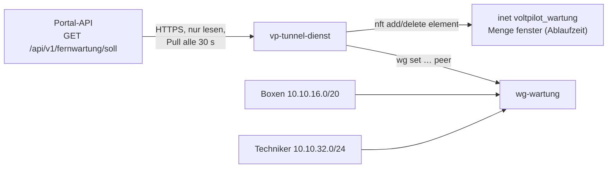

# Tunnel-Dienst (Fernwartung)

`vp-tunnel-dienst` läuft auf der Wartungs-VM (Vorgabe `wartung.voltpilot.de`). Er holt alle 30 s den Soll-Stand der Fernwartung aus dem Portal und setzt ihn um:

- **Peers** auf der WireGuard-Schnittstelle `wg-wartung`: Boxen und Techniker-Zugänge, je genau eine `/32`.
- **Fenster** in der nftables-Menge `fenster` der eigenen Tabelle `voltpilot_wartung`: Techniker → Box nur, solange das Fenster offen ist. Jedes Element hat eine **Ablaufzeit**; das Fenster schließt im Kernel, auch wenn API oder Dienst ausfallen.

Fachliche Grundlage, Rollen und Datenmodell: [Fernwartung](../../docs/fernwartung.md). `vpn.voltpilot.de` mit WireGuard UI ist davon nicht berührt.



## Was die Firewall erlaubt

Die Tabelle regelt nur Verkehr, der `wg-wartung` berührt, und verwirft davon alles, was nicht ausdrücklich erlaubt ist. `vp-tunnel-dienst basis` gibt den Regelsatz aus.

| Weg | Regel |
|---|---|
| Techniker → Box | nur wenn das Paar in `fenster` steht; TCP `VP_TUNNEL_PORTS` (2222, 8484) und Ping. Geprüft wird **jedes** Paket: läuft ein Fenster ab oder wird es geschlossen, reißt auch eine laufende Sitzung ab |
| Box → Techniker | nur Antworten auf erlaubte Verbindungen, ebenfalls nur bei offenem Fenster |
| Box ↔ Box, Techniker ↔ Techniker | verworfen |
| Tunnel → Internet, altes VPN, andere Netze der VM | verworfen |
| Tunnel → VM selbst | nur Ping |

Neue Techniker-Verbindungen landen mit dem Präfix `vp-wartung neu:` im Kernel-Log (`journalctl -k`).

## Verhalten bei Störungen

Die Grundregel: im Zweifel nichts öffnen.

| Lage | Verhalten |
|---|---|
| API nicht erreichbar, HTTP-Fehler, ungültiges JSON | letzter Stand bleibt; kein neues Fenster; offene Fenster laufen von selbst ab. Im Log `WARN … API nicht erreichbar`, ab dem zehnten Fehllauf in Folge `ALARM` |
| Keycloak lehnt die Anmeldung ab (HTTP 401 oder 403 am Token-Endpunkt) | dasselbe Verhalten, aber sofort als Fehler mit eigenem Wortlaut: `ERROR … Anmeldung abgelehnt: Client oder Secret prüfen` |
| Netze der API weichen von der Konfiguration ab, unbekannte Version | Soll-Stand verworfen, `ALARM` im Log |
| einzelner fehlerhafter Eintrag (Adresse außerhalb des Netzes, doppelter Schlüssel, Fenster ohne gültige Box) | Eintrag übersprungen, Warnung, der Rest gilt |
| mehr als `VP_TUNNEL_MAX_ENTFERNEN` Peers sollen auf einmal weg | keiner wird entfernt, `ALARM` |
| ein Fenster ist länger als `VP_TUNNEL_MAX_FENSTER` | auf diese Dauer gekürzt, `ALARM` |
| nft-Tabelle fehlt oder weicht ab (z. B. `nft flush ruleset`) | beim nächsten Lauf neu geladen, der frische Stand desselben Laufs öffnet die Fenster wieder. **Bis dahin, also bis zu ein Abrufintervall lang, filtert die Tabelle nichts** (siehe [Betrieb](#betrieb)) |
| Neustart der VM ohne erreichbare API | Peers aus dem letzten gültigen Stand (`/var/lib/vp-tunnel-dienst/letzter-soll.json`), **nie** ein Fenster |
| Dienst wird beendet | nichts wird abgebaut; Fenster laufen von selbst ab |

Peers allein öffnen keinen Weg; erst ein Element in `fenster` tut das.

## Installation auf der VM

Voraussetzungen:

- Linux ab 5.6 (WireGuard im Kernel), `wireguard-tools`, `nftables` ab 1.0.6, systemd, Zeitabgleich (NTP).
- Kein Docker auf dieser VM: Docker setzt die Weiterleitung auf `DROP` und mischt eigene Regeln ein.
- **Feste Adresse der VM** (statisch oder als feste DHCP-Zuweisung im Router). Steht die VM hinter NAT, hängt die Portweiterleitung UDP 51820 an dieser Adresse; wechselt sie, zeigt die Weiterleitung ins Leere.
- Der Servername (Vorgabe `wartung.voltpilot.de`) zeigt **direkt** auf die öffentliche Adresse. Ein HTTP-Proxy davor (Cloudflare „proxied“) leitet kein UDP weiter.

Geprüft: Debian 13 auf einer echten VM unter systemd (Kernel 6.12, nftables 1.1.3, systemd 257, wireguard-tools 1.0.20210914; Einrichtung am 08.10.2026). Debian 12 (nftables 1.0.6) und Alpine 3.20 (nftables 1.0.9) nur in Containern mit der Integrationsprobe (siehe [Prüfen](#prüfen)).

**Diese Anleitung richtet keine eigene Firewall der VM ein.** Sie lädt nur die Tabelle des Dienstes, und die regelt ausschließlich Verkehr, der `wg-wartung` berührt. Alles andere (SSH, weitere Dienste, Verkehr zwischen anderen Schnittstellen) bleibt so offen oder geschlossen, wie die VM es vorher war. Ein frisches Debian 13 bringt in `/etc/nftables.conf` nur drei leere Ketten mit `policy accept` mit, also keinen Schutz. Die Host-Firewall ist eine eigene Aufgabe.

1. **Pakete und Weiterleitung**

   ```bash
   apt install wireguard-tools nftables
   cat > /etc/sysctl.d/90-vp-wartung.conf <<'EOF'
   net.ipv4.ip_forward = 1
   net.ipv4.conf.all.send_redirects = 0
   EOF
   sysctl --system
   ```

   Unter Debian 13 ist `nftables` schon installiert, sein Dienst aber abgeschaltet; er wird in Schritt 5 aktiviert. `send_redirects` ist damit für `wg-wartung` aus (gemessen: `all=0`, `wg-wartung=0`). Auf der Netzwerkkarte der VM bleibt der Wert 1 und wirkt dort weiter, weil der Kernel `all` und den Wert der Schnittstelle mit ODER verknüpft; für den Tunnel ist das ohne Belang.

2. **WireGuard-Schnittstelle** nach [`deploy/wg-wartung.conf.beispiel`](deploy/wg-wartung.conf.beispiel): Server-Schlüssel auf der VM erzeugen, Datei nach `/etc/wireguard/wg-wartung.conf`, dann `systemctl enable --now wg-quick@wg-wartung`. Den öffentlichen Server-Schlüssel bekommt die API als `VP_FERNWARTUNG_SERVER_PUBLIC_KEY`.

3. **Programm bauen und ablegen** (Go laut [`go.mod`](go.mod), keine Fremdabhängigkeiten). Der Bau trägt den Commit als Version ein:

   ```bash
   cd services/tunnel-dienst
   CGO_ENABLED=0 GOOS=linux GOARCH=amd64 go build -trimpath \
     -ldflags "-X main.version=$(git rev-parse --short=12 HEAD)" \
     -o vp-tunnel-dienst ./cmd/vp-tunnel-dienst
   install -o root -g root -m 0755 vp-tunnel-dienst /usr/local/bin/
   vp-tunnel-dienst version    # vp-tunnel-dienst Version <commit>
   ```

   Die Version steht außerdem in der Startzeile im Journal (`msg="Tunnel-Dienst läuft" version=…`) und in `vp-tunnel-dienst status`. Ohne `-ldflags` nimmt das Programm den Commit, den Go beim Bau aus einem Git-Checkout selbst einträgt; fehlt auch der, steht dort `unbekannt`.

   **Ohne lokales Go** auf einem anderen Rechner im Container bauen (nicht auf der VM, dort läuft kein Docker) und die Datei auf die VM kopieren. Die **Repo-Wurzel** einhängen, nicht nur dieses Verzeichnis: Der Test des Vertragsvektors liest `docs/contracts/`. `-buildvcs=false` ist in einem Git-Worktree nötig und schadet sonst nicht.

   ```bash
   # in der Repo-Wurzel
   V="$(git rev-parse --short=12 HEAD)"
   docker run --rm --user "$(id -u):$(id -g)" -e HOME=/tmp -e GOCACHE=/tmp/gocache -e GOFLAGS=-buildvcs=false \
     -v "$PWD":/repo -w /repo/services/tunnel-dienst golang:1.24 sh -c \
     "go vet ./... && go test -race ./... && CGO_ENABLED=0 GOOS=linux GOARCH=amd64 go build -trimpath -ldflags '-X main.version=$V' -o vp-tunnel-dienst ./cmd/vp-tunnel-dienst"
   scp services/tunnel-dienst/vp-tunnel-dienst root@<vm>:/root/
   # auf der VM:
   install -o root -g root -m 0755 /root/vp-tunnel-dienst /usr/local/bin/
   ```

4. **Benutzer und Konfiguration**

   ```bash
   useradd --system --no-create-home --shell /usr/sbin/nologin vp-tunnel
   install -d -o root -g root -m 0700 /etc/vp-tunnel-dienst
   install -o root -g root -m 0600 deploy/tunnel-dienst.env.beispiel /etc/vp-tunnel-dienst/tunnel-dienst.env
   # Secret des Keycloak-Clients voltpilot-tunnel-dienst:
   (umask 077; printf '%s\n' '<secret>' > /etc/vp-tunnel-dienst/client-secret)
   ```

   Die Datei [`tunnel-dienst.env.beispiel`](deploy/tunnel-dienst.env.beispiel) beschreibt jede Einstellung. Die Netze müssen zur API passen.

5. **Firewall-Basis ab dem Systemstart** (empfohlen): Dann ist der Weg schon zu, bevor der Dienst läuft.

   ```bash
   install -d /etc/nftables.d
   set -a; . /etc/vp-tunnel-dienst/tunnel-dienst.env; set +a
   vp-tunnel-dienst basis > /etc/nftables.d/voltpilot-wartung.nft
   grep -qF 'voltpilot-wartung.nft' /etc/nftables.conf ||
     echo 'include "/etc/nftables.d/voltpilot-wartung.nft"' >> /etc/nftables.conf
   systemctl enable --now nftables
   ```

   Der Block ist wiederholbar: Die Include-Zeile kommt nur einmal in die Datei. Stünde sie doppelt, stünden auch die Regeln doppelt in den Ketten.

   Die Tabelle `voltpilot_wartung` gehört dem Dienst; nichts anderes schreibt hinein. Eine eigene Firewall der VM gehört in `/etc/nftables.conf` oder eine weitere Datei daneben; diese Anleitung legt keine an (siehe oben). Was `flush ruleset` in dieser Datei und ein gestoppter `nftables`-Dienst bedeuten, steht unter [Betrieb](#betrieb).

6. **Dienst** nach [`deploy/vp-tunnel-dienst.service`](deploy/vp-tunnel-dienst.service):

   ```bash
   install -m 0644 deploy/vp-tunnel-dienst.service /etc/systemd/system/
   systemctl daemon-reload
   systemctl enable --now vp-tunnel-dienst
   journalctl -u vp-tunnel-dienst -f
   ```

   Der Dienst läuft als `vp-tunnel` mit nur `CAP_NET_ADMIN`. Das Secret kommt über `LoadCredential`, nie über eine Umgebungsvariable.

   Was im Journal stehen kann:

   | Journal | Bedeutung |
   |---|---|
   | `msg="Tunnel-Dienst läuft" version=… api=…`, danach keine Warnung | läuft; im Portal steht unter **Geräte › Fernwartung** „Tunnel-Dienst holt ab“ |
   | `Failed to set up credentials: Protocol error`, `status=243/CREDENTIALS`, Neustart alle 10 s | die Datei `/etc/vp-tunnel-dienst/client-secret` fehlt (Schritt 4). `systemctl start` meldet trotzdem Erfolg; nur das Journal und `systemctl is-active` zeigen es |
   | `ERROR … Anmeldung abgelehnt: Client oder Secret prüfen (Token-Endpunkt: HTTP 401)` | Secret oder Client-ID stimmen nicht mit Keycloak überein |
   | `WARN … API nicht erreichbar … Soll-Stand: HTTP 403` | die Anmeldung gelingt, dem Dienstkonto fehlt die Rolle `tunnel-dienst` |
   | `WARN … API nicht erreichbar … dial tcp …` oder `… no such host` | kein Weg zu Portal oder Keycloak (Netz, DNS, Adresse in der Konfiguration) |

## Von Hand, solange der Dienst noch nicht läuft (E1)

Die zweite Testanlage soll nicht auf den Dienst warten. Auf der VM (Schritte 1, 2 und 5 der Installation erledigt) geht derselbe Zustand von Hand, ohne dass später etwas umzuziehen ist:

1. Box-Schlüssel trotzdem im Portal hinterlegen: Das reserviert die Adresse und steht im Protokoll.
2. Peer mit genau dieser Adresse setzen: `wg set wg-wartung peer <öffentlicher Box-Schlüssel> allowed-ips 10.10.16.x/32`; ebenso jeder Techniker-Zugang mit seiner Adresse aus dem Portal.
3. Fenster öffnen, mit Ablaufzeit: `nft add element inet voltpilot_wartung fenster '{ 10.10.32.y . 10.10.16.x timeout 1h }'`; vorzeitig schließen mit `nft delete element …` ohne `timeout`.

Startet der Dienst später, findet er dieselben Peers vor und ändert an ihnen nichts. Von Hand geöffnete Fenster schließt er beim ersten Abruf, weil sie nicht im Soll-Stand stehen. Sie stehen auch nicht im Protokoll: In dieser Zeit Grund, Techniker und Zeit selbst notieren.

## Betrieb

| Befehl | Zweck |
|---|---|
| `vp-tunnel-dienst status` (als root) | Version, ob die geladene Firewall-Basis stimmt, letzter Lauf, Peers mit letztem Handshake, offene Fenster mit Restzeit |
| `vp-tunnel-dienst version` | der Commit, aus dem das abgelegte Programm gebaut wurde |
| `vp-tunnel-dienst einmal` | ein Abgleich von Hand, Rückgabe 0/1 |
| `vp-tunnel-dienst basis` | der nft-Regelsatz, wie der Dienst ihn erzwingt |
| `vp-tunnel-dienst pruefen <datei>` | einen Soll-Stand offline prüfen |
| `journalctl -u vp-tunnel-dienst` | Peers angelegt/entfernt, Fenster geöffnet/geschlossen, `ALARM` |
| `/var/lib/vp-tunnel-dienst/status.json` | letzter Lauf, letzter Erfolg, Fehlläufe in Folge - für eine Überwachung |

Ein bewusst großes Aufräumen (mehr als `VP_TUNNEL_MAX_ENTFERNEN` Peers) geht über einen einmaligen Lauf mit erhöhtem Wert: `VP_TUNNEL_MAX_ENTFERNEN=50 vp-tunnel-dienst einmal` mit der Umgebung des Dienstes.

`status`, `basis` und `pruefen` lesen dieselbe Konfiguration wie der Dienst. Weicht `/etc/vp-tunnel-dienst/tunnel-dienst.env` von den Vorgaben ab, vorher laden (`set -a; . /etc/vp-tunnel-dienst/tunnel-dienst.env; set +a`); sonst meldet `status` eine Basis als abweichend, die zur echten Konfiguration passt.

`status` und `version` nennen die Version der Datei unter `/usr/local/bin`. Welche Version gerade **läuft**, sagt die Startzeile im Journal; nach dem Ablegen eines neuen Programms gilt es erst ab `systemctl restart vp-tunnel-dienst`.

Secret wechseln: neues Secret in Keycloak, Datei `client-secret` ersetzen, `systemctl restart vp-tunnel-dienst`.

### nftables neu laden oder stoppen

Unter Debian beginnt `/etc/nftables.conf` mit `flush ruleset`, und `nftables.service` führt beim Stoppen `nft flush ruleset` aus. Das trifft auch die Tabelle des Dienstes:

| Aktion | Folge |
|---|---|
| `systemctl reload nftables` oder `restart nftables` | die Tabelle wird neu geladen, die Menge `fenster` ist danach leer: **alle offenen Fenster sind zu**, laufende Sitzungen reißen ab. Der Dienst öffnet sie beim nächsten Abruf wieder (höchstens ein Abrufintervall) |
| `nft flush ruleset` von Hand, Dienst läuft | die Tabelle ist weg, bis der Dienst sie beim nächsten Lauf neu lädt (auf der VM gemessen: 27 s). **In dieser Zeit filtert nichts:** Bei eingeschalteter Weiterleitung ist der Weg zwischen allen Peers und aus dem Tunnel in die anderen Netze der VM offen |
| `systemctl stop nftables`, Dienst läuft nicht | die Tabelle ist weg und **bleibt** weg: Die Weiterleitung ist ohne jede Regel offen, bis `nftables` oder der Dienst wieder startet |

Deshalb: `nftables` auf dieser VM nicht stoppen, solange `wg-wartung` oben ist, und Änderungen an der Host-Firewall nicht während einer laufenden Fernwartung laden. Eine Host-Firewall mit `policy drop` in der Weiterleitung wäre eine zweite Schranke gegen Fehler in der Tabelle des Dienstes; gegen `flush ruleset` hilft auch sie nicht, weil der Befehl beide entfernt.

## Prüfen

```bash
cd services/tunnel-dienst
go vet ./... && go test -race ./...
test/integration.sh                      # Alpine 3.20, nftables 1.0.9
VPTD_BASIS=debian test/integration.sh    # Debian 12, nftables 1.0.6
```

Ohne DNS im Container zusätzlich `VPTD_DOCKER_DNS=1.1.1.1` setzen. `go vet` und `go test` ohne lokales Go: im Container mit eingehängter Repo-Wurzel, wie in Schritt 3 der Installation.

### Stimmt die geladene Firewall-Basis?

`vp-tunnel-dienst status` sagt es in der zweiten Zeile: `Firewall-Basis stimmt: ja` oder `nein`. Das ist dieselbe Prüfung, mit der der Dienst bei jedem Lauf entscheidet, ob er die Tabelle neu lädt (Prüfwert im Kommentar der Menge und die vier Ketten). Sie hängt nicht davon ab, wie `nft` die Regeln ausgibt.

Ein Textvergleich `vp-tunnel-dienst basis | diff - <(nft list table inet voltpilot_wartung)` taugt dafür **nicht**: Er schlägt immer an, auch wenn der Inhalt gleich ist. nftables 1.1 schreibt `timeout 1d` statt `timeout 86400s`, lässt `flags timeout` weg, ergänzt `burst 5 packets` und gibt Zählerstände aus. Wer die Regeln selbst Zeile für Zeile vergleichen will, lässt deshalb beide Seiten von `nft` ausgeben und lädt den Soll-Stand dazu in einen eigenen Netz-Namensraum:

```bash
ip netns add vpvergleich
vp-tunnel-dienst basis | ip netns exec vpvergleich nft -f -
ip netns exec vpvergleich nft -s list table inet voltpilot_wartung > /tmp/basis.soll.txt
ip netns del vpvergleich
nft -s list table inet voltpilot_wartung > /tmp/basis.ist.txt
diff /tmp/basis.soll.txt /tmp/basis.ist.txt && echo identisch
```

`-s` lässt die Zählerstände weg. Offene Fenster erscheinen als Unterschied in der Zeile `elements`; das ist dann kein Fehler der Basis. Die Datei aus Schritt 5 prüft `vp-tunnel-dienst basis | diff - /etc/nftables.d/voltpilot-wartung.nft`.

- **Unit-Tests:** Vertragsvektor streng gelesen ([`fernwartung-soll-v1.example.json`](../../docs/contracts/fernwartung-soll-v1.example.json), dieselbe Datei prüft die API), Prüfregeln, Abgleich, Parser für `wg` und `nft -j`, die Quelle gegen einen Test-Server, der Dienst-Lauf gegen eine ersetzte Befehlsschicht, die abgelehnte Anmeldung (401 und 403, getrennt von „nicht erreichbar“) und die Versionsausgabe.
- **Integrationsprobe** (`test/integration.sh`): echtes Kernel-WireGuard und echtes nftables in vier Docker-Containern mit `NET_ADMIN` (Server, zwei Boxen, ein Techniker) und eine API-Attrappe. Belegt:
  - kein Weg ohne Fenster;
  - im Fenster nur die Dienste-Ports;
  - Box ↔ Box und Box → Techniker verworfen;
  - Schließen reißt eine laufende Sitzung ab;
  - Ablauf ohne Dienst und API;
  - keine Öffnung bei ausgefallener API;
  - Wiederanlauf ohne Fenster;
  - Lauf als Nicht-root nur mit `CAP_NET_ADMIN`;
  - Schutz vor dem leeren Soll-Stand;
  - abgelehnte Anmeldung: eigene Meldung, kein Fenster;
  - `status` nennt die Version und erkennt eine fehlende Basis.
- **Unit statisch geprüft:** `systemd-analyze verify` ohne Befund; `systemd-analyze security` 3.7 unter Debian 12 (systemd 252) und 3.5 unter Debian 13 (systemd 257), beides „OK“.
- **Auf der echten VM belegt** (Debian 13, 08.10.2026; die Unit unverändert unter systemd, als Gegenstelle die API-Attrappe aus `test/attrappe` auf der VM):
  - Lauf der Unit mit dem Rechtemodell: Benutzer `vp-tunnel`, nur `CAP_NET_ADMIN`, Secret nur als Credential und nicht in der Umgebung;
  - Peers anlegen, Fenster öffnen und schließen durch den echten Tunnel, nur die Dienste-Ports;
  - Tunnel → Heimnetz und Internet wird verworfen (am Zähler der Regel abgelesen);
  - der Weg über NAT: Handshake über die öffentliche Adresse und über den Namen, vom Router auf die VM umgesetzt. Der Test kam aus demselben Netz und lief über die Rückschleife des Routers;
  - `nft flush ruleset` im Betrieb, Stopp des Dienstes, Start ohne Secret-Datei, abgelehnte Anmeldung, API aus;
  - Neustart der VM: Die Firewall-Basis steht, bevor WireGuard lauscht.
- **Im Betrieb:** Seit dem 08.10.2026 läuft der Dienst auf dieser VM gegen die echte API mit Keycloak. Ein eigenes Prüfprotokoll dazu gibt es nicht; die API-Seite ist mit `FernwartungApiTest` gegen echtes Keycloak geprüft.
- **Nicht belegt:**
  - ein Handshake aus einem fremden Netz (Mobilfunk, Kundenanschluss), also ohne die Rückschleife des Routers;
  - die Box-Seite unter OpenWrt gegen diesen Server;
  - der Start der aktivierten Unit beim Systemstart und der Wiederanlauf aus dem Zwischenstand ohne erreichbare API unter systemd (die Logik deckt Schritt 6 der Integrationsprobe);
  - die Integrationsprobe mit nftables 1.1 (sie läuft mit 1.0.6 und 1.0.9; mit 1.1.3 ist der Dienst nur auf der VM geprüft).
