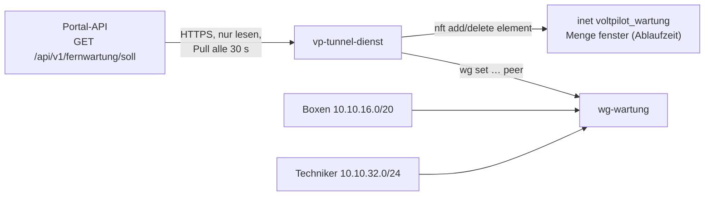

# Tunnel-Dienst (Fernwartung)

`vp-tunnel-dienst` läuft auf der Wartungs-VM (Vorgabe `wartung.voltpilot.de`). Er holt alle 30 s den Soll-Stand der Fernwartung aus dem Portal und setzt ihn um:

- **Peers** auf der WireGuard-Schnittstelle `wg-wartung`: Boxen und Techniker-Zugänge, je genau eine `/32`.
- **Fenster** in der nftables-Menge `fenster` der eigenen Tabelle `voltpilot_wartung`: Techniker → Box nur, solange das Fenster offen ist. Jedes Element hat eine **Ablaufzeit**; das Fenster schließt im Kernel, auch wenn API oder Dienst ausfallen.

Fachliche Grundlage, Rollen und Datenmodell: [Fernwartung](../../docs/fernwartung.md). `vpn.voltpilot.de` mit WireGuard UI ist davon nicht berührt.



## Was die Firewall erlaubt

Die Tabelle regelt nur Verkehr, der `wg-wartung` berührt, und verwirft davon alles, was nicht ausdrücklich erlaubt ist. `vp-tunnel-dienst basis` gibt den Regelsatz aus.

| Weg | Regel |
|---|---|
| Techniker → Box | nur wenn das Paar in `fenster` steht; TCP `VP_TUNNEL_PORTS` (2222, 8484) und Ping. Geprüft wird **jedes** Paket: läuft ein Fenster ab oder wird es geschlossen, reißt auch eine laufende Sitzung ab |
| Box → Techniker | nur Antworten auf erlaubte Verbindungen, ebenfalls nur bei offenem Fenster |
| Box ↔ Box, Techniker ↔ Techniker | verworfen |
| Tunnel → Internet, altes VPN, andere Netze der VM | verworfen |
| Tunnel → VM selbst | nur Ping |

Neue Techniker-Verbindungen landen mit dem Präfix `vp-wartung neu:` im Kernel-Log (`journalctl -k`).

## Verhalten bei Störungen

Die Grundregel: im Zweifel nichts öffnen.

| Lage | Verhalten |
|---|---|
| API nicht erreichbar, HTTP-Fehler, ungültiges JSON | letzter Stand bleibt; kein neues Fenster; offene Fenster laufen von selbst ab |
| Netze der API weichen von der Konfiguration ab, unbekannte Version | Soll-Stand verworfen, `ALARM` im Log |
| einzelner fehlerhafter Eintrag (Adresse außerhalb des Netzes, doppelter Schlüssel, Fenster ohne gültige Box) | Eintrag übersprungen, Warnung, der Rest gilt |
| mehr als `VP_TUNNEL_MAX_ENTFERNEN` Peers sollen auf einmal weg | keiner wird entfernt, `ALARM` |
| ein Fenster ist länger als `VP_TUNNEL_MAX_FENSTER` | auf diese Dauer gekürzt, `ALARM` |
| nft-Tabelle fehlt oder weicht ab (z. B. `nft flush ruleset`) | neu geladen; bis zum nächsten frischen Stand ist kein Fenster offen |
| Neustart der VM ohne erreichbare API | Peers aus dem letzten gültigen Stand (`/var/lib/vp-tunnel-dienst/letzter-soll.json`), **nie** ein Fenster |
| Dienst wird beendet | nichts wird abgebaut; Fenster laufen von selbst ab |

Peers allein öffnen keinen Weg; erst ein Element in `fenster` tut das.

## Installation auf der VM

Voraussetzungen: Linux ab 5.6 (WireGuard im Kernel), `wireguard-tools`, `nftables` ab 1.0.6, systemd, Zeitabgleich (NTP). Kein Docker auf dieser VM: Docker setzt die Weiterleitung auf `DROP` und mischt eigene Regeln ein. Geprüft mit Debian 12 und Alpine 3.20 (siehe Prüfen).

1. **Pakete und Weiterleitung**

   ```bash
   apt install wireguard-tools nftables
   cat > /etc/sysctl.d/90-vp-wartung.conf <<'EOF'
   net.ipv4.ip_forward = 1
   net.ipv4.conf.all.send_redirects = 0
   EOF
   sysctl --system
   ```

2. **WireGuard-Schnittstelle** nach [`deploy/wg-wartung.conf.beispiel`](deploy/wg-wartung.conf.beispiel): Server-Schlüssel auf der VM erzeugen, Datei nach `/etc/wireguard/wg-wartung.conf`, dann `systemctl enable --now wg-quick@wg-wartung`. Den öffentlichen Server-Schlüssel bekommt die API als `VP_FERNWARTUNG_SERVER_PUBLIC_KEY`.

3. **Programm bauen und ablegen** (Go laut [`go.mod`](go.mod), keine Fremdabhängigkeiten):

   ```bash
   cd services/tunnel-dienst
   CGO_ENABLED=0 GOOS=linux GOARCH=amd64 go build -trimpath -o vp-tunnel-dienst ./cmd/vp-tunnel-dienst
   install -o root -g root -m 0755 vp-tunnel-dienst /usr/local/bin/
   ```

4. **Benutzer und Konfiguration**

   ```bash
   useradd --system --no-create-home --shell /usr/sbin/nologin vp-tunnel
   install -d -o root -g root -m 0700 /etc/vp-tunnel-dienst
   install -o root -g root -m 0600 deploy/tunnel-dienst.env.beispiel /etc/vp-tunnel-dienst/tunnel-dienst.env
   # Secret des Keycloak-Clients voltpilot-tunnel-dienst:
   (umask 077; printf '%s\n' '<secret>' > /etc/vp-tunnel-dienst/client-secret)
   ```

   Die Datei [`tunnel-dienst.env.beispiel`](deploy/tunnel-dienst.env.beispiel) beschreibt jede Einstellung. Die Netze müssen zur API passen.

5. **Firewall-Basis ab dem Systemstart** (empfohlen): Dann ist der Weg schon zu, bevor der Dienst läuft.

   ```bash
   install -d /etc/nftables.d
   set -a; . /etc/vp-tunnel-dienst/tunnel-dienst.env; set +a
   vp-tunnel-dienst basis > /etc/nftables.d/voltpilot-wartung.nft
   echo 'include "/etc/nftables.d/voltpilot-wartung.nft"' >> /etc/nftables.conf
   systemctl enable --now nftables
   ```

   Die eigene Firewall der VM (SSH, UDP-Port 51820 von außen) bleibt in `/etc/nftables.conf`. Die Tabelle `voltpilot_wartung` gehört dem Dienst; nichts anderes schreibt hinein.

6. **Dienst** nach [`deploy/vp-tunnel-dienst.service`](deploy/vp-tunnel-dienst.service):

   ```bash
   install -m 0644 deploy/vp-tunnel-dienst.service /etc/systemd/system/
   systemctl daemon-reload
   systemctl enable --now vp-tunnel-dienst
   journalctl -u vp-tunnel-dienst -f
   ```

   Der Dienst läuft als `vp-tunnel` mit nur `CAP_NET_ADMIN`. Das Secret kommt über `LoadCredential`, nie über eine Umgebungsvariable.

## Von Hand, solange der Dienst noch nicht läuft (E1)

Die zweite Testanlage soll nicht auf den Dienst warten. Auf der VM (Schritte 1, 2 und 5 der Installation erledigt) geht derselbe Zustand von Hand, ohne dass später etwas umzuziehen ist:

1. Box-Schlüssel trotzdem im Portal hinterlegen: Das reserviert die Adresse und steht im Protokoll.
2. Peer mit genau dieser Adresse setzen: `wg set wg-wartung peer <öffentlicher Box-Schlüssel> allowed-ips 10.10.16.x/32`; ebenso jeder Techniker-Zugang mit seiner Adresse aus dem Portal.
3. Fenster öffnen, mit Ablaufzeit: `nft add element inet voltpilot_wartung fenster '{ 10.10.32.y . 10.10.16.x timeout 1h }'`; vorzeitig schließen mit `nft delete element …` ohne `timeout`.

Startet der Dienst später, findet er dieselben Peers vor und ändert an ihnen nichts. Von Hand geöffnete Fenster schließt er beim ersten Abruf, weil sie nicht im Soll-Stand stehen. Sie stehen auch nicht im Protokoll: In dieser Zeit Grund, Techniker und Zeit selbst notieren.

## Betrieb

| Befehl | Zweck |
|---|---|
| `vp-tunnel-dienst status` (als root) | Peers mit letztem Handshake, offene Fenster mit Restzeit, letzter Lauf |
| `vp-tunnel-dienst einmal` | ein Abgleich von Hand, Rückgabe 0/1 |
| `vp-tunnel-dienst basis` | der nft-Regelsatz, wie der Dienst ihn erzwingt |
| `vp-tunnel-dienst pruefen <datei>` | einen Soll-Stand offline prüfen |
| `journalctl -u vp-tunnel-dienst` | Peers angelegt/entfernt, Fenster geöffnet/geschlossen, `ALARM` |
| `/var/lib/vp-tunnel-dienst/status.json` | letzter Lauf, letzter Erfolg, Fehlläufe in Folge - für eine Überwachung |

Ein bewusst großes Aufräumen (mehr als `VP_TUNNEL_MAX_ENTFERNEN` Peers) geht über einen einmaligen Lauf mit erhöhtem Wert: `VP_TUNNEL_MAX_ENTFERNEN=50 vp-tunnel-dienst einmal` mit der Umgebung des Dienstes.

Secret wechseln: neues Secret in Keycloak, Datei `client-secret` ersetzen, `systemctl restart vp-tunnel-dienst`.

## Prüfen

```bash
cd services/tunnel-dienst
go vet ./... && go test -race ./...
test/integration.sh                      # Alpine 3.20, nftables 1.0.9
VPTD_BASIS=debian test/integration.sh    # Debian 12, nftables 1.0.6
```

Ohne DNS im Container zusätzlich `VPTD_DOCKER_DNS=1.1.1.1` setzen.

- **Unit-Tests:** Vertragsvektor streng gelesen ([`fernwartung-soll-v1.example.json`](../../docs/contracts/fernwartung-soll-v1.example.json), dieselbe Datei prüft die API), Prüfregeln, Abgleich, Parser für `wg` und `nft -j`, die Quelle gegen einen Test-Server, der Dienst-Lauf gegen eine ersetzte Befehlsschicht.
- **Integrationsprobe** (`test/integration.sh`): echtes Kernel-WireGuard und echtes nftables in vier Docker-Containern mit `NET_ADMIN` (Server, zwei Boxen, ein Techniker) und eine API-Attrappe. Belegt:
  - kein Weg ohne Fenster;
  - im Fenster nur die Dienste-Ports;
  - Box ↔ Box und Box → Techniker verworfen;
  - Schließen reißt eine laufende Sitzung ab;
  - Ablauf ohne Dienst und API;
  - keine Öffnung bei ausgefallener API;
  - Wiederanlauf ohne Fenster;
  - Lauf als Nicht-root nur mit `CAP_NET_ADMIN`;
  - Schutz vor dem leeren Soll-Stand.
- **Unit statisch geprüft:** `systemd-analyze verify` ohne Befund, `systemd-analyze security` 3.7 („OK“), unter Debian 12.
- **Nicht belegt:**
  - ein Lauf der Unit unter systemd (das Rechtemodell ist mit `setpriv` nachgestellt);
  - der Weg über das Internet mit NAT;
  - die Box-Seite unter OpenWrt;
  - ein Lauf gegen die echte API mit Keycloak. Die API-Seite ist mit `FernwartungApiTest` gegen echtes Keycloak geprüft, die Kombination beider Seiten erst auf der VM.
