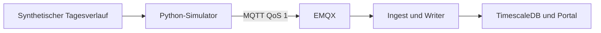

# MQTT-Gerätesimulator

Ein einzelnes Python-Programm simuliert PV, Speicher und Hauslast. Es sendet v1-Telemetrie und Status an VoltPilot; die [Node-RED-Simulation](../../edge/node-red/README.md) prüft zusätzlich einen Modbus-Pfad.



## Lokal starten

Aus diesem Verzeichnis, mit vorhandenem lokalen Stack:

```bash
python3 -m venv .venv
.venv/bin/pip install -r requirements.txt
.venv/bin/python voltpilot_edge_sim.py --host localhost --count 20
```

Ohne eigene Identität verwendet der Simulator das Demo-Gerät des lokalen Seeds. Der [Nachweis](proof/README.md) kontrolliert den Eingang in der Datenbank.

## Identität wählen

| Modus | Verwendung |
|---|---|
| `--ref pi-sim-01` | Legacy-Provisioning: Hello senden und auf Claim/retained Identität warten |
| `--tenant-id … --site-id … --device-id …` | Bereits bekannte UUIDs direkt verwenden |
| Keine Identitätsoption | Lokale Demo-Identität |

```bash
.venv/bin/python voltpilot_edge_sim.py --host <broker> --ref pi-sim-01
```

Der Ref-Modus benötigt einen Brokerzugang, der die Provisioning-Topics erlaubt. Er ersetzt kein mTLS-Enrollment. Für den öffentlichen Broker braucht das Gerät gültige Zertifikate und eine zu deren Identität passende Topic-Zuordnung:

```bash
.venv/bin/python voltpilot_edge_sim.py --host mqtt.example.com --port 8883   --ca-cert <ca.pem> --client-cert <device.crt> --client-key <device.key>   --tenant-id <uuid> --site-id <uuid> --device-id <uuid>
```

[Geräte-PKI](../pki/README.md) · [Kunden-Box mit Enrollment](../../docs/connect-a-device.md). Produktions-Compose ist eigenständig; nicht mit lokalem Compose zusammenführen.

## Simulation und Optionen

PV folgt einer Tageskurve, Last einem synthetischen Haushaltsprofil. Die Batterie lädt/entlädt innerhalb des Modells. `power_kw = load - pv + battery`: positiv Netzbezug, negativ Einspeisung.

| Option | Zweck / Vorgabe |
|---|---|
| `--interval` | Abstand der Messungen, 5 Sekunden |
| `--count` | Nach N Nachrichten stoppen, 0 = unbegrenzt |
| `--time-scale` | Simulierte Zeit pro Echtzeit; 288 spielt einen Tag in 5 Minuten |
| `--provision-retry` | Hello-Abstand, 10 Sekunden |
| `--provision-timeout` | Wartezeit auf Claim, 0 = unbegrenzt |
| `--pv-peak-kw`, `--batt-capacity-kwh`, `--batt-max-kw` | Größe der simulierten Anlage |

CLI-Werte gehen vor Umgebung/`.env` und Defaults. Vollständige Optionen: `--help` und [`.env.example`](.env.example). `--insecure` überspringt Zertifikatsprüfung und ist nur für kontrollierte Tests gedacht.

```bash
.venv/bin/python -m pytest test_edge_sim.py -q
```

Die Tests prüfen Modell, MQTT-Austausch und Vertragsform ohne einen externen Broker. Sie ersetzen nicht den Nachweis des vollständigen Cloud-Pfads.

## UEMS: zwei Boxen im Werk Ahrenberg

`uems_ahrenberg.py` liest ausschließlich das Referenzunternehmen
`docs/contracts/v2/uems-referenzunternehmen.json`. Es löst die zeitgültigen
Zuständigkeiten von DQ-1…DQ-5 auf zwei getrennte Box-Identitäten auf und gibt
deren Herzschläge samt `data_sources[]` als JSON aus. Der Lauf ist offline und
benötigt weder Broker noch Zugangsdaten:

```bash
python3 uems_ahrenberg.py
python3 uems_ahrenberg.py --at 2027-04-10T07:30:00+02:00
python3 uems_ahrenberg.py --offline-box E-2
python3 -m pytest test_edge_sim.py test_uems_ahrenberg.py -q
```

Der Zeitpunkt ist halboffen ausgewertet. Dadurch liest DQ-3 beim Wechsel um
07:30 Uhr nie auf beiden Boxen. `--offline-box` unterdrückt nur die
Quellmeldungen dieser Box; die andere Identität und ihre Quellen bleiben
unverändert.
